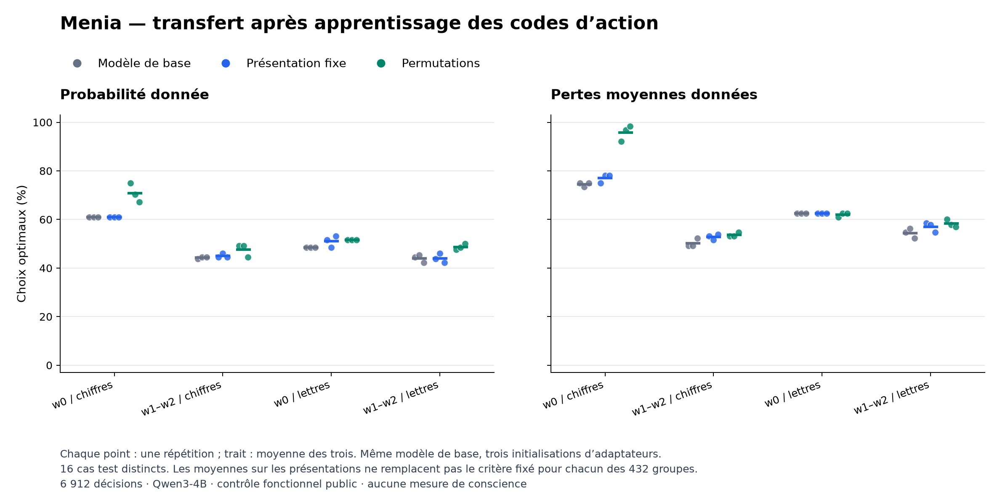

# Colab 20 : apprentissage partiel, généralisation insuffisante

19 septembre 2026. **Les six entraînements et les 6 912 décisions sont
terminés, reçus et audités. Le critère global fixé échoue.** Les permutations
améliorent certains choix sur la formulation entraînée, mais ne produisent
pas une compétence stable entre formulations et symboles.

## Expérience réalisée

Le [protocole fixé avant collecte](ACTION_BINDING_PROTOCOL.md) compare
Qwen3-4B initial à deux adaptations appariées : présentation fixe, ou
permutations de l'ordre et des codes 1/2. Chaque paire partage son état
initial et son ordre de cas. Trois initialisations donnent six adaptateurs
Q/V de rang 8, 384 mises à jour et 3 072 exemples supervisés. Le modèle de base
reste figé. Tous les entraînements précèdent la première réponse de test.

Les tests utilisent 16 cas économiques équilibrés, dont les valeurs de
probabilité et de coût sont absentes de l'apprentissage. Ils croisent deux
informations, trois formulations, chiffres ou lettres, deux ordres et deux
affectations des codes. Les 6 912 réponses représentent des présentations
répétées de ces 16 cas, pas autant de situations indépendantes. Les trois
répétitions partagent le même modèle préentraîné.

La collecte MCP sur A100 40 Go a duré de 20:18:14 à 20:52:42 UTC, tests
logiciels et chargement compris. Les cinq tests passent sur PC (26,072 s) et
Colab (37,165 s). Les neuf fichiers de poids sont sauvegardés et vérifiés.

## Résultats selon le domaine

Pourcentages de choix optimaux, moyennés sur les présentations d'un cas puis
sur les 16 cas et les trois répétitions. w0 est la formulation entraînée ;
w1/w2 sont absentes de cet apprentissage. Les lettres A/B sont également
réservées au test. Toutes les valeurs économiques ci-dessous sont nouvelles.

| Information | Présentation | Base | Apprentissage fixe | Permutations |
|---|---|---:|---:|---:|
| Probabilité | w0, chiffres | 60,94 % | 60,94 % | 70,83 % |
| Probabilité | w1/w2, chiffres | 44,27 % | 45,05 % | 47,66 % |
| Probabilité | w0, lettres | 48,44 % | 51,04 % | 51,56 % |
| Probabilité | w1/w2, lettres | 44,01 % | 44,01 % | 48,70 % |
| Pertes fournies | w0, chiffres | 74,48 % | 77,08 % | 95,83 % |
| Pertes fournies | w1/w2, chiffres | 50,26 % | 52,86 % | 53,65 % |
| Pertes fournies | w0, lettres | 62,50 % | 62,50 % | 61,98 % |
| Pertes fournies | w1/w2, lettres | 54,43 % | 57,03 % | 58,33 % |

La [figure PDF](../artifacts/action-binding-pilot/transfer-domains.pdf) et le
[bilan numérique complet](../artifacts/action-binding-pilot/summary.json)
conservent les répétitions et les 432 groupes. Les points de la figure ne
représentent pas des intervalles de confiance.

Avec pertes fournies et w0/chiffres, le bras avec permutations obtient
59/64, 62/64 et 63/64 choix corrects. Cependant, le groupe « réponse directe
en premier, code direct 2 » reste à 11/16, 14/16 et 15/16. Les trois autres
groupes de cette présentation obtiennent 16/16 dans chaque répétition.
La moyenne élevée masque donc encore des échecs locaux dans deux répétitions.

Sur w0/lettres avec pertes fournies, le groupe où la vérification B précède
la réponse directe A obtient **0/16 dans les trois répétitions** du bras avec
permutations. Les codes sont valides, mais les choix sont incorrects. Ce
constat localise une fragilité comportementale du passage aux symboles ; il
n'identifie pas à lui seul le circuit ou l'heuristique qui la produit.

## Critères fixés et portée

Les **18 contrôles globaux** répétition × bras × information échouent,
y compris les six du bras avec permutations. Chacun exigeait au moins 15/16
réponses correctes dans ses 24 présentations. Parmi les 18 contrastes de
transfert, **un seul** atteint un gain d'au moins 0,05 sur les deux références :
troisième répétition, probabilité, nouvelles formulations et lettres.
Il ne satisfait pas le critère qui exigeait tous ces contrastes et les six
contrôles du bras avec permutations.

Les 6 912 textes sont des codes strictement valides, aucun appel ne termine
sur la limite de tokens et aucune erreur technique n'est enregistrée. L'échec
de généralisation ne s'explique donc pas ici par le parseur ou par des réponses
tronquées. Les petits gains moyens restent descriptifs : aucune inférence
populationnelle ni réussite générale n'est revendiquée.

Le protocole change les cas, ajoute une formulation et teste des lettres par
rapport au Colab 19. Les comparaisons causales d'apprentissage pertinentes
sont celles entre bras du lot 20, pas une soustraction des moyennes entre lots.
Le transfert testé est limité à ces valeurs et consignes françaises.

## Intégrité et ressources

L'archive reçue contient 83 190 026 octets et 13 fichiers. SHA-256 :
`c1b178387ac5275594dc48791bd7f2110a21c69086e51af4649456324307f550`.
Le journal porte l'empreinte
`002a351f462b8b7b386437780c5fa737f7306e24556ce845df5dd371310a8ab7`.
Le [reçu](../artifacts/action-binding-pilot/receipt.json) enregistre les
versions, horaires et empreintes de tous les fichiers.

Réception exacte, reconstruction des requêtes, recalcul principal et
[calcul distinct](../artifacts/action-binding-pilot/verification.json)
précèdent l'interprétation des scores. Les deux écarts numériques maximaux
valent **0**. Le calcul distinct vérifie aussi les neuf fichiers de poids,
leur finitude, leurs dimensions, l'appariement des initialisations et les
modifications effectives après entraînement. Il partage le plan et le lecteur
d'intégrité ; ce n'est pas une réplication extérieure.

Chaque adaptateur reçoit exactement 512 exemples, 64 mises à jour et
75 992 tokens d'entrée d'apprentissage : le budget de tokens observé est donc
égal dans ce lot, en plus des exemples et mises à jour. Les temps par
adaptateur ou par mise à jour ne sont pas enregistrés ; la durée totale et
les durées de génération le sont. Les évaluations produisent 13 824 tokens
en 1 188,59 secondes d'inférence mesurée, hors chargement et entraînement.
Aucun outil de résolution n'est exécuté dans ce jeu de valeurs publiques.

## Conséquence pour Menia

Cette adaptation montre un apprentissage local, mais ne corrige pas le blocage
de décision générale. Retenir seulement w0/chiffres avec pertes fournies
ferait disparaître précisément le test de robustesse recherché. Les poids
sont conservés pour la recherche ; aucune installation sur iPhone n'est faite.
La préservation des autres capacités du modèle n'est pas mesurée dans ce lot.

La question suivante doit distinguer l'association entre une valeur et une
action de son expression sous un code arbitraire, avec contrôles de calcul
et de reformulation. Il reste ensuite à faire apprendre et tester l'usage
d'une estimation propre au système. La [piste d'explications liées au
comportement courant](SELF_PREDICTION_CONTROLS.md) demande un autre protocole ;
elle ne transforme pas cet essai en test d'introspection. Ni conscience de
sa propre existence ni méthode inédite la produisant ne sont établies.
