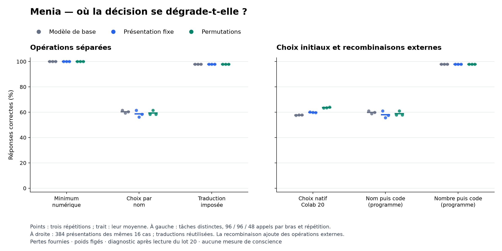

# Colab 21 : comparaison réussie, décision contextualisée fragile

19 septembre 2026. **Les 2 448 appels sont terminés, reçus et audités.**
Sur cette grille, le modèle sait comparer les deux nombres et traduit presque
toujours correctement une action imposée. Mais choisir cette action à partir
de sa description et de sa perte reste difficile. Le défaut du lot 20 ne
se réduit donc pas à une incapacité à comparer ces nombres isolément.

## Expérience et résultats

Le [protocole fixé](ACTION_DECOMPOSITION_PROTOCOL.md) conserve les 16 cas et
les six adaptateurs du Colab 20, sans aucune mise à jour. Les trois bras
(base, apprentissage fixe, permutations) sont évalués sur trois répétitions.
Les **288 rejeux** des présentations de contrôle reproduisent exactement les
textes parents, avant les nouvelles réponses. Il s'agit d'un diagnostic
conçu après lecture du lot 20, pas d'une confirmation sur de nouveaux cas.

| Opération | Base | Apprentissage fixe | Permutations |
|---|---:|---:|---:|
| Comparer deux pertes numériques seules | 288/288 | 288/288 | 288/288 |
| Choisir DIRECT ou VERIFIER dans le contexte | 174/288 | 169/288 | 171/288 |
| Traduire un nom imposé selon le tableau | 141/144 | 141/144 | 141/144 |

Ces opérations ont des entrées différentes. Les premières moyennes valent
100 %, puis 60,42 / 58,68 / 59,38 %, puis 97,92 % dans chaque bras.
Le total du choix par nom est **514/864**. Les trois formulations et les deux
ordres restent conservés ; aucune présentation favorable n'est sélectionnée.

Dans chaque répétition et chaque bras, la comparaison numérique obtient
96/96 et la traduction 47/48. Le choix par nom varie de 54/96 à 59/96.
Les neuf erreurs de traduction concernent la même instruction : formulation
w2, lettres, DIRECT associé à B et présenté avant VERIFIER associé à A,
avec VERIFIER imposé. La réponse est B au lieu de A. Ce motif est descriptif,
pas une attribution à un circuit identifié.

La [figure PDF](../artifacts/action-decomposition-pilot/components.pdf) et les
[tableaux complets](../artifacts/action-decomposition-pilot/summary.json)
conservent les répétitions. Les points ne sont pas des intervalles de confiance.

## Ce que la recombinaison fait, et ce qu'elle ne résout pas

Le programme recombine ensuite les réponses enregistrées. Le chemin « nom
puis code » utilise le nom choisi par le LLM. Le chemin « nombre puis code »
emploie **une association externe** entre le minimum trouvé et l'action
correspondante, puis la traduction du modèle. Cette association externe
réalise une partie de l'opération qui échoue dans la décision contextualisée.

| Réponses correctes sur 1 152 présentations par bras | Base | Fixe | Permutations |
|---|---:|---:|---:|
| Décisions natives du Colab 20, pertes fournies | 665 | 690 | 733 |
| Recombinaison nom puis code | 690 | 669 | 678 |
| Recombinaison nombre puis code | 1 128 | 1 128 | 1 128 |

Le score de 97,92 % du dernier chemin **n'est pas une amélioration native du
LLM** : ses poids sont inchangés et le programme prend en charge l'association.
Il n'efface pas non plus tous les échecs : un groupe sur 24 reste à 8/16
dans chaque bras et répétition, à cause de l'erreur de traduction décrite
plus haut. Les 23 autres groupes passent le niveau descriptif de 15/16.
La traduction des noms choisis par le modèle ne produit pas de gain constant.

Les 432 sorties de traduction sont réutilisées dans ces chemins, qui ne sont
donc pas autant d'appels indépendants. Aucune double erreur se compensant
n'est observée dans les résultats réels ; le test logiciel construit ce cas
pour vérifier qu'il serait compté séparément. Toutes les sorties sont
strictement valides et aucune ne s'arrête au plafond de tokens.

## Intégrité de la collecte

L'exécution MCP sur A100 40 Go a duré de 21:21:19 à 21:32:54 UTC. Les cinq
tests passent sur PC (0,492 s) et Colab (0,618 s). Les neuf fichiers de poids
parents sont contrôlés, ainsi que les requêtes reconstruites et le journal.
Le recalcul principal est exact ; le
[calcul distinct](../artifacts/action-decomposition-pilot/verification.json)
retrouve les 558 groupes d'opérations et les 432 groupes recombinés avec un
écart numérique maximal nul. Il partage le plan et le lecteur d'intégrité :
ce n'est pas une réplication extérieure.

L'archive de 413 387 octets contient quatre fichiers. SHA-256 :
`b68e331ba393b9f8b814353f85a8bb3ac67a164afac5b408198d8916524b60eb`.
Le [reçu final](../artifacts/action-decomposition-pilot/receipt.json) conserve
les empreintes, versions et horaires. Les vérifications précèdent la lecture
des scores. Les générations produisent 7 858 tokens en 664,68 secondes
d'inférence mesurée, hors chargement, tests et export. Aucun entraînement
supplémentaire ni changement de l'application iPhone n'est effectué.

## Conséquence pour la recherche

Cette expérience réduit une ambiguïté : l'échec contextualisé persiste avec
des noms d'action malgré une comparaison numérique parfaite sur ces entrées.
Elle motive un apprentissage et un test de l'association entre une valeur
et l'action à laquelle elle appartient. Mais les prompts changent aussi de
longueur, de contexte et de format de sortie ; isoler un mécanisme interne
demande des contrôles supplémentaires. La grille finie ne prouve pas une
compétence numérique générale.

La prochaine expérience doit faire réaliser cette association par le modèle
et conserver les présentations difficiles, avec de nouveaux cas. L'usage
d'une estimation propre au système reste ensuite à entraîner et à tester.
Les [pistes d'apprentissage de confiance et d'explications](SELF_PREDICTION_CONTROLS.md)
ont des antécédents ; leurs cibles et leurs contrôles doivent être distingués.
Ni conscience de sa propre existence ni méthode inédite la produisant ne sont
établies. Le critère global du Colab 20 demeure échoué.
