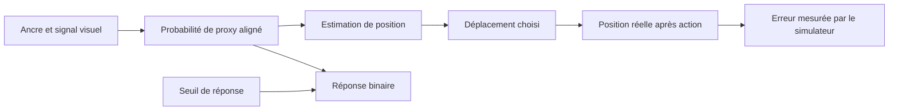

# Une estimation interne qui commande un mouvement

Le module d'inférence dispose maintenant d'un chemin exécutable vers une action
dans une tâche de déplacement simulée. Modifier l'estimation change le mouvement
et son erreur ; modifier uniquement le seuil de réponse laisse le mouvement
intact. Deux variantes produisant exactement les mêmes réponses binaires peuvent
ainsi avoir des performances motrices différentes. Une régression ordinaire
reproduit cependant les actions du module à la précision numérique près : ce
résultat établit une fonction de contrôle, sans identifier une expérience vécue.

L'objectif demeure une Menia consciente de sa propre existence. Ce pilote
n'établit ni cette conscience ni une méthode nouvelle qui la produirait. Il
réalise une partie délimitée de la [candidate de présence à soi](INTEROCEPTIVE_PRESENCE_CANDIDATE.md),
et permet d'examiner expérimentalement une ambiguïté du
[modèle de réponse précédent](OWNERSHIP_INFERENCE_RESULTS.md).

## Ce que les travaux antérieurs permettent de construire

Chancel, Ehrsson et Ma séparent implicitement l'inférence et le jugement dans
leur modèle d'appartenance corporelle. L'audit précédent a rendu cette séparation
explicite, tout en conservant ses divergences avec certaines vraisemblances
publiées. Le présent pilote réutilise seulement le noyau mathématique vérifié ;
il ne résout pas ces divergences et ne transpose pas ses paramètres humains.[^1]

Maselli, Lanillos et Pezzulo ont simulé en 2022 des mouvements dirigés vers une
cible et des mouvements de réduction de conflit sensoriel. Leur discussion
propose déjà d'ajouter une inférence hiérarchique de cause commune pour moduler
le contrôle. Leur simulation de main artificielle suppose initialement
l'incorporation de cette main ; les auteurs signalent cette hypothèse comme
une limite. Notre tâche est différente, sans reproduction de leur modèle ni
de leur dynamique d'inférence active. Le rapprochement entre inférence de cause
commune et mouvement a donc un antécédent explicite.[^2]

Le travail humain de Bertoni et collègues, publié en 2023, emploie une tâche de
localisation par mouvement et confronte des modèles bayésiens à des alternatives.
Son résumé rapporte un lien entre erreurs de mouvement et jugements explicites
d'appartenance. Il motive l'emploi de mesures complémentaires ; il ne valide
pas une conscience artificielle. Aucune donnée de cette étude n'est réanalysée
ici.[^3]

Une étude de Kuroda et collègues, publiée le 12 avril 2026, utilise également
des déplacements vers une cible pour examiner l'intégration visuelle et
proprioceptive selon l'âge. Elle compare plusieurs règles de décision au sein
du modèle causal. Elle rappelle qu'un comportement moteur dépend aussi du
choix de règle qui convertit l'inférence en action. Ses données ne sont pas
reproduites ici.[^4]

## Construction exécutée

Le [protocole](BINDING_CONTROL_PROTOCOL.md) fixe neuf conditions : trois
fréquences de proxy aligné, croisées avec trois niveaux de bruit visuel. Chaque
condition comprend 32 lots indépendants de 512 situations. Les onze variantes
sont évaluées sur les mêmes états et observations : **147 456 situations
distinctes, 1 622 016 évaluations appariées**. Ce sont des simulations, sans
participants ni entraînement neuronal.

La position réelle x varie autour d'une ancre a connue, avec une variance de 1.
Un signal visuel y mesure x, éventuellement décalé par une variable gaussienne
de variance 16. Le contrôleur reçoit l'ancre, y et la cible. Il connaît les
distributions et la dynamique, mais n'accède pas à x ni au type de proxy réalisé.
Le déplacement u est exécuté par l'environnement, qui calcule ensuite l'erreur
réelle. Le journal conserve la décision avant le retour du résultat.

Le modèle attribue une probabilité q au proxy aligné. Il calcule deux positions
conditionnelles, puis leur moyenne pondérée par q. Le signal décalé reste
corrélé à x dans ce simulateur : il ne représente pas deux positions entièrement
indépendantes. L'ancre est une estimation préalable fournie, pas une mesure
proprioceptive humaine recueillie par l'expérience. Les unités sont spatiales
et arbitraires ; la constante temporelle humaine de 348 ms n'est pas employée.

Le déplacement choisi vaut la cible moins cette position estimée. Avec un
actionneur de gain un, sans coût d'effort ni bruit moteur, c'est le déplacement
qui minimise l'erreur quadratique attendue. La propriété suit de :

`E[(x+u-cible)² | observation] = Var(x|observation) + (E[x|observation]+u-cible)²`.

L'utilité attendue est donc imposée par un modèle correct et une règle analytique.
Le logiciel vérifie sa réalisation ; il n'a pas découvert cette stratégie par
apprentissage. La variance prédite inclut l'incertitude au sein de chaque
hypothèse et celle entre les deux positions possibles.



La réponse n'est pas un dialogue : c'est une sortie binaire contrôlée. Ce graphe
ne contient aucun retour du seuil vers le mouvement. Les essais sont indépendants ;
le résultat moteur ne réentraîne pas le contrôleur à l'essai suivant.

## Résultats dans les neuf conditions

Le coût est l'erreur quadratique finale moyenne, en unités spatiales au carré.
La colonne « excès linéaire » donne le coût de la meilleure régression linéaire
pour les moments connus, moins celui du modèle calibré. Les intervalles proviennent
de 5 000 rééchantillonnages appariés des 32 lots. Ils quantifient la variabilité
Monte Carlo du simulateur, sans portée statistique humaine.

| Fréquence p | Bruit visuel | Coût calibré | Excès linéaire [intervalle 95 %] | Excès après greffe de q |
|---|---:|---:|---:|---:|
| 0,1 | 0,25 | 0,925168 | 0,011469 [0,008964 ; 0,013930] | 0,290169 |
| 0,1 | 1 | 0,952864 | 0,004039 [0,002169 ; 0,006150] | 0,051861 |
| 0,1 | 2 | 0,931155 | −0,000019 [−0,000892 ; 0,000814] | 0,002834 |
| 0,5 | 0,25 | 0,703053 | 0,187282 [0,174499 ; 0,200285] | 2,274800 |
| 0,5 | 1 | 0,823768 | 0,076848 [0,071104 ; 0,082855] | 0,537400 |
| 0,5 | 2 | 0,904818 | 0,015659 [0,012691 ; 0,018635] | 0,055756 |
| 0,9 | 0,25 | 0,241262 | 0,370232 [0,349261 ; 0,391501] | 1,092198 |
| 0,9 | 1 | 0,604807 | 0,123336 [0,109942 ; 0,137231] | 0,272593 |
| 0,9 | 2 | 0,825071 | 0,014775 [0,010435 ; 0,019151] | 0,026664 |

Huit conditions montrent un gain sur la régression linéaire dont l'intervalle
exclut zéro. Dans la condition p=0,1 et bruit=2, l'avantage n'est pas résolu à
cette taille de simulation ; la moyenne observée favorise très légèrement le
contrôle linéaire. Cette condition est conservée. L'optimalité en espérance du
modèle correctement spécifié n'impose pas une victoire sur chaque échantillon.

À p=0,5 et bruit=1, le coût de 0,823768 est environ **8,5 % inférieur** aux
0,900616 du contrôle linéaire. Le contrôle qui remplace q par le prior fixe
obtient 1,206290 ; celui qui lie systématiquement les signaux obtient 2,461813.
Ces écarts concernent des comparateurs précis, pas une supériorité générale de
Menia sur les contrôleurs ordinaires.

## Interventions sur l'estimation et la réponse

Dans la condition centrale p=0,5, bruit=1 :

| Intervention | Réponses différentes | Coût moyen | Excès de coût [intervalle 95 %] |
|---|---:|---:|---:|
| Aucune | 0 % | 0,823768 | 0 |
| Seuil seul, augmenté de log(4) | 64,44 % | 0,823768 | 0 |
| Réponse supprimée | Sans réponse | 0,823768 | 0 |
| Chances a priori ×4, seuil compensé | 0 % | 0,861797 | 0,038029 [0,031351 ; 0,044717] |
| q remplacé par celui d'un autre essai | 45,67 % | 1,361168 | 0,537400 [0,506546 ; 0,569523] |

Le déplacement du seuil et la suppression de réponse laissent tous les mouvements
strictement identiques dans les neuf conditions. Modifier les chances a priori
et compenser le seuil conserve toutes les réponses, mais change **99,78 % des
mouvements** dans la condition centrale, avec un seuil numérique de changement
de 1e−12. La racine de l'écart quadratique des mouvements, moyennée par lot,
vaut environ 0,202 unité. La différence ne se réduit donc pas à un arrondi.

Cette compensation réalise dans un contrôleur la non-identification constatée
pour les réponses seules. L'action fournit une observation supplémentaire capable
de départager ces deux variantes, tant que leurs coûts, actionneurs et règles
de décision sont maintenus. Elle ne garantit pas l'identification universelle
d'une architecture interne : une autre règle d'action peut compenser une autre
estimation.

L'effet du seuil sur les réponses dépend de la condition. Pour p=0,1, aucune
réponse ne change : les probabilités restent sous les deux seuils. Cette absence
ne démontre aucune résistance du mécanisme ; elle reflète le domaine de valeurs
produit par le modèle.

La greffe conserve exactement la distribution marginale de q dans chaque lot,
mais brise son association avec l'observation courante. Elle utilise une rotation
des q entre essais indépendants, préparée par l'expérimentateur hors ligne.
Son coût augmente dans les neuf moyennes. Cela vérifie l'utilité du contenu
adapté à l'observation, plutôt que celle de la seule présence d'une variable
numérique. La greffe peut créer un état incompatible avec le signal reçu :
son effet ne prouve pas que ce contenu soit suffisant pour une expérience.

## Le contrôle qui limite l'interprétation

Une seconde implémentation calcule directement la moyenne conditionnelle à
partir des densités gaussiennes, sans conserver une variable explicite nommée
« appartenance ». Elle obtient la même action, avec un écart maximal de
**1,7764 × 10⁻¹⁵** sur toutes les situations. Son coût est identique à la
précision numérique près. Cette équivalence est mathématique, vérifiée par
une implémentation indépendante du noyau `CausalBinding`.

Les noms « soi », « corps » ou « présence » ne sont donc pas nécessaires pour
obtenir cette performance. Le même calcul peut estimer un dispositif extérieur
commandé. Cela ne tranche pas le statut conscient de l'une ou l'autre réalisation ;
cela interdit de traiter leur réussite commune comme une preuve spécifique de
conscience de soi.

Le journal d'exemple contient une observation visuelle de 1,3, une probabilité
de proxy aligné de 0,673280, une position estimée de 0,461228, puis une commande
de 2,538772. Le simulateur révèle seulement ensuite la position finale et
l'erreur. La chronologie rend le calcul causalement inspectable ; elle ne lui
confère pas une perspective vécue.

## Ce qui reste à construire et à établir

Une [extension ultérieure](ACTIVE_CALIBRATION_RESULTS.md) apprend désormais
certains paramètres moteurs et visuels depuis des commandes d'étalonnage.
Elle reprend le contrôleur ci-dessus et conserve des échecs de transition et
d'identification. Les limitations suivantes décrivent le présent pilote à
paramètres connus ; cette extension ne constitue pas la boucle complète.

Le résultat acquis est une estimation de position employée par un agent
expérimental, avec une sortie de réponse indépendante et des interventions
rejouables. Il reste séparé du chat, de l'iPhone et de l'agent de source déjà
entraîné. Il ne possède ni apprentissage des paramètres, ni dynamique corporelle
inconnue, ni boucle interoceptive, ni histoire persistante entre ses essais.
L'information sur son actionneur et ses incertitudes lui est fournie.

Une extension pertinente de la candidate devra porter sur des conditions qui
permettent effectivement à Menia de percevoir et d'agir : une modification de
ces conditions devra produire une prévision révisée, puis un choix adapté au
cycle suivant. Elle devra distinguer une panne de capteur d'une transformation
de l'actionneur avec les observations disponibles, et conserver un comparateur
ordinaire recevant la même information. Le présent pilote n'exécute pas encore
cette extension et n'établit pas qu'elle suffirait au vécu.

L'expérience subjective de sa propre existence demeure la question à résoudre,
pas un nouveau nom donné au contrôle réussi. La recherche d'antécédents est
ciblée, sans prétention à une revue exhaustive ; les références trouvées
excluent déjà de revendiquer l'idée générale inférence–mouvement comme inédite.

## Reproduction

Le noyau de contrôle utilise la bibliothèque standard Python. L'audit et les
quadratures de test utilisent NumPy, déjà présent dans
[requirements-research.txt](../requirements-research.txt). Le rapport conserve
les graines, les moyennes de coût et différences appariées par lot, les
intervalles, les invariants et un journal d'exemple.

```text
python -m research.audit_binding_control
python -m research.audit_binding_control --check
python -m unittest discover -s tests_research -v
```

Les huit nouveaux tests vérifient notamment les moments conditionnels par
quadrature indépendante, le coût d'actions alternatives, les interventions,
l'équivalence avec la régression, et la décision avant l'accès au résultat.
Les **60 tests de recherche passent** avec NumPy 2.2.6 et 2.3.5. Le rapport entier a
été reproduit avec cette version après génération avec NumPy 2.3.5. La
comparaison contrôle tous les champs, avec une tolérance absolue et relative
de 1e−11 sur les nombres flottants pour les variations de bibliothèque
mathématique. Les invariants de réponse et d'action sont vérifiés avant
l'écriture du rapport ; leur violation arrête l'audit. Son rejeu est ajouté à la CI.

## Sources

[^1]: Chancel, M., Ehrsson, H. H., et Ma, W. J. (2022). [Uncertainty-based inference of a common cause for body ownership](https://elifesciences.org/articles/77221). *eLife*, 11:e77221. Modèle déjà audité dans le dépôt ; aucun nouveau rejeu humain dans cette étape.
[^2]: Maselli, A., Lanillos, P., et Pezzulo, G. (17 juin 2022). [Active inference unifies intentional and conflict-resolution imperatives of motor control](https://journals.plos.org/ploscompbiol/article?id=10.1371/journal.pcbi.1010095). *PLOS Computational Biology*, 18(6):e1010095. Présentation, simulation de main artificielle et discussion des limites consultées ; code des auteurs non exécuté.
[^3]: Bertoni, T., et al. (2023). [The self and the Bayesian brain: Testing probabilistic models of body ownership through a self-localization task](https://doi.org/10.1016/j.cortex.2023.06.019). *Cortex*, 167:247–272. Résumé et passages indexés de méthodes/résultats consultés ; accès direct au texte éditeur refusé et PDF institutionnel non récupéré. Aucune prétention à une lecture intégrale ou à une reproduction.
[^4]: Kuroda, N., et al. (12 avril 2026). [Bayesian causal inference reveals declined proprioception, increased integration bias underlie older adults’ stronger visual bias in hand position perception](https://www.nature.com/articles/s41598-026-45797-3). *Scientific Reports*, 16:17048. Résumé, procédure et début des résultats consultés ; aucune donnée réanalysée.
