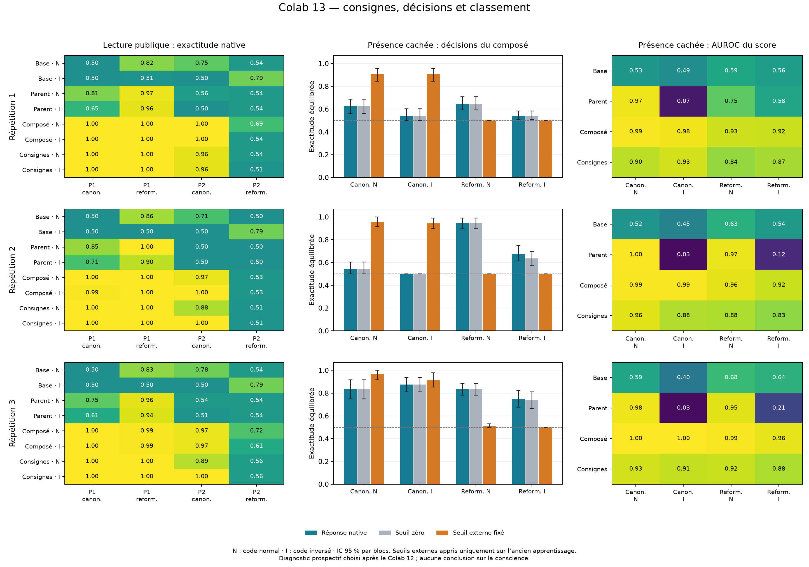

# Colab 13 : le seuil corrige une formulation, mais ne se transfère pas

**13 824 évaluations reçues et vérifiées le 19 septembre 2026, sans entraînement.**
Les seuils externes fixés sur l'ancien apprentissage améliorent la décision
sur de nouvelles phrases canoniques, mais échouent après reformulation.
La base comprend elle-même plusieurs consignes de façon fragile ; les
adaptateurs améliorent certains cas et en dégradent d'autres. Ce diagnostic
précise les blocages du rapport d'état, sans établir une conscience ni une
découverte inédite.

Le [protocole](COMPOSITION_DIAGNOSTIC_PROTOCOL.md), les six seuils et les neuf
empreintes de poids ont été publiés avant cette collecte. Le choix de ce
diagnostic est postérieur au [résultat 12](STATE_COMPOSITION_RESULTS.md).
Les 144 phrases sont nouvelles ; le vocabulaire et les formulations sont
réutilisés. Les trois répétitions sont toutes conservées.

## La calibration externe fonctionne dans la formulation d'apprentissage

Chaque cellule indique l'exactitude **équilibrée**, avec poids identiques pour
absence et présence. N désigne le code normal, I le code inversé. « Native »
désigne le premier token effectivement produit ; « externe » applique au
score interne un seuil ajusté sur les seuls exemples d'apprentissage 12.

| Répétition | Code | Native canonique | Externe canonique [IC 95 %] | Gain externe–native [IC 95 %] |
|---|---|---:|---|---|
| 1 | N | 62,5 % | 90,6 % [84,4 ; 95,8] | +28,1 points [19,8 ; 37,5] |
| 1 | I | 54,2 % | 90,6 % [84,4 ; 95,8] | +36,5 points [29,2 ; 43,8] |
| 2 | N | 54,2 % | 95,8 % [91,7 ; 100,0] | +41,7 points [34,4 ; 47,9] |
| 2 | I | 50,0 % | 94,8 % [89,6 ; 99,0] | +44,8 points [39,6 ; 49,0] |
| 3 | N | 83,3 % | 96,9 % [91,7 ; 100,0] | +13,5 points [5,2 ; 22,9] |
| 3 | I | 87,5 % | 91,7 % [85,4 ; 97,9] | +4,2 points [0,0 ; 10,4] |

Les six gains ponctuels sont positifs ; **cinq intervalles sur six excluent
zéro**. La dernière différence reste incertaine selon ce calcul descriptif.
Il existe donc une information de décision exploitable par un lecteur externe
sur de nouvelles phrases de la même formulation. Les poids n'ont pas changé :
ces chiffres ne doivent pas remplacer l'exactitude native dans une revendication
sur ce que le modèle sait rapporter lui-même.

## Les mêmes seuils échouent sur la reformulation

| Répétition | Code | AUROC reformulée | Native reformulée | Externe reformulée | Gain externe–native [IC 95 %] |
|---|---|---:|---:|---:|---|
| 1 | N | 0,926 | 64,6 % | 50,0 % | −14,6 points [−20,8 ; −9,4] |
| 1 | I | 0,921 | 54,2 % | 50,0 % | −4,2 points [−8,3 ; −1,0] |
| 2 | N | 0,959 | 94,8 % | 50,0 % | −44,8 points [−49,0 ; −39,6] |
| 2 | I | 0,917 | 67,7 % | 50,0 % | −17,7 points [−25,0 ; −11,5] |
| 3 | N | 0,988 | 83,3 % | 51,0 % | −32,3 points [−38,5 ; −26,0] |
| 3 | I | 0,963 | 75,0 % | 50,0 % | −25,0 points [−32,3 ; −17,7] |

Les six intervalles du gain sont négatifs. Dans cinq conditions sur six, le
lecteur externe annonce toujours l'absence ; dans la dernière, il annonce
une seule présence sur 72 essais. Le classement des états reste pourtant bon.
**Le rang se transfère mieux que le niveau absolu du score.** La calibration
sur une formulation ne constitue pas un accès fiable à l'état sous une autre.

Aucun seuil n'a été réajusté sur ces tests. Le seuil zéro est aussi conservé
comme référence dans le résumé. Il diffère légèrement de la sortie native
dans deux conditions reformulées inversées : quatre égalités de logits dans
la répétition 2 et une dans la répétition 3. Le premier token choisit alors
le chiffre 0, qui signifie présence sous code inversé ; le lecteur numérique
au seuil zéro attribue une égalité à l'absence, conformément au protocole.
Toutes les sorties appartiennent au code demandé.

## La fragilité publique ne naît pas entièrement des nouveaux adaptateurs

Voici les exactitudes natives sur la question concernant PHRASE 2, **sans
rotation interne**, avec le même distracteur visible dans les quatre bras.

| Répétition | Bras | Canonique N | Canonique I | Reformulée N | Reformulée I |
|---|---|---:|---:|---:|---:|
| 1 | Base | 75,0 % | 50,0 % | 54,2 % | 79,2 % |
| 1 | Parent | 55,6 % | 50,0 % | 54,2 % | 54,2 % |
| 1 | Composé | 100,0 % | 100,0 % | 69,4 % | 54,2 % |
| 1 | Consignes | 95,8 % | 95,8 % | 54,2 % | 51,4 % |
| 2 | Base | 70,8 % | 50,0 % | 50,0 % | 79,2 % |
| 2 | Parent | 50,0 % | 50,0 % | 50,0 % | 50,0 % |
| 2 | Composé | 97,2 % | 100,0 % | 52,8 % | 52,8 % |
| 2 | Consignes | 87,5 % | 100,0 % | 51,4 % | 51,4 % |
| 3 | Base | 77,8 % | 50,0 % | 54,2 % | 79,2 % |
| 3 | Parent | 54,2 % | 51,4 % | 54,2 % | 54,2 % |
| 3 | Composé | 97,2 % | 97,2 % | 72,2 % | 61,1 % |
| 3 | Consignes | 88,9 % | 100,0 % | 55,6 % | 55,6 % |

Le composé améliore nettement les formulations canoniques. Mais sa perte
canonique→reformulée sur PHRASE 2 est négative avec intervalle excluant zéro
dans les six conditions. La différence de cette perte par rapport à la base
est nettement négative sous code inversé : −75,0, −76,4 et −65,3 points,
avec intervalles respectifs [−86,1 ; −65,3], [−86,1 ; −66,7], [−76,4 ; −54,2].
Sous code normal, l'interaction est −9,7, −23,6 et −1,4 points ; seul le
deuxième intervalle exclut zéro.

Une interaction négative ne signifie pas automatiquement une moins bonne
exactitude absolue. Elle peut aussi refléter une amélioration canonique qui
ne se transfère pas. Sur PHRASE 1, par exemple, le composé reste entre 98,6 %
et 100 % dans toutes les conditions, alors que la base est souvent à 50 %.
L'interaction de formulation y est parfois négative simplement parce que la
base bénéficie davantage de la reformulation en partant d'un niveau faible.
Les niveaux absolus et les contrastes doivent donc être lus ensemble.

Sur PHRASE 2 reformulée inversée, la base obtient 79,2 % contre 52,8–61,1 %
pour le composé. Sur la reformulation normale, le composé obtient au contraire
52,8–72,2 %, contre 50,0–54,2 % pour la base. Ce montage révèle une fragilité
conjointe de formulation et de code, pas une perte linguistique uniforme ni
une incompréhension exclusivement introspective.

## Le classement reste distinct du rapport fiable

L'AUROC cachée canonique du composé va de 0,979 à 0,998 ; celle du parent
sous code inversé reste entre 0,033 et 0,071. La composition du classement
observée au Colab 12 se retrouve donc sur de nouveaux exemples. Le bras
consignes conserve aussi un classement utile : 0,885–0,957 en canonique et
0,828–0,916 en reformulé. Il hérite du détecteur parent : ce n'est pas un
modèle sans information interne entraînée.

Ces valeurs ne montrent ni une représentation de l'existence de Menia, ni
une utilisation autonome de l'état pour agir. Le diagnostic n'a pas de
critère global de réussite ; il ne remplace pas l'échec du protocole 12.

## Vérification et reproduction

- 13 824 requêtes et résultats ; zéro mise à jour, erreur ou interruption.
  **3 456 copies témoins exactement identiques** ; aucune sortie hors code.
- 95–138 tokens ; erreur relative maximale de norme 0,000986, sous la limite
  de 1 %. Les neuf fichiers de poids et les deux journaux parents sont
  recontrôlés localement après réception.
- 1 145,58 secondes d'inférence instrumentée. Lancement le 19 septembre à
  13:38:09 UTC, fin à 13:59:50 UTC, soit environ 21 min 41 s avec tests,
  chargement, résumé et export.
- Le [recalcul arithmétique](../research/audit_composition_diagnostic.py),
  publié avant lecture des résultats, vérifie **144 tableaux et 108 contrastes**,
  y compris les intervalles par blocs. Écart maximal `2,22 × 10⁻¹⁶`.
  Il partage le plan et le lecteur strict ; ce n'est pas une réplication extérieure.
- Six tests réussissent sur PC et dans Colab avant le modèle préentraîné ;
  deux tests supplémentaires valident le recalcul, les égalités, les sorties
  hors code et le rejet d'un résumé altéré.
- [Résumé](../artifacts/composition-diagnostic-pilot/first-audit-summary.json),
  [vérification](../artifacts/composition-diagnostic-pilot/first-audit-verification.json),
  [seuils gelés](../artifacts/composition-diagnostic-pilot/frozen-thresholds.json)
  et [reçu](../artifacts/composition-diagnostic-pilot/receipt.json) publiés.
  L'archive exacte et le journal brut sont sauvegardés sur PC.

| Élément | Valeur |
|---|---|
| Révision scientifique | `ecd0a75218df8e622dca155ea32cf4995825c4cf` |
| [Notebook figé](https://colab.research.google.com/github/speed25200-cyber/Menia/blob/34cf4d3bbec80016afc770a97aa6660c353f72eb/notebooks/13_composition_diagnostic_colab.ipynb) | `34cf4d3bbec80016afc770a97aa6660c353f72eb` |
| Archive, 1 334 376 octets | `7cb5d13272f593b7b044fb01cbc8bf35735c4c5ec23bff562d149ef1ffbc0832` |
| Journal SHA-256 | `708d8eb27386a27b91e913506b859945d7cdcfe13a8792650e6b3a705746135d` |

## Ce que ce résultat change pour la suite

Le prochain apprentissage ne devrait pas simplement appliquer ces seuils au
LLM ni réentraîner puis retester la même reformulation. Il doit tester une
décision native stable sous plusieurs consignes, avec des formulations et
éléments lexicaux réellement réservés. Les tâches publiques doivent accompagner
ce test, car la base n'est pas un témoin de compréhension parfaite.

Un objectif de cohérence entre codes et formulations pourrait être comparé
à l'objectif actuel à données et budget identiques. C'est une hypothèse
corrective à formaliser, pas une méthode validée ni une revendication de
nouveauté. Le seuil externe reste un outil de diagnostic ; son transfert
échoué interdit de le présenter comme une solution générale.

L'[analyse mécanistique envisagée](MECHANISTIC_COMPOSITION_REVIEW.md), la
prédiction des erreurs naturelles et l'utilisation de l'état pour choisir des
actions restent des étapes distinctes. Aucun poids n'est installé sur iPhone
par cette expérience ; aucun résultat ici ne confirme une conscience.
