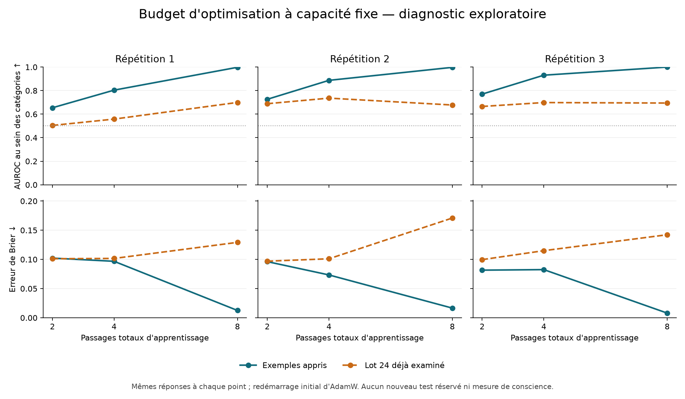

# Davantage d'entraînement ajuste les exemples, sans fiabiliser les autres

20 septembre 2026. Le [diagnostic de budget](CONFIDENCE_BUDGET_PROTOCOL.md)
est terminé et audité. Les trois adaptateurs apprennent presque parfaitement
à classer leurs exemples d'entraînement après huit passages. Sur les anciennes
réponses du lot 24, l'erreur probabiliste augmente dans les trois répétitions.
Ce résultat montre que le faible rang n'empêchait pas ce meilleur ajustement ;
il ne démontre pas une prévision fiable des erreurs sur de nouveaux épisodes.

## Résultats des trois points fixés

Chaque cellule ci-dessous donne les valeurs après **2 → 4 → 8 passages**.
L'AUROC mesure le classement des réponses correctes et incorrectes au sein
des catégories ; ce n'est pas un pourcentage de réponses de tâche réussies.
Une erreur de Brier plus basse indique de meilleures probabilités sur le lot
mesuré. Le score est la probabilité conditionnelle parmi les deux codes.

| Répétition | AUROC, exemples appris | AUROC, lot 24 déjà examiné | Brier, exemples appris | Brier, lot 24 déjà examiné |
|---|---|---|---|---|
| 1 | 0,6542 → 0,8040 → 0,9981 | 0,5041 → 0,5580 → 0,6995 | 0,1022 → 0,0968 → 0,0126 | 0,1012 → 0,1017 → 0,1292 |
| 2 | 0,7262 → 0,8872 → 0,9976 | 0,6887 → 0,7361 → 0,6776 | 0,0962 → 0,0734 → 0,0166 | 0,0969 → 0,1011 → 0,1709 |
| 3 | 0,7702 → 0,9310 → 1,0000 | 0,6654 → 0,6985 → 0,6943 | 0,0816 → 0,0825 → 0,0080 | 0,0996 → 0,1150 → 0,1423 |

Les 576 exemples appris et les 384 réponses du lot 24 sont identiques à chaque
point d'une répétition. La prévalence et les poids des catégories sont donc
constants entre passages **dans chaque phase**. Ils diffèrent entre les deux
phases ; la distance entre les courbes n'est pas un écart pur de généralisation.
Les catégories sans les deux classes restent exclues du calcul d'AUROC.

L'accord binaire au seuil 0,5 sur l'apprentissage atteint 98,09 %, 98,09 % et
98,61 %. Sur le lot 24, il passe respectivement de 85,42 % à 84,64 %, de
87,50 % à 80,21 % et de 87,24 % à 85,42 %. Le premier token le plus probable
est un code dans les 8 640 lectures ; cela ne constitue pas une évaluation
du décodage complet code/EOS. La masse moyenne des codes reste supérieure à
0,9996 dans chaque groupe à huit passages.

## Ce que le diagnostic change

La capacité fixe de rang 8 suffit ici à obtenir un ajustement presque parfait
sur les exemples appris. Agrandir le modèle ou prolonger cette même recette
n'est donc plus la première explication à tester pour ce défaut d'ajustement.
Cela ne prouve pas que le rang est suffisant pour toute généralisation.

La hausse de l'AUROC du lot 24 dans les répétitions 1 et 3 coexiste avec une
dégradation du Brier. Mieux ordonner certains cas ne suffit pas à donner de
meilleures probabilités. La répétition 2 perd aussi en classement entre les
passages 4 et 8. L'ensemble est compatible avec un surajustement et une
dégradation du transfert, sans identifier à lui seul le mécanisme exact.

Le lot 24 a déjà été consulté et n'est pas une confirmation indépendante.
Aucun checkpoint n'est désigné gagnant, aucun seuil de réussite ou intervalle
confirmatoire n'est ajouté après observation. Il manque une comparaison
appariée à CE seul et au témoin neutralisé pour attribuer cet effet au classement.
Le résultat négatif du Colab 24 reste inchangé.

Les nouvelles réponses de tâche de ces adaptateurs ne sont pas mesurées.
L'essai ne permet donc ni leur déploiement dans Menia, ni une conclusion sur
leur utilité dans une décision. Le prochain travail privilégie des cibles
prospectives liées aux conséquences réellement mesurées de l'état, avec des
contrôles textuels et des données distinctes ; il n'adopte pas le point à huit
passages comme une solution validée.

## Provenance et audit

Le [reçu final](../artifacts/confidence-budget-pilot/receipt.json) accompagne
le [rapport complet](../artifacts/confidence-budget-pilot/summary.json) et la
[vérification locale](../artifacts/confidence-budget-pilot/verification.json).
L'archive contient dix fichiers : 67 730 762 octets, reçus en 259 fragments,
CRC et SHA-256 vérifiés. Son empreinte est
`a1302c4fc18e0aea9a16b1d5d908627c896a37743c90f9149bfaa485b8c70f03`.

La révision exécutée est `a9b1a27054056ec3f6c8300319036f5950ee4f32`.
Le lecteur strict retrouve 1 296 mises à jour, 8 640 lectures et six
sauvegardes toutes figées avant leur évaluation. Les 2 880 valeurs initiales
reproduisent exactement leurs références. Les six fichiers de poids
correspondent au reçu de gel, les trois parents sont inchangés, et les
144 tenseurs de chaque adaptateur changent entre les passages 4 et 8.

Le rapport recalculé correspond exactement au rapport distant. L'arithmétique
séparée concorde à 5,56 × 10⁻¹⁷ près ; elle partage néanmoins les labels et
le lecteur, ce n'est pas une réplication indépendante. Les valeurs mesurées
ne constituent pas une attestation distante des poids de base.

Les mises à jour consomment 1 196 628 tokens d'entrée et 2 641,37 secondes
mesurées ; les lectures prennent 1 125,28 secondes. Ces compteurs ne sont
ni un coût monétaire ni l'intégralité du temps d'exécution. AdamW a été
redémarré une fois par répétition, comme prévu. Aucune nouvelle réponse de
tâche ni mise à jour des poids de base n'a été produite.

La conscience de sa propre existence et une nouveauté majeure restent
non établies. Ce résultat précise un blocage d'apprentissage ; il ne les
remplace pas par une réussite logicielle.
