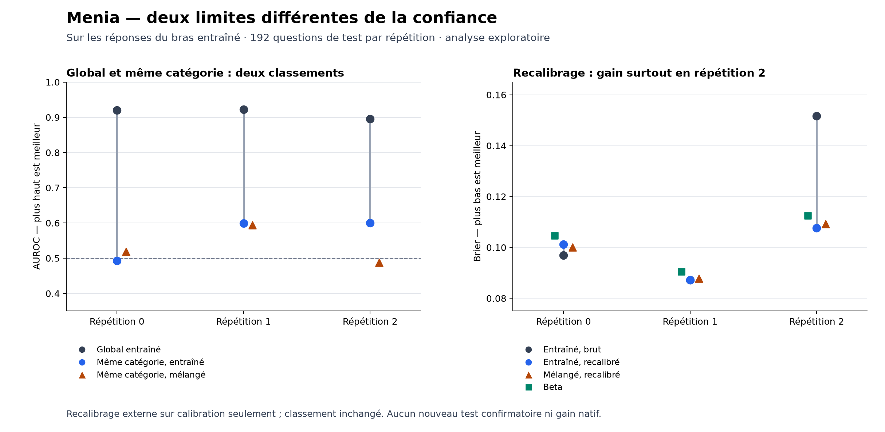

# Séparer calibration et discrimination après le Colab 23

20 septembre 2026. Analyse exploratoire décidée après lecture des
[résultats du Colab 23](NATIVE_ANSWER_CONFIDENCE_RESULTS.md). Elle conserve
l'échec du critère principal et ne fournit pas une nouvelle confirmation.
Aucun appel LLM ni apprentissage de ses poids n'est requis.

## Deux questions distinctes

La première est de savoir quelles paires contribuent à l'AUROC globale.
On sépare les paires réponse correcte / incorrecte appartenant à une même
catégorie des paires entre catégories. Chaque égalité de scores vaut un
demi-succès. Le score global est exactement la moyenne des deux AUROC,
pondérée par leurs nombres de paires. Une composante sans paire reste
indéfinie. Ces paires partagent leurs observations ; leur nombre ne constitue
pas un nouvel effectif indépendant. Ce découpage est une identité descriptive,
pas un nouveau test statistique ou une méthode inédite.

La seconde question est de savoir si une transformation des probabilités
améliore leur Brier sans apprendre à mieux classer les réponses. La
[documentation de calibration](https://scikit-learn.org/stable/modules/calibration.html)
distingue ces propriétés et décrit le recalibrage sigmoïde. Nous utilisons
ici une variante régularisée à pente non négative, et non l'implémentation
Platt exacte de scikit-learn. Un changement monotone strict conserve l'ordre
des scores ; une pente nulle ou des égalités numériques peuvent créer des
ex æquo. La méthode ne fournit pas d'information nouvelle au modèle.

## Méthode fixée pour ce diagnostic

- Pour chaque répétition, producteur et juge, ajuster une sigmoïde sur les
  seuls 96 exemples de calibration : 27 ajustements, tous rapportés.
- Entrée scalaire : logit du score natif, avec probabilités bornées à
  `[10⁻¹², 1−10⁻¹²]`. Centrage et échelle calculés sur la calibration.
- Objectif : log-vraisemblance négative moyenne plus `b²/(2n)`, où `b ≥ 0`
  est la pente standardisée et `n = 96`. Interception non pénalisée.
- Newton avec recherche de pas ; au plus 100 itérations ; résidu des
  conditions d'optimalité ≤ 10⁻⁹. Un échec numérique arrête l'analyse.
- Pas de sélection d'hyperparamètre, de meilleur juge ou de répétition.
  Les comparateurs Beta et de confiance de sortie du parent restent inchangés.
- Rapporter Brier et AUROC avant/après, ainsi que la décomposition des paires.
  Aucun nouveau seuil de succès ou intervalle confirmatoire.

Le fichier de données doit correspondre à l'empreinte du journal déjà audité.
Le diagnostic vérifie la reconstruction des métriques originales avec la
tolérance de l'audit parent (10⁻¹⁰, relative aux valeurs supérieures à 1).
Un premier passage s'est arrêté sur une égalité flottante exacte trop stricte :
seul le comparateur de confiance de sortie différait, de 2,23 × 10⁻¹⁶ au plus.
Le contrôle reprend la tolérance déjà utilisée pour l'archive, sans changer
l'ajustement ni consulter de nouveaux scores recalibrés à cette étape.
Les données de test ne sont pas utilisées pour ajuster les
coefficients ; toutefois, leur résultat précédent a motivé cette analyse.
Un gain restera donc exploratoire et externe au LLM.

```sh
python -m unittest tests_research.test_confidence_calibration_diagnostic -v
python -m research.confidence_calibration_diagnostic JOURNAL --output artifacts/confidence-calibration-diagnostic/report.json
```

## Résultats exploratoires

**Les deux difficultés sont présentes.** La majorité des paires contribuant
au score global opposent des catégories différentes. Un recalibrage améliore
surtout la répétition 2 ; il ne change pas l'ordre des réponses. Les cinq
tests passent, les 27 ajustements convergent et aucun poids LLM n'est modifié.



### Origine du classement global

Le tableau concerne le juge à cibles mesurées. La colonne « même catégorie »
agrège les paires de même famille et difficulté, pondérées par leurs effectifs,
sans les confondre avec des observations indépendantes.

| Répétition | Producteur | AUROC globale | Même catégorie | Entre catégories | Paires entre catégories |
|---|---|---:|---:|---:|---:|
| 0 | Base | 0.9008 | 0.5078 | 0.9342 | 92.16 % |
| 0 | Entraîné | 0.9199 | 0.4932 | 0.9502 | 93.36 % |
| 1 | Base | 0.8972 | 0.5652 | 0.9291 | 91.23 % |
| 1 | Entraîné | 0.9224 | 0.5994 | 0.9483 | 92.59 % |
| 2 | Base | 0.8977 | 0.6675 | 0.9194 | 91.41 % |
| 2 | Entraîné | 0.8952 | 0.5997 | 0.9232 | 91.35 % |

Ainsi, 91,23–93,36 % des paires des ensembles principaux relèvent du contraste
entre catégories. Sur les réponses propres du bras entraîné, l'AUROC au sein
d'une catégorie vaut 0,4932, 0,5994 et 0,5997. Pour le juge mélangé sur ces
mêmes réponses, elle vaut 0,5186, 0,5938 et 0,4874. Le résultat suggère une
information individuelle variable ; il ne permet ni de l'affirmer robuste
dans les trois répétitions ni de conclure qu'elle est partout absente.

### Effet d'une calibration externe

Les Briers ci-dessous sont calculés sur les mêmes réponses. Aucun intervalle
ou nouveau seuil n'est ajouté après lecture des données.

| Répétition | Producteur | Entraîné brut | Entraîné recalibré | Mélangé recalibré | Beta inchangé |
|---|---|---:|---:|---:|---:|
| 0 | Base | 0.114407 | 0.119100 | 0.115736 | 0.109118 |
| 0 | Entraîné | 0.096913 | 0.101251 | 0.099996 | 0.104681 |
| 1 | Base | 0.116981 | 0.118707 | 0.117202 | 0.124035 |
| 1 | Entraîné | 0.087200 | 0.087198 | 0.087725 | 0.090535 |
| 2 | Base | 0.147870 | 0.104394 | 0.108793 | 0.110468 |
| 2 | Entraîné | 0.151610 | 0.107610 | 0.109227 | 0.112526 |

Sur ses propres réponses de la répétition 2, le Brier entraîné passe de
0,151610 à 0,107610. Dans la répétition 0, il se dégrade de 0,096913 à
0,101251 ; dans la répétition 1, il reste proche de 0,087200. Il serait donc
incorrect de présenter ce recalibrage comme une correction générale réussie.
L'AUROC ne change dans aucun des 27 ajustements observés. La transformation
modifie les probabilités, pas le classement ni les décisions natives du LLM.

### Vérification numérique séparée

L'audit relit le journal exact et recalcule les bonnes réponses sans utiliser
le correcteur de l'analyse. Il reconstruit les partitions d'AUROC par une
matrice vectorisée, puis ajuste chaque calibrateur par optimisation scalaire
du profil de vraisemblance et recherche de racine de Brent pour l'interception,
au lieu du Newton à deux paramètres utilisé dans l'analyse.

Les 27 contrôles passent. Écart maximal d'objectif : 1,12 × 10⁻¹⁶ ; écart
maximal de probabilité de test : 1,56 × 10⁻⁸ ; différence sur la décomposition
d'AUROC : zéro. Les versions sont NumPy 2.2.6 et SciPy 1.15.3. Le contrôle
réutilise les données et la recette : ce n'est pas une réplication externe.
Les tests logiciels couvrent ex æquo, classe unique, gradients, contrainte
de pente et exclusion des données de test lors de l'ajustement.

## Décision de recherche

Le critère natif du Colab 23 reste négatif. Coller cette formule au score de
sortie ne suffirait pas à produire une connaissance individuelle de ses erreurs.
Le prochain apprentissage doit traiter séparément deux objectifs : conserver
des probabilités adéquates et apprendre des différences entre cas de même
catégorie. Ses contrôles devront distinguer le contenu des exemples, la
capacité de l'adaptateur et la dégradation éventuelle de la résolution.
Il faudra de nouvelles questions pour une confirmation, sans sélectionner
uniquement la répétition favorable ni supprimer les catégories difficiles.

Ce diagnostic ne mesure ni l'usage causal d'un état interne pour agir ni une
conscience de sa propre existence. Aucun principe de calibration ou de
décomposition des scores n'est revendiqué comme inédit.

[Résultats complets](../artifacts/confidence-calibration-diagnostic/report.json) ·
[Audit numérique](../artifacts/confidence-calibration-diagnostic/verification.json) ·
[Critère parent inchangé](NATIVE_ANSWER_CONFIDENCE_RESULTS.md).
