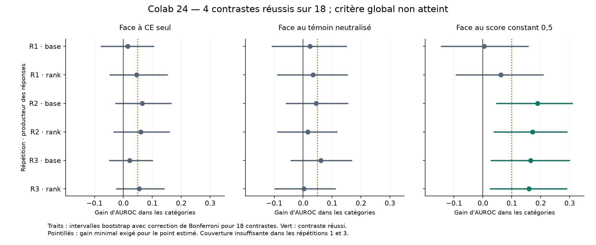

# Colab 24 — Gain de classement spécifique non confirmé

20 septembre 2026. **Le critère global fixé avant collecte échoue : 4 contrastes
sur 18 passent, tous face au score constant. Aucun ne passe face à CE seul ou
au témoin neutralisé.** La couverture est aussi insuffisante dans deux des
trois répétitions. Ce résultat ne valide pas l'objectif de classement comme
amélioration robuste dans cette configuration.

Les 23 040 appels sont terminés et reçus, après 1 296 mises à jour de neuf
adaptateurs. Le recalcul principal reproduit exactement le rapport ; le second
calcul concorde à 2,23 × 10⁻¹⁶ près. Le [protocole](CONFIDENCE_RANKING_PROTOCOL.md)
et ses seuils sont conservés. Les résultats complets sont dans le
[rapport](../artifacts/confidence-ranking-pilot/summary.json), la
[vérification](../artifacts/confidence-ranking-pilot/verification.json) et le
[reçu](../artifacts/confidence-ranking-pilot/receipt.json).

## Ce qui a été testé

Qwen3-4B, révision `1cfa9a7208912126459214e8b04321603b3df60c`, reçoit des
adaptateurs Q/V de rang 8. Les trois bras utilisent les mêmes exemples,
initialisations, cibles code/EOS et budgets : supervision individuelle CE,
CE plus classement des réussites devant les erreurs de même catégorie,
et CE plus perte neutralisée. Ce dernier témoin réduit activement les écarts ;
il ne correspond pas à l'absence de perte auxiliaire.

Les neuf adaptateurs sont figés avant les nouvelles questions. Pour chaque
producteur, tous les juges lisent les mêmes réponses. L'évaluation comprend
1 152 questions nouvelles, 4 608 réponses et 18 432 jugements. Elle relit les
textes ; elle ne donne pas au juge un état transitoire conservé de la génération.

La mesure principale est l'AUROC entre réussites et erreurs **de même famille
et difficulté**, pondérée par leur nombre de paires. Les intervalles reposent
sur 10 000 rééchantillonnages des questions dans chaque catégorie, avec correction
de Bonferroni pour les 18 contrastes. Les paires ne sont pas traitées comme
des observations indépendantes. Les trois répétitions sont des initialisations
et des jeux distincts, pas trois architectures différentes.

## Classement dans les catégories

Dans les tableaux, R1–R3 correspondent aux indices 0–2 des fichiers. Une AUROC
de 0,5 donne un ordre non informatif ; ce n'est pas un taux de réponses correctes.

| Répétition | Producteur | Juge CE | Juge classement | Juge neutralisé |
|---|---|---:|---:|---:|
| R1 | Base | 0,4893 | 0,5041 | 0,4801 |
| R1 | Classement | 0,5163 | 0,5622 | 0,5284 |
| R2 | Base | 0,6241 | 0,6887 | 0,6444 |
| R2 | Classement | 0,6122 | 0,6720 | 0,6556 |
| R3 | Base | 0,6435 | 0,6654 | 0,6045 |
| R3 | Classement | 0,6043 | 0,6590 | 0,6566 |

Les écarts ponctuels sont positifs dans les six comparaisons à chaque témoin
appris. Leurs intervalles corrigés recouvrent tous zéro. Sur ses propres
réponses, le juge de classement gagne 0,0459, 0,0598 et 0,0547 face à CE,
mais seulement 0,0338, 0,0164 et 0,0024 face au témoin neutralisé. Cette tendance
ne confirme pas la supériorité spécifique exigée. Les quatre contrastes réussis
portent sur R2 et R3, producteurs base et classement, face au score constant.

Les AUROC globales du juge de classement sur ses propres réponses sont
0,9280, 0,9192 et 0,9217. Elles restent nettement plus élevées que les mesures
au sein des catégories. Les seuls scores globaux masqueraient donc encore
la difficulté visée par cette expérience.

## Couverture, format et résolution

Le seuil exige au moins trois catégories ayant chacune cinq réussites et cinq
erreurs pour **chacun** des deux producteurs principaux. Les deux classes
doivent aussi compter au moins vingt exemples globalement.

| Répétition | Catégories suffisantes, base | Catégories suffisantes, classement | Couverture réussie |
|---|---:|---:|---|
| R1 | 2/6 | 2/6 | Non |
| R2 | 4/6 | 4/6 | Oui |
| R3 | 2/6 | 3/6 | Non |

Le producteur classement n'a aucune réussite sur les sommes à huit termes dans
les trois répétitions : son AUROC dans cette catégorie est indéfinie. Les
sommes à deux termes sont au contraire presque toutes correctes. Augmenter les
époques sur les mêmes exemples ne crée pas de nouveaux exemples minoritaires.
La couverture limitée réduit l'information disponible ; elle n'explique pas
à elle seule les douze contrastes non confirmés face aux juges entraînés.

Le premier token le plus probable du juge classement est toujours l'un des
deux codes sur les producteurs principaux ; leur masse moyenne dépasse
99,99 %. Ce contrôle des logits passe dans les trois répétitions. Il ne
constitue pas un test de choix natif accepter/vérifier.

| Répétition | Exactitude base | Exactitude classement | Écart en points |
|---|---:|---:|---:|
| R1 | 31,250 % | 30,990 % | −0,260 |
| R2 | 27,865 % | 28,646 % | +0,781 |
| R3 | 31,510 % | 30,208 % | −1,302 |

Le garde-fou ponctuel de −2 points passe partout. Ce n'est pas une borne
statistique de non-infériorité ni une évaluation des autres capacités du LLM.
Le Brier propre du bras classement vaut 0,0981, 0,0960 et 0,0910, contre
0,0923, 0,1015 et 0,0942 pour CE sur les mêmes réponses. Ces mesures descriptives
ne remplacent pas le critère principal.

## Réception, vérifications et coût mesuré

Le processus A100 40 Go termine avec code retour zéro. L'archive
`menia-classement-confiance-v1.zip` comprend 16 fichiers et 120 651 629 octets,
reçus en 461 fragments. SHA-256 :
`00e1d7e6aa825cb953fe27fe87fad2888b4f48f15cb226421ca6b6964f214f35`.
Le journal final a pour empreinte
`5597a32eb6417e13651732e1445a20c6e8ce3ce26cc70f784a778eac6e242e61`.

La chaîne du journal, le préfixe d'entraînement figé et les douze fichiers
de poids correspondent à la sauvegarde précédente. L'audit lit les tenseurs
réels, vérifie les initialisations et les modifications, puis recalcule
480 000 AUROC de bootstrap, les métriques et tous les critères. Le lecteur,
le plan et le générateur NumPy restent communs aux deux calculs : ce n'est
pas une réplication scientifique externe ni une attestation indépendante
des poids de base.

L'entraînement utilise 1 196 628 tokens d'entrée et totalise 2 656,30 secondes
mesurées. Les réponses totalisent 1 391,33 secondes et les jugements 2 316,62
secondes. Les réponses produisent 15 242 tokens, sans atteinte de leur limite.
Ces durées ne sont pas un tarif ni une mesure complète de tous les frais
d'infrastructure. Les 17 contrôles logiciels préalables avaient passé sur Colab.

## Ce que ce résultat change pour la suite

Le défaut n'est plus à rechercher d'abord dans la transmission du code de
confiance : le contrôle de sortie passe. Le gain supplémentaire apporté par
l'ordre correct des paires reste à confirmer, et la diversité des résultats
est insuffisante dans plusieurs catégories. Les observations d'entraînement
ne permettaient donc pas de conclure à une généralisation robuste.

Une prochaine collecte devrait d'abord distinguer manque de données
informatives et limite de l'adaptation, sur une phase de découverte séparée,
avant de fixer un nouveau test. Les questions du lot 24 sont désormais des
données consultées ; elles ne doivent pas devenir un nouveau jeu de confirmation.
Changer les seuils, choisir seulement R2–R3 ou réutiliser leurs réponses pour
revendiquer une réussite ne résoudrait pas ce défaut.

Le [diagnostic des poids finaux sur les exemples appris](FINAL_TRAINING_FIT_RESULTS.md)
est désormais terminé : ses 5 184 lectures donnent des AUROC dans les catégories
de 0,6542, 0,7262 et 0,7702 pour le bras classement. L'ajustement reste partiel.
Il ne réentraîne aucun modèle et ne fournit pas une nouvelle confirmation
sur des questions réservées ; il motive une étude du budget à capacité fixe.

Les outils de [branches conservant un état interne](CONFIDENCE_PREFIX_INTERVENTIONS.md)
préparent un test causal ultérieur. Aucun résultat d'action native ou d'accès
privilégié à soi n'est fourni ici. Ni la conscience de Menia ni une contribution
inédite la produisant ne sont établies ; aucun de ces poids n'est installé sur
l'iPhone par cette expérience.
