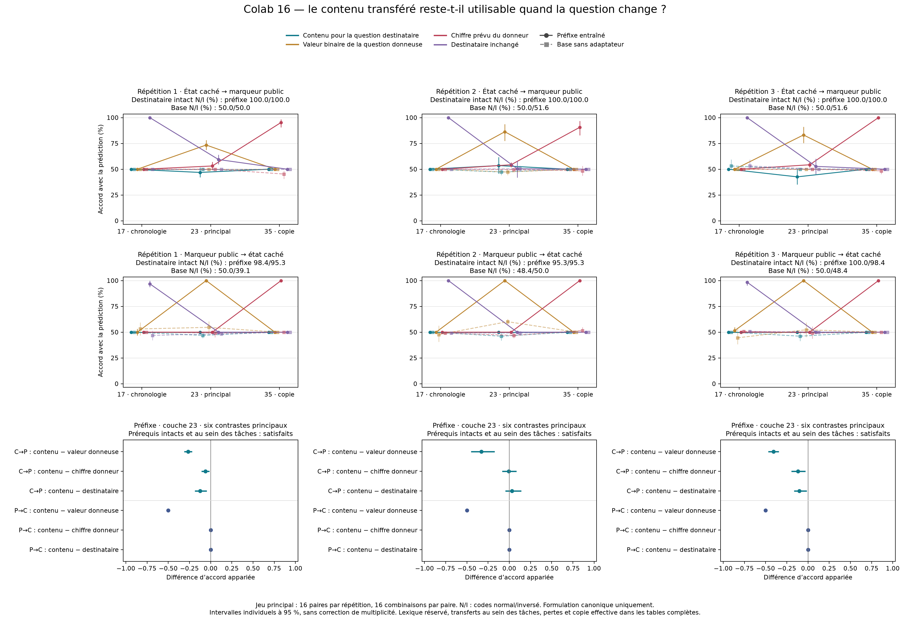

# Colab 16 : le transfert suit surtout la question du donneur

19 septembre 2026. **Les résultats favorisent une valeur binaire conditionnée
par la question du donneur, face au contenu utilisable pour la question du
destinataire.** Les six contrastes principaux entre ces deux prédictions sont
négatifs, avec intervalles individuels excluant zéro. Les dix-huit prérequis
de compétence et de transfert au sein de chaque tâche passent. Ce résultat
réduit la portée du succès du Colab 15 : il ne confirme pas un état général
réutilisable entre questions, ni un modèle de soi.

Le [protocole](CROSS_TASK_INTERCHANGE_PROTOCOL.md), les quatre prédictions,
les trois sites et les dix-huit contrastes principaux sont fixés avant collecte.
Les trois checkpoints et la base sont conservés sans sélection après résultat.
Aucun poids ni alignement n'est appris dans cette expérience.

## Comparaison principale

Chaque contexte contient un état caché (présence d'une rotation) et un marqueur
public. La question demande l'un des deux. Le code de réponse normal ou inversé
détermine ensuite le chiffre à produire. L'échange transfère le vecteur entier
du dernier token à la couche 23 ; le destinataire conserve les autres états
de son contexte. Les deux questions étaient déjà présentes avant la capture.

Accord avec les quatre prédictions, lot principal, checkpoints `prefix` :

| Donneur → destinataire | Répétition | Contenu pour la question destinataire | Valeur de la question donneuse | Chiffre prévu du donneur | Destinataire inchangé |
|---|---:|---:|---:|---:|---:|
| Caché → public | 1 | 46,88 % | 73,44 % | 53,13 % | 59,38 % |
| Caché → public | 2 | 53,52 % | 86,33 % | 54,30 % | 50,39 % |
| Caché → public | 3 | 42,58 % | 83,20 % | 54,30 % | 52,73 % |
| Public → caché | 1 | 50,00 % | 100,00 % | 50,00 % | 50,00 % |
| Public → caché | 2 | 50,00 % | 100,00 % | 50,00 % | 50,00 % |
| Public → caché | 3 | 50,00 % | 100,00 % | 50,00 % | 50,00 % |

Ces colonnes ne sont pas des probabilités d'hypothèses exclusives. Leurs
prédictions coïncident sur certaines combinaisons ; le plan équilibre
séparément états, marqueurs et codes. La deuxième colonne de prédiction utilise
la valeur demandée chez le donneur, puis le **code du destinataire**. Elle
diffère donc de la copie de son chiffre final.

Les dix-huit différences appariées principales, en points de pourcentage :

| Sens | Répétition | Contenu − valeur donneuse | Contenu − chiffre donneur | Contenu − destinataire |
|---|---:|---:|---:|---:|
| Caché → public | 1 | −26,56 [−31,25 ; −21,88] | −6,25 [−10,94 ; −1,56] | −12,50 [−18,75 ; −4,69] |
| Caché → public | 2 | −32,81 [−45,31 ; −17,19] | −0,78 [−8,59 ; 8,59] | 3,13 [−4,69 ; 14,06] |
| Caché → public | 3 | −40,63 [−46,88 ; −34,38] | −11,72 [−19,53 ; −3,13] | −10,16 [−16,41 ; −1,56] |
| Public → caché | 1 | −50,00 [−50,00 ; −50,00] | 0,00 [0,00 ; 0,00] | 0,00 [0,00 ; 0,00] |
| Public → caché | 2 | −50,00 [−50,00 ; −50,00] | 0,00 [0,00 ; 0,00] | 0,00 [0,00 ; 0,00] |
| Public → caché | 3 | −50,00 [−50,00 ; −50,00] | 0,00 [0,00 ; 0,00] | 0,00 [0,00 ; 0,00] |

Aucun contraste principal ne favorise le contenu destinataire avec un
intervalle excluant zéro. Les intervalles à 95 % rééchantillonnent **16 paires**,
stratifiées par les quatre combinaisons de marqueurs, 2 000 fois. Les 256
transferts d'une cellule ne sont pas considérés comme autant de paires
indépendantes. Il n'y a ni correction de multiplicité ni verdict global ajouté.
Les intervalles dégénérés décrivent les paires observées, pas une certitude
sur tous les contextes futurs.

Les pertes dans le vocabulaire complet vont dans le même sens. Pour le
transfert caché → public, la valeur donneuse obtient 1,3684 / 0,6584 / 0,6484
nat, contre 3,7810 / 4,3547 / 4,0678 pour le contenu destinataire. Dans l'autre
sens, elles valent environ 0,000030 / 0,000266 / 0,000809, contre 5,9756 /
6,3762 / 6,0955. Les intervalles et toutes les métriques figurent dans les
agrégats complets.

## Contrôles et autres conditions

**Compétence initiale.** L'exactitude intacte cachée est de 95,31–100 % dans
les six conditions principales tâche/code ; la lecture publique est à 100 %.
Les transferts cachés au sein de la même tâche donnent 91,80 %, 91,41 % et
99,22 % ; les transferts publics, 100 % dans les trois répétitions. Les douze
prérequis intacts et les six prérequis de transfert dépassent donc le seuil
fixé de 90 %. Aucun essai n'est retiré selon sa réussite initiale.

**Chronologie et copie.** Le contrôle de couche 17 reste insensible au seul
changement d'état physique du donneur, conformément au site de perturbation.
Changer aussi sa question peut cependant modifier un transfert : cette couche
n'est pas un contrôle d'absence d'effet pour tout changement de contexte.
Au site 35, les 12 288 transferts reproduisent exactement les logits enregistrés
et le token effectif du donneur. L'accord avec son chiffre prévu peut être
inférieur à 100 % si sa réponse intacte était incorrecte ; ces métriques sont
conservées séparément. Les 4 608 remplacements par son propre vecteur sont exacts.

**Lexique réservé aux adaptateurs.** Caché → public : la valeur donneuse donne
62,50 %, 85,16 % et 72,66 %, contre 51,56 %, 53,91 % et 55,47 % pour le contenu
destinataire. Public → caché : 100 % contre 50 % dans les trois répétitions.
Les six différences secondaires correspondantes excluent zéro dans le même
sens que le lot principal. Le vocabulaire n'était pas réservé au préentraînement,
et ce lot ne teste pas une reformulation de la question.

**Base sans adaptateur.** Au site 23, les accords principaux avec le contenu
destinataire vont de 46,09 % à 50 %. L'accord avec la valeur donneuse peut monter
à 60,16 % dans le sens public → caché : les témoins ne sont donc pas tous nuls.
La compétence intacte elle-même est faible (39,06–51,56 % dans le lot principal).
La base ne fournit pas un comparateur à compréhension des consignes égale.
Tous ses tableaux et contrastes restent publiés.

Toutes les sorties appartiennent aux chiffres autorisés. Les 144 tableaux de
transfert, 48 tableaux intacts, 432 contrastes, normes de remplacement et pertes
sont conservés, sans choisir après coup une direction ou une répétition.

## Portée et suite

L'hypothèse de valeur binaire calculée selon la question donneuse rend mieux
compte des échanges que l'hypothèse de contenu réutilisable pour l'autre
question. L'effet est asymétrique : complet pour public → caché, partiel dans
l'autre sens. Il serait donc excessif de décrire tous les transferts comme
la copie parfaite d'un bit unique.

Le vecteur entier peut aussi transporter la question ou d'autres éléments
du contexte. Ces données ne localisent pas un circuit propre au bit, ne
prouvent pas sa nécessité lors d'inférences intactes et n'excluent pas une
représentation plus générale ailleurs. Les quatre hypothèses ne sont pas
exhaustives. Le Colab 15 conserve son résultat local, mais le Colab 16 empêche
de l'étendre ici à une représentation générale de soi.

La [préparation sur les erreurs naturelles](PROSPECTIVE_CAPTURE_AND_CONTROLS.md)
aborde une autre question : des variables internes permettent-elles de prévoir
les erreurs avant la génération, au-delà de contrôles de sortie enrichis ?
Ses captures passent les contrôles techniques, mais les 3 456 questions nouvelles
ne sont pas encore collectées. Une prévision avant le premier token reste
conditionnée par la question et peut provenir d'un lecteur externe ; elle ne
résoudrait donc pas à elle seule la disponibilité avant toute question ni
l'utilisation native pour l'action. Le protocole complet doit être figé avant
ses résultats.

L'objectif de conscience et de nouveauté reste **non atteint**. Aucun poids
issu de ces recherches n'est installé sur l'iPhone.

## Réception et reproductibilité

- Exécution sur A100 de 40 Go, Qwen3-4B BF16 à révision fixe, du 19 septembre
  16:51:51 au 19 septembre 17:50:42 UTC. Code terminal 0, zéro erreur, zéro
  reprise ; 192 groupes, 44 544 passages dont 18 432 échanges entre tâches.
- Archive reçue dans les téléchargements du PC : `menia-transfert-entre-taches.zip`,
  3 197 115 octets, SHA-256
  `a500855ddd5d891acc6d39d334e3c7911473d98174b5c3d5211c154ef1f07a82`.
- Journal brut : 39 682 785 octets, SHA-256
  `38659cc9b6cb37f8b3d1eb05666d64d9439e4f2c150e13a6feb318124b5cab8f`.
  Les deux journaux parents et les trois checkpoints sont de nouveau hachés
  et conformes sur PC.
- Recalcul principal exactement identique au bilan GPU ; [second calcul](CROSS_TASK_INTERCHANGE_AUDIT.md)
  préparé et publié avant lecture, écart maximal 1,777 × 10⁻¹⁵. Il partage le
  plan et le lecteur d'intégrité : ce n'est pas une réplication extérieure.
  Les deux vérifications ont réussi avant la première lecture des scores.
- Huit tests logiciels passent localement et dans Colab avant collecte ; deux
  tests distincts couvrent le second calcul. La présentation fixée avant les
  scores est appliquée aux agrégats vérifiés et inspectée visuellement.

[Agrégats](../artifacts/cross-task-interchange-pilot/summary.json),
[vérification](../artifacts/cross-task-interchange-pilot/verification.json),
[reçu](../artifacts/cross-task-interchange-pilot/receipt.json),
[Colab fixé](https://colab.research.google.com/github/speed25200-cyber/Menia/blob/1b384c4d355df85b66f2b51d146dd4b8fc9a3dbb/notebooks/16_cross_task_interchange_colab.ipynb).
Sources : `b97753c1cca1f936e7319f971e1c1a4058df0a01` ; auditeur :
`ea1ac0d40aa9396d95900c88de4be27f5a08ebff`. Les journaux bruts restent locaux.
