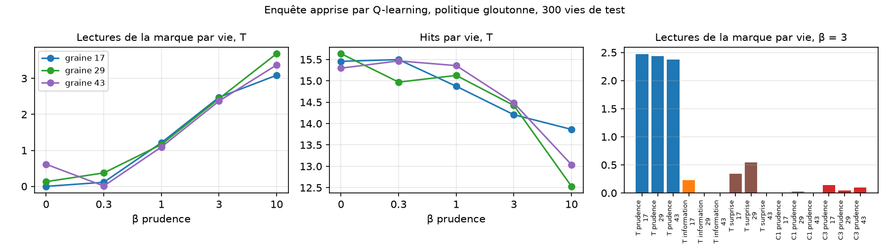

# Enquête apprise — résultats du 21 septembre 2026

Exécution du [protocole pré-enregistré](LEARNED_INQUIRY_PROTOCOL.md) : 39
apprentissages par Q-learning sur les modèles du monde figés de
l'[enquête sur l'origine](ORIGIN_INQUIRY_RESULTS.md), 10 000 vies chacun,
évaluation gloutonne sur 300 vies. Audit indépendant : empreintes, résumés
et rejeu exact de 30 vies par apprentissage.

**Critère global : non satisfait. Quatre sous-critères sur sept passent.**
Le résultat principal est pourtant net : la disposition à lire la marque de
sa propre cause avant d'agir s'apprend par renforcement, avec une réponse
dose-effet propre, et seulement sous une aversion à agir dans l'ignorance.
Les trois échecs viennent de deux phénomènes que les critères n'avaient pas
prévus : des inspections tardives sans enquête chez un agent sans récompense
intrinsèque, et une paralysie quand la prudence est forte et l'origine sans
trace. Ils sont décrits tels quels ; aucun seuil n'a été retouché.

## Critères pré-enregistrés

| Critère | Ce qui était prédit | Ce qui est mesuré | Verdict |
|---|---|---|---|
| A, β = 0 | < 0,50 inspection par vie, 9/9 | 8/9 ; T graine 43 : 0,73 | échoue |
| B, T β = 3 et 10 | ≥ 1 inspection par vie, part(0) ≥ 0,75, ≥ 5 × β = 0 | 2,49 à 4,01 ; 0,81 à 0,95 ; rapport 3,9 pour la graine 43 à β = 3 | échoue sur le rapport |
| B, monotonie en β | non décroissant à 0,25 près | graine 43 : 0,73 puis 0,21 entre β = 0 et 0,3 | échoue |
| C, origine donnée | < 0,50, tous les bras | 0,04 à 0,28 | passe |
| D, sans trace β = 3 et 10 | < 1,00 et part(0) < 0,50 | β = 3 : 0,24 à 0,41 ; **β = 10 : 24,00, zéro mouvement** | échoue |
| E, bonus d'information | < 0,50 | 0,42 / 0,13 / 0,14 | passe |
| F, surprise | bruit > 0,50, hits < 8 | 0,93 / 0,97 / 0,96 ; 0 hit | passe |

## Dose-effet en condition orpheline

Lectures de la marque par vie, part de la marque parmi les inspections, hits
par vie ; trois graines.

| β prudence | Lectures de la marque | Part de la marque | Hits par vie |
|---|---|---|---|
| 0 | 0,00 / 0,13 / 0,61 | — | 15,5 / 15,6 / 15,3 |
| 0,3 | 0,11 / 0,37 / 0,01 | 0,28 / 0,44 / 0,05 | 15,5 / 15,0 / 15,5 |
| 1 | 1,21 / 1,16 / 1,09 | 0,89 / 0,97 / 1,00 | 14,9 / 15,1 / 15,4 |
| 3 | 2,47 / 2,44 / 2,37 | 0,81 / 0,92 / 0,95 | 14,2 / 14,4 / 14,5 |
| 10 | 3,09 / 3,69 / 3,37 | 0,94 / 0,93 / 0,84 | 13,9 / 12,5 / 13,0 |

À partir de β = 1, l'agent appris lit la marque avant son premier mouvement
puis s'arrête : analyse après lecture, inspections avant le premier
mouvement 1,07 à 3,96 selon β et la graine, après le premier mouvement 0,02
à 0,34. Chaque lecture coûte, les hits baissent de 15,5 à 13 quand β monte.
La disposition apparaît dans les 3 000 à 4 000 premières vies et reste
stable jusqu'à 10 000.



## Ce que disent les échecs

**A et B, graine 43 avec β = 0.** Cet agent sans aucune récompense intrinsèque
inspecte 0,73 fois par vie, à 84 % la marque. Ce n'est pas une enquête :
sur ses 218 inspections de test, 11 précèdent le premier mouvement, et le
pas médian est le seizième, quand son corps est connu depuis longtemps.
C'est une habitude tardive apprise dans des états où toutes les actions se
valent presque. La mesure « inspections par vie » ne distingue pas cela
d'une enquête ; la mesure « inspections avant le premier mouvement » le
fait, à 0,04 / 0,01 / 0,04 pour β = 0 contre 1,07 et plus dès β = 1. Cette
mesure n'était pas pré-enregistrée ; elle est rapportée comme exploratoire
et le critère reste échoué.

**D, sans trace avec β = 10.** Les trois agents n'ont jamais bougé : 24
inspections par vie, zéro hit. La valeur apprise du meilleur mouvement au
premier pas est inférieure de 4 unités à celle de la meilleure inspection ;
à β = 3 elle lui est supérieure de 0,4 à 0,5. Ce n'est pas une enquête, la
marque n'est visée qu'à 0,02 / 0,20 / 0,64 : c'est une paralysie. Un agent
qui craint d'agir sans se connaître, et qui n'a aucun moyen de se connaître
sans agir, apprend à ne rien faire. Le critère D confondait absence
d'enquête et absence d'action. Dans la condition orpheline, la même
prudence β = 10 ne paralyse pas : la marque rend le premier mouvement
abordable.

## Réponse à la question du protocole

La disposition s'apprend, et elle dépend de la récompense :

- **Aversion à agir dans l'ignorance** : enquête dirigée vers la marque,
  avant d'agir, proportionnelle à β. Trois graines sur trois.
- **Bonus d'information seul** : aucune enquête, 0,13 à 0,42 inspection par
  vie. Agir informe autant et rapporte plus ; l'agent apprend à agir.
- **Surprise** : captivité du bruit, jamais un mouvement, zéro hit.
- **Rien** : rien, à une habitude tardive près.

Rapporté à l'expérience précédente : la règle écrite à la main y produisait
2,2 à 3,0 lectures avant le premier mouvement ; l'agent appris à β = 3 en
produit 2,3 à 2,5 sans qu'on lui ait écrit de règle. Le comportement est le
même, son origine est différente.

## Ce qui n'est pas établi

Les mêmes réserves que précédemment : agent minuscule, monde à seize états,
récompenses choisies par nous. Ce qui est appris est le comportement ; le
motif, prudence, information ou surprise, est fixé par nous. Rien sur le
vécu, un concept de créateur ou un modèle de langage.

## Décision, conformément à la règle d'arrêt

**Arrêter cette ligne.** Le critère global échoue et ne sera pas relancé
avec des seuils ajustés. Le résultat utile est acquis et ses limites sont
identifiées : deux mesures à pré-enregistrer différemment si quelqu'un
reprend cette question, inspections avant le premier mouvement plutôt que
par vie, et mouvements par vie comme garde-fou contre la paralysie.

La suite déjà préparée est l'[Atelier en contexte pour un modèle de
langage](LLM_ATELIER_PROTOCOL.md), à exécuter sur A100.

## Reproduction et audit

```bash
python -m unittest discover -s tests_research -p "test_origin_rl*.py" -v
python -m research.audit_origin_rl --root artifacts/learned-inquiry
python scripts/summarize_learned_inquiry.py artifacts/learned-inquiry
python scripts/learned_inquiry_posthoc.py artifacts/learned-inquiry
```

Les 39 politiques, les 39 journaux de 300 vies, les rapports par condition
et la [vérification](../artifacts/learned-inquiry/verification.json) sont
publiés avec leurs empreintes. Trois processus parallèles : 904, 906 et
2 152 secondes.
