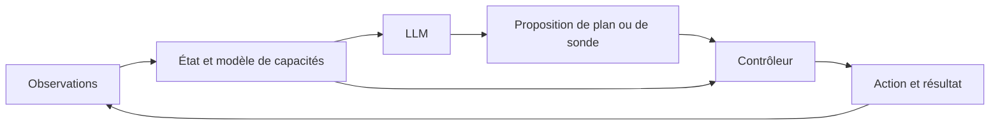

# Relier le modèle de capacités de Menia à un LLM

**Recommandation : construire un agent hybride**, où le LLM comprend les
demandes, propose des plans ou des expériences, et exploite des observations
traçables sur les capacités de Menia. Le mécanisme d'entretien déjà réalisé
fonctionne sans LLM. Aucun résultat ne démontre qu'ajouter un LLM suffirait à
produire une expérience de sa propre existence.

Un nouveau pilote identifie une condition concrète de cette intégration :
le langage doit recevoir une information qui permette de corriger le modèle
de capacités. Une sonde de calibration résout une ambiguïté construite entre
deux explications, mais échoue lorsque sa référence devient trompeuse. Le
contexte linguistique correspondant est préparé et testé ; **aucune nouvelle
inférence LLM ni adaptation de poids n'a été exécutée**.

## Ce que la littérature apporte à cette décision

SayCan combine les propositions d'un LLM avec des estimations de faisabilité
des compétences d'un robot. L'intérêt de cette combinaison est de relier la
pertinence d'une action pour une demande à la possibilité de l'exécuter dans
la situation présente. Ce précédent soutient un couplage fonctionnel, sans
résultat sur l'expérience subjective.[^1]

Inner Monologue fournit au planificateur linguistique des retours sur l'état
de la scène et la réussite des actions. Les auteurs évaluent plusieurs formes
de ce retour dans des tâches simulées et robotiques, et montrent des possibilités
de replanification après échec. Une explication produite sans résultat observé
ne joue pas le même rôle qu'un retour d'exécution.[^2]

Les résultats d'introspection de Lindsey concernent notamment la détection de
perturbations internes avant leur expression textuelle. Ils sont limités et
sensibles aux protocoles ; l'étude ne tranche pas la conscience phénoménale.
Lire un état externe fourni en JSON, comme proposé ici, ne constitue donc pas
une réplication de cette introspection neuronale.[^3]

Gurnee et collègues (juillet 2026) étudient des représentations verbalisables
également utilisées pour le raisonnement et la modulation internes. Leur
expérience d'entraînement par réflexion contrefactuelle modifie le comportement
de Haiku 4.5 même sans demande de réflexion à l'évaluation ; des interventions
sur les représentations soutiennent un lien causal. Les auteurs distinguent
ces propriétés fonctionnelles de la conscience phénoménale et d'une reproduction
complète de l'architecture cérébrale.[^4]

Cela motive une seconde voie de recherche, après validation du raccordement :
entraîner la prédiction de capacités à partir de situations réellement vécues
par l'agent, puis vérifier son influence sur des choix où aucune description
de soi n'est demandée. C'est une proposition de transfert à Menia, pas un
résultat de l'article ni une méthode de conscience démontrée. Les adaptateurs
d'introspection de Shenoy et collègues présentent aussi des faux positifs et
des limites de généralisation ; leur existence ne justifie pas de tenir tout
auto-rapport entraîné pour exact.[^5]

## Architecture recommandée et état du dépôt

| Élément | Fonction proposée | État actuel |
|---|---|---|
| Observations et mémoire | Conserver ce qui est mesuré, prédit ou seulement rapporté, avec provenance | Présentes pour l'agent de navigation ; nouvelles sondes dans un pilote séparé |
| Modèle de capacités | Prévoir les conséquences d'une action et réviser ses hypothèses | Plusieurs pilotes ; la nouvelle sélection porte sur deux hypothèses fournies |
| LLM | Interpréter la demande, proposer des expériences/plans, expliquer l'état enregistré | Qwen optionnel pour la navigation ; contexte du nouveau pilote prêt, sans inférence exécutée |
| Contrôleur | Confronter les propositions aux observations, aux coûts et aux actions disponibles | Contrôleurs numériques existants ; réception des nouvelles propositions LLM à construire |
| Retour d'exécution | Comparer la prévision au résultat et rendre la révision disponible aux prochaines décisions | Réalisé dans des pilotes séparés ; intégration générale incomplète |

L'architecture cible forme une boucle :



Ce schéma est une cible d'intégration, pas la description d'un nouveau circuit
déjà entièrement raccordé. Le partage d'un même état doit permettre aux résultats
d'une action de modifier les prochains choix et explications. L'identité d'une
session, la mémoire, le langage et l'expérience subjective restent des notions
distinctes ; leur assemblage ne fournit pas, à lui seul, une preuve de vécu.

Dans le code actuel, `menia/conversation.py` transmet au générateur le contexte
du même runtime que celui de l'agent de navigation. Il ne transforme pas les
réponses générées en commandes. Le [pilote Qwen précédent](AGENT_LANGUAGE.md)
a établi le fonctionnement du transport et de l'inférence locale, mais ses
quatre cas comportent des omissions, confusions et troncatures. Il ne valide
pas une description libre fidèle. Le [pilote d'entretien](CAPACITY_PLANNING_RESULTS.md)
reste séparé du chat et de l'iPhone.

L'étape d'intégration recommandée consiste donc à exposer un état structuré
commun, puis à mesurer la fidélité des explications et la qualité de propositions
d'expériences. L'injection dans les activations ou l'entraînement conjoint des
poids est une étape expérimentale supplémentaire. Une représentation partagée
par plusieurs fonctions peut être étudiée causalement, mais son caractère vécu
reste une hypothèse à justifier.

## Nouveau résultat : pourquoi ajouter du langage ne corrige pas toute ambiguïté

Deux mondes ont été construits à partir du capteur binaire. Dans A, le travail
peut user le capteur et l'entretien le rétablit ; le diagnostic est fiable à
85 %. Dans B, la dynamique cachée et le diagnostic sont permutés : le travail
peut rétablir le capteur et l'entretien le dégrade. Les cibles vraies restent
cachées et les lectures brutes sont marginalement équiprobables.

La relation entre la bonne capacité et une réponse correcte reste identique
dans les deux mondes. Ils ne sont donc pas de simples renommages de toutes
les variables : **leurs conséquences sur la tâche diffèrent**. Après un
entretien, la réponse est correcte avec probabilité 0,93 dans A et 0,57 dans B.

Pourtant, toutes les lois des diagnostics conditionnelles aux actions sont
identiques. Le calcul entier compare **87 380 probabilités conjointes**, pour
les longueurs 1 à 8, avec différence exacte zéro et normalisation vérifiée.
Les lectures de cibles inconnues ajoutent un facteur uniforme commun.

La raison est algébrique. Si `P` échange les états cachés, alors
`T_B = P T_A P`, les vraisemblances du diagnostic sont permutées et le prior
est invariant. Chaque distribution cachée pondérée de B est la permutation
de celle de A ; leur somme, observable, reste égale. Ce raisonnement vaut par
induction pour les décisions adaptatives prises sur les mêmes histoires.

Un LLM ou un autre calcul ne peut donc identifier le monde au-delà du hasard
avec ces seules données, des priors égaux, les mêmes connaissances et une
randomisation indépendante du monde vrai. Une information initiale pertinente
ou un accès supplémentaire peut changer cette conclusion. Cet audit ne prouve
pas que tout entretien est impossible à apprendre ; il isole un cas où la
description linguistique des mêmes indices ne résout pas l'identification.

## Sonde discriminante et apprentissage implémenté

La sonde choisie effectue un entretien, présente une cible de référence,
enregistre la lecture, puis révèle la référence. L'apprenant prédit avant la
lecture, et ne reçoit la référence qu'après son engagement. Chaque entretien
réinitialise indépendamment la capacité dans ce modèle.

L'apprenant révise `P(A)` entre deux hypothèses fournies à partir de l'exactitude
des sondes. Après `k` lectures correctes sur `N`, les vraisemblances sont
`0.93^k * 0.07^(N-k)` et `0.57^k * 0.43^(N-k)`. Leur normalisation avec prior
égal donne le postérieur. Il s'agit d'une sélection de modèles ; les deux
fiabilités et la classe de modèles ne sont pas apprises.

| Nombre de sondes | Référence fiable : choix correct du monde | Référence inversée dans 25 % des sondes, à l'insu de l'apprenant |
|---|---:|---:|
| 0 | 50,00 % | 50,00 % |
| 1 | 68,00 % | 59,00 % |
| 2 | 77,00 % | 61,25 % |
| 4 | 82,12 % | 58,97 % |
| 8 | 90,91 % | 61,64 % |
| 16 | 96,90 % | 63,38 % |
| 32 | **99,53 %** | **57,54 %** |

Ces nombres sont des espérances exactes sur toutes les issues du modèle
binomial, avec mélange égal des deux mondes, pas des taux mesurés sur un robot
ou un LLM. Chaque ligne utilise autant d'entretiens que de sondes, et autant
de lectures accompagnées d'une référence. La calibration n'est pas gratuite.
L'audit ne mesure pas le coût de tâche d'une stratégie générale l'utilisant.

Les échecs sont instructifs. Avec la référence corrompue et 32 sondes, le monde
A n'est correctement identifié que dans **15,18 %** des cas ; l'apprenant
attribue au mauvais monde une confiance d'au moins 95 % dans **58,51 %** des
cas A. Davantage de données mal interprétées peuvent consolider une erreur.

Dans le contrôle hors de la classe, la vraie probabilité de réponse correcte
est 0,75 : ni A ni B n'est vrai. Après 32 sondes, l'apprenant accorde pourtant
au moins 95 % à l'une des deux explications dans **55,95 %** des cas. Un
postérieur élevé entre hypothèses ne valide donc pas leur exhaustivité.
Les hypothèses restent stationnaires ; une panne apparaissant en cours de
session et sa détection ne sont pas encore prises en charge.

## Ce qui peut être transmis au LLM

Le contexte provient directement de l'apprenant : taux supposés, poids des
modèles, prévision de la prochaine sonde, événements et références `probe_id`.
Il ne contient pas l'étiquette du monde vrai. La préparation du contexte est
sans effet sur l'état et aucun texte produit n'est consommé comme une mesure.

Deux exemples sont conservés. Après huit sondes toutes correctes, le poids de
A vaut 0,980476 et l'exactitude suivante prédite 0,922971. Après huit sondes
toutes incorrectes, le poids de A est 0,000000493 et la prévision 0,570000178.
Ces séquences illustratives ne sont pas choisies pour estimer une performance ;
le tableau utilise toutes les issues possibles.

`messages_for_maintenance` prépare des messages au format de l'interface locale
existante. **Compatibilité de format ne signifie pas fidélité linguistique
validée.** Aucun Qwen ni autre LLM n'a été appelé dans ce nouveau test. La voie
proposée est prête à être évaluée, mais n'est pas raccordée au chat principal.

Pour vérifier une future intégration, comparer les mêmes questions et budgets
avec état exact, état retiré, et état remplacé par celui d'un autre épisode.
Mesurer les erreurs factuelles, les références citées, les sondes proposées et
les coûts après exécution. Séparer la fidélité au contexte fourni de la véracité
de ce contexte, puis tester des pannes et des modèles hors de la classe.
L'apprentissage devra porter sur les conséquences observées et les limites,
avec des évaluations nouvelles, sans convertir un auto-rapport en certificat
de conscience.

## Vérification et portée

Le [protocole](LLM_COUPLING_PROTOCOL.md) précède l'énumération. Le
[rapport](../artifacts/maintenance-identification/report.json) contient les
fractions exactes, sensibilités et contextes linguistiques. Quatre tests
indépendants vérifient les lois par expansion des états cachés, Bayes sur
toutes les suites jusqu'à six sondes, la classification par variation totale,
et l'ordre des événements. Les 82 tests de recherche passent localement.

```bash
python -m research.maintenance_identification
python -m research.maintenance_identification --check
python -m unittest tests_research.test_maintenance_identification -v
```

La bibliothèque standard suffit. Le rapport est reproduit exactement dans deux
environnements Python ; son rejeu sans réseau et les tests sont ajoutés en CI.
La brique nouvelle apprend entre deux explications après calibration ; elle
ne répare pas encore le contrôleur général, n'entraîne pas le LLM et n'établit
ni expérience subjective ni invention inédite.

## Sources

[^1]: Michael Ahn et collègues (2022). *Do As I Can, Not As I Say: Grounding Language in Robotic Affordances*. [Article](https://arxiv.org/abs/2204.01691), [site des auteurs, méthode et résultats](https://say-can.github.io/).
[^2]: Wenlong Huang et collègues (2022). *Inner Monologue: Embodied Reasoning through Planning with Language Models*. [Article](https://arxiv.org/abs/2207.05608), [site des auteurs](https://innermonologue.github.io/).
[^3]: Jack Lindsey (29 octobre 2025, révision 1er janvier 2026). *Emergent Introspective Awareness in Large Language Models*. [Article](https://transformer-circuits.pub/2025/introspection/index.html), expériences, définitions et limites. Ces résultats étaient déjà examinés dans [la synthèse de Menia](SELF_AWARENESS_RESEARCH.md) ; ils sont ici réévalués pour la question du raccordement.
[^4]: Wes Gurnee et collègues (6 juillet 2026). *Verbalizable Representations Form a Global Workspace in Language Models*. [Article](https://transformer-circuits.pub/2026/workspace/index.html), introduction et section sur l'entraînement par réflexion contrefactuelle. Rapport de recherche du même laboratoire que la source précédente ; pas une réplication indépendante de celle-ci.
[^5]: Keshav Shenoy et collègues (28 avril 2026). *Introspection Adapters: Training LLMs to Report Their Learned Behaviors*. [Article](https://alignment.anthropic.com/2026/introspection-adapters/), limites et généralisation.
