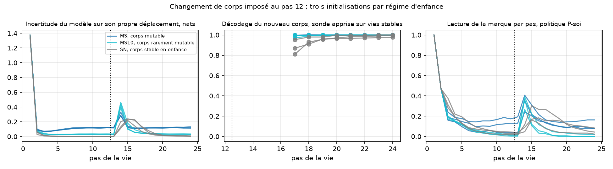

# Confirmation sur graines neuves — résultats du 22 septembre 2026

Exécution du [protocole de confirmation](MUTABLE_BODY_CONFIRMATION_PROTOCOL.md)
sur les graines 53, 61 et 71, régimes SN, MS et MS10, avec une politique de
prudence apprise sur le modèle de chaque régime. Audit indépendant reproduit
pour les neuf runs.

**Critère global : non satisfait, 0 critère chiffré sur 5.** Les seuils,
calibrés sur les amplitudes du premier jeu de graines, ne sont pas atteints.
Le sens de chaque effet se reproduit pourtant trois fois sur trois. Une
[troisième exécution à critères directionnels](MUTABLE_BODY_DIRECTIONAL_PROTOCOL.md)
a été pré-enregistrée avant de conclure.

## Mesures

| Graine | Régime | Nouveau corps décodé | Lectures après changement | Lectures témoin sans changement | Hits après pas 12, témoin | Hits après changement | Politique apprise : lectures après changement |
|---|---|---:|---:|---:|---:|---:|---:|
| 53 | SN | 0,958 | 1,47 | 0,36 | 8,17 | 4,85 | 0,02 |
| 53 | MS | 1,000 | 1,41 | 0,99 | 7,73 | 6,50 | 0,51 |
| 53 | MS10 | 0,998 | 0,59 | 0,00 | 8,43 | 7,03 | 0,07 |
| 61 | SN | 0,944 | 1,74 | 0,19 | 8,28 | 4,86 | 0,04 |
| 61 | MS | 1,000 | 2,35 | 2,02 | 7,06 | 5,95 | 0,73 |
| 61 | MS10 | 1,000 | 1,05 | 0,13 | 8,31 | 6,82 | 0,02 |
| 71 | SN | 0,988 | 0,70 | 0,06 | 8,41 | 5,53 | 0,04 |
| 71 | MS | 1,000 | 1,67 | 1,38 | 7,47 | 6,35 | 0,85 |
| 71 | MS10 | 0,995 | 0,46 | 0,01 | 8,40 | 7,10 | 0,03 |

## Lecture

- **H1, pas de condition développementale.** Décodage 0,944 à 0,988 ; retour
  à la marque 1,47 / 1,74 / 0,70. Échoue sur la graine 71, sous le seuil de
  1,0, tout en restant douze fois au-dessus de son témoin.
- **H2, hypervigilance.** Témoin sans changement : MS 0,99 / 2,02 / 1,38
  contre SN 0,36 / 0,19 / 0,06, soit 2,7 ×, 10,6 × et 24 ×. Le seuil « ≥ 2,0
  et ≥ 10 × » échoue sur deux graines ; la direction tient sur trois.
- **H3, dose.** MS10 ne se situe pas entre SN et MS : 0,00 / 0,13 / 0,01,
  sous SN. Une exposition rare, une vie sur dix, n'installe aucune vigilance.
  Prédiction réfutée telle quelle.
- **H4, compromis.** Monde stable : MS perd 0,4 à 1,2 hit par rapport à SN,
  moins que les 2,0 exigés ; monde qui change : MS gagne 0,8 à 1,6, au-delà
  des 0,5 exigés. Direction 3/3, amplitude 1/2.
- **H5, l'habitude ne se transfère pas.** Politique apprise sur SN : 0,02 /
  0,04 / 0,04 lecture après le changement, contre 1,47 / 1,74 / 0,70 pour la
  règle sur le même modèle. Échoue uniquement par la clause « règle ≥ 1,0 »
  sur la graine 71.
- **Exploratoire.** Politique apprise sur MS avec son modèle : 0,51 / 0,73 /
  0,85 lectures après le changement, dix à vingt fois celles de la politique
  apprise sur SN. L'habitude retourne à la marque quand l'enfance a contenu
  des changements de soi.



## Décision

Ne pas requalifier ces mesures en réussite. Une seule exécution
supplémentaire, à critères de direction fixés avant, sur trois graines
jamais utilisées, tranche la ligne. Rien sur le vécu ni sur un modèle de
langage.

## Reproduction et audit

```bash
python -m research.audit_mutable --root artifacts/mutable-body-confirmation --confirmation
python scripts/summarize_mutable.py artifacts/mutable-body-confirmation
```
