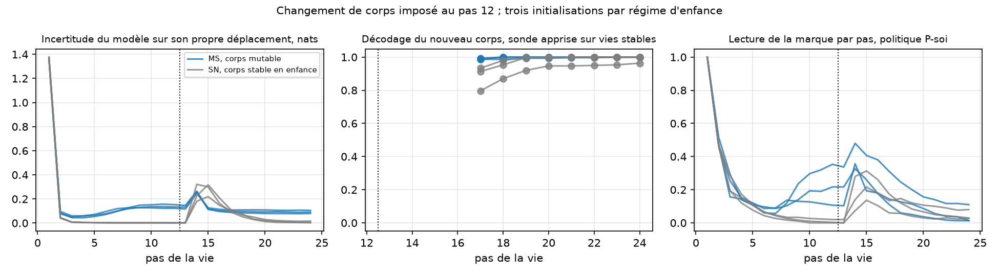

# Confirmation directionnelle — résultats du 22 septembre 2026

Exécution du [protocole directionnel](MUTABLE_BODY_DIRECTIONAL_PROTOCOL.md)
sur les graines 83, 97 et 101, jamais utilisées, régimes SN et MS, avec une
politique de prudence apprise sur le modèle de chaque régime. Audit
indépendant reproduit pour les six runs.

**Quatre critères sur cinq passent trois fois sur trois. Le cinquième échoue
sur une graine, de justesse. Le critère global n'est donc pas satisfait.**

| Graine | Régime | Nouveau corps décodé | Lectures après changement, règle | Lectures témoin sans changement | Hits après pas 12, témoin | Hits après changement | Politique apprise : lectures après changement |
|---|---|---:|---:|---:|---:|---:|---:|
| 83 | SN | 0,918 | 1,41 | 0,20 | 8,23 | 5,05 | 0,017 |
| 83 | MS | 0,998 | 3,00 | 2,40 | 6,56 | 5,53 | 0,547 |
| 97 | SN | 0,983 | 1,46 | 0,00 | 8,41 | 5,67 | 0,053 |
| 97 | MS | 0,999 | 1,31 | 1,62 | 7,15 | 6,66 | 0,260 |
| 101 | SN | 0,988 | 0,60 | 0,00 | 8,41 | 5,82 | 0,010 |
| 101 | MS | 0,994 | 1,45 | 0,63 | 7,91 | 6,52 | 0,497 |

- **D1, passe 3/3.** Le modèle à l'enfance stable décode son nouveau corps à
  0,918 ou plus et retourne à la marque après le changement, trois à
  quatorze fois plus que dans ses vies sans changement.
- **D2, passe 3/3.** Le modèle à l'enfance mutable relit la marque sans
  changement, 0,63 à 2,40 lectures contre 0,00 à 0,20.
- **D3, passe 3/3.** Cette vigilance coûte 0,5 à 1,7 hit dans un monde
  stable et rapporte 0,5 à 1,0 hit dans un monde qui change.
- **D4, passe 3/3.** La politique apprise sur l'enfance stable ne retourne
  pas à la marque, 0,010 à 0,053, quand la règle sur le même modèle en fait
  0,60 à 1,46.
- **D5, échoue 2/3.** La politique apprise sur l'enfance mutable retourne à
  la marque à 0,547, 0,260 et 0,497. La graine 97 est sous le seuil de 0,30
  et à 4,9 fois la politique stable au lieu de 5. Direction respectée trois
  fois, seuil manqué une fois.



## Ce qui est établi et ce qui ne l'est pas

Sur neuf graines, dont six jamais vues avant que leurs critères soient
fixés, et avec des critères directionnels pré-enregistrés sur les trois
dernières :

- Établi : un agent prédictif dont le corps n'a jamais changé pendant son
  enfance met à jour son modèle de soi après un changement de corps et
  retourne lire la marque de sa cause. Aucune condition développementale.
- Établi : l'habitude d'enquête apprise dans une enfance stable ne se
  rallume pas au changement, alors que le calcul depuis le modèle se rallume.
- Établi : une enfance au corps souvent changeant installe une vigilance
  persistante, qui coûte dans un monde stable et rapporte dans un monde qui
  change.
- Non établi au sens du critère, direction reproduite 6/6 : l'habitude
  apprise dans une enfance mutable retourne à la marque. Une graine sur trois
  manque le seuil de 0,30 à 0,26.

## Décision

Arrêter la ligne ici, comme le protocole l'exige. Le résultat est présenté
avec cette réserve exacte dans la [synthèse](SELF_INQUIRY_SYNTHESIS.md).
Rien sur le vécu, un concept de créateur ou un modèle de langage.

## Reproduction et audit

```bash
python -m research.audit_mutable --root artifacts/mutable-body-directional --directional
python scripts/summarize_mutable.py artifacts/mutable-body-directional
```
