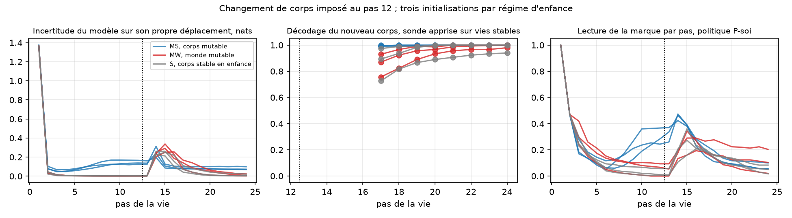

# Corps mutable et surveillance de soi — résultats du 22 septembre 2026

Exécution du [protocole pré-enregistré](MUTABLE_BODY_PROTOCOL.md) : trois
régimes d'enfance, trois initialisations, 300 vies de test avec changement
de corps imposé au pas 12 et 300 vies témoins par politique. Audit
indépendant : empreintes, lectures, hits, sauts d'entropie, états rejoués
et sondes.

**Critère global : non satisfait, 4 sous-critères sur 9. L'hypothèse
principale est réfutée.** Un agent dont le corps est resté stable pendant
toute son enfance remarque qu'on l'a changé, met à jour son modèle de soi et
retourne lire la marque de sa cause. La surveillance de soi n'a pas besoin
d'avoir vécu des changements de soi. Trois effets non prédits sont apparus ;
ils sont divulgués ici et soumis à une [confirmation pré-enregistrée sur
graines neuves](MUTABLE_BODY_CONFIRMATION_PROTOCOL.md).

## Mesures contre critères

| Régime | Graine | M1 nouveau corps décodé | M2 saut d'entropie | M3 lectures après changement | M3 témoin sans changement | M4 hits après / avant |
|---|---|---:|---:|---:|---:|---:|
| S stable | 17 | 0,875 | +0,23 | 1,38 | 0,00 | 0,71 |
| S stable | 29 | 0,994 | +0,22 | 1,49 | 0,02 | 0,84 |
| S stable | 43 | 0,976 | +0,18 | 1,77 | 0,31 | 0,82 |
| MS soi mutable | 17 | 0,997 | +0,01 | 2,59 | 4,60 | 0,94 |
| MS soi mutable | 29 | 0,999 | +0,06 | 2,08 | 3,85 | 1,04 |
| MS soi mutable | 43 | 1,000 | −0,05 | 2,23 | 4,15 | 1,05 |
| MW monde mutable | 17 | 0,909 | +0,23 | 2,74 | 0,67 | 0,66 |
| MW monde mutable | 29 | 0,962 | +0,24 | 1,57 | 0,04 | 0,76 |
| MW monde mutable | 43 | 0,984 | +0,27 | 1,46 | 0,19 | 0,90 |

Prédictions réfutées : S ne met pas à jour, S et MW ne retournent pas à la
marque, MS présente un saut d'entropie, les témoins restent silencieux.
Prédictions confirmées : MS met à jour, retourne à la marque et récupère.



## Ce que montrent les courbes

**Aucune condition développementale.** Le modèle stable a une incertitude
motrice nulle du pas 3 au pas 12, un pic de 0,25 nat aux pas 14 et 15 après
le changement, puis zéro à nouveau. Son décodage du nouveau corps passe de
0,73 au pas 17 à 0,94 au pas 24. Sa règle d'information retourne à la marque
dans le pic, 1,4 à 1,8 lectures, puis se tait. Le mécanisme est celui de
l'enquête sur l'origine : un déplacement inattendu rend le corps incertain,
l'incertitude rend la marque informative, la marque est lue.

**Hypervigilance.** Le modèle à l'enfance mutable ne présente pas de pic
parce que son incertitude est chroniquement élevée, 0,10 à 0,15 nat, et
qu'elle monte du pas 8 au pas 12 dans la fenêtre où son enfance lui a
appris que les corps changent. Dans des vies où rien ne change, il relit sa
marque 3,9 à 4,6 fois après le pas 12, contre 0,0 à 0,3 pour le modèle
stable. Ce comportement coûte : 5,2 à 5,7 hits après le pas 12 dans un
monde stable, contre 8,2 à 8,4. Il rapporte dans un monde qui change : 5,9 à
6,2 hits après le changement contre 4,8 à 5,6. C'est un compromis entre
vigilance et rendement, fixé par l'enfance.

**L'habitude ne se transfère pas.** La politique de prudence apprise sur le
régime stable, évaluée avec son propre modèle, lit la marque 0,03 à 0,09
fois après le changement, alors que la règle d'information sur le même
modèle en fait 1,38 à 1,77. L'incertitude est bien dans le modèle ; la
politique apprise n'a jamais rencontré une incertitude en milieu de vie et
ne la reconnaît pas. Comparaison exploratoire, pas un critère.

Une quatrième comparaison exploratoire, la même politique évaluée avec le
modèle d'un autre régime, est invalide : deux modèles n'ont pas les mêmes
coordonnées d'état caché. Ses journaux sont conservés mais ne sont pas
interprétés.

## Ce qui n'est pas établi

Les trois effets sont des lectures après coup sur les graines du plan
initial. Le [protocole de confirmation](MUTABLE_BODY_CONFIRMATION_PROTOCOL.md)
les teste sur les graines 53, 61 et 71 avec des critères fixés avant
exécution. Rien sur le vécu, un concept de créateur ou un modèle de langage.

## Décision, conformément à la règle d'arrêt

Arrêter ce plan. Une seule confirmation pré-enregistrée sur graines neuves,
puis décision finale dans son propre document de résultats.

## Reproduction et audit

```bash
python -m unittest discover -s tests_research -p "test_mutable*.py" -v
python -m research.audit_mutable --root artifacts/mutable-body
python scripts/summarize_mutable.py artifacts/mutable-body
```
