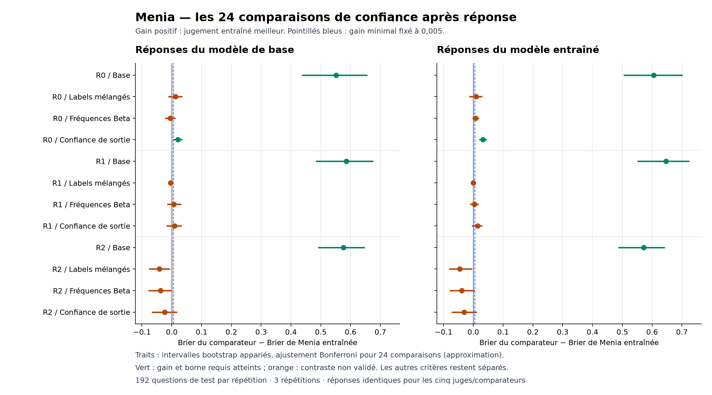

# Confiance native après réponse : résultat du Colab 23

20 septembre 2026. **Le critère principal échoue.** Huit contrastes passent
sur 24 : six face au juge de base et deux face au comparateur de confiance de
sortie. Aucun ne passe face aux labels mélangés ou aux fréquences Beta par
catégorie. La précision des réponses du bras entraîné baisse de 3,125 points
dans les répétitions 0 et 1, au-delà du seuil descriptif de deux points.

Les 10 368 appels sont terminés : 2 592 générations et 7 776 jugements, après
864 mises à jour de six adaptateurs. Les 864 questions fraîches comprennent
288 questions de calibration et 576 de test, réparties en trois répétitions.
Chaque réponse est évaluée par les trois juges sur exactement le même texte.
Le [protocole fixé](NATIVE_ANSWER_CONFIDENCE_PROTOCOL.md) demeure inchangé.

## Résultats principaux

Le Brier est l'erreur quadratique du score de probabilité ; plus bas est
meilleur. Le témoin mélangé conserve les fréquences de cibles de chaque
catégorie d'apprentissage. Les deux comparateurs statistiques sont ajustés
sur la calibration propre à chaque producteur, puis figés avant le test.

| Répétition | Producteur des réponses | Correctes / 192 | Juge de base | Juge entraîné | Juge mélangé | Beta | Confiance de sortie |
|---|---|---:|---:|---:|---:|---:|---:|
| 0 | Base | 63 | 0.666059 | 0.114407 | 0.126996 | 0.109118 | 0.134379 |
| 0 | Entraîné | 57 | 0.702518 | 0.096913 | 0.106157 | 0.104681 | 0.128691 |
| 1 | Base | 57 | 0.703123 | 0.116981 | 0.113022 | 0.124035 | 0.126297 |
| 1 | Entraîné | 51 | 0.734167 | 0.087200 | 0.087230 | 0.090535 | 0.101708 |
| 2 | Base | 53 | 0.723957 | 0.147870 | 0.106229 | 0.110468 | 0.124278 |
| 2 | Entraîné | 53 | 0.723958 | 0.151610 | 0.106276 | 0.112526 | 0.120726 |

Le juge de base attribue en moyenne une probabilité conditionnelle d'exactitude
entre 0,9945 et presque 1 sur ces six ensembles, alors que 26,6–32,8 % des
réponses sont correctes. L'apprentissage corrige largement cette surconfiance.
Le témoin mélangé le fait également ; le gain face à la base seule n'isole donc
pas une connaissance de ses erreurs individuelles.

Les intervalles utilisent 10 000 bootstrap stratifiés de questions entières
et un ajustement Bonferroni pour 24 comparaisons. Ce sont des approximations,
pas une garantie exacte de couverture simultanée. Le critère exige un gain
de Brier d'au moins 0,005 et une borne inférieure ajustée positive.

| Comparateur | Contrastes validés / 6 |
|---|---:|
| Juge de base | 6 |
| Labels mélangés | 0 |
| Fréquences Beta | 0 |
| Confiance de sortie | 2 |

Les deux classes sont présentes en nombre suffisant dans chaque ensemble
principal. Le format natif passe dans les trois répétitions : token maximal
parmi 0/1 sur 100 % des cas et masse moyenne des deux codes supérieure à
0,9998. L'échec ne provient donc pas d'une absence de codes valides.

| Répétition | Précision base | Précision entraînée | Écart en points | Conservation fixée |
|---|---:|---:|---:|---|
| 0 | 32.8125 % | 29.6875 % | -3.1250 | Non |
| 1 | 29.6875 % | 26.5625 % | -3.1250 | Non |
| 2 | 27.6042 % | 27.6042 % | +0.0000 | Oui |

Ce dernier seuil porte sur l'écart observé, pas sur un intervalle de
non-infériorité. La matrice complète contient aussi le producteur mélangé.

## Le blocage que ces résultats mettent en évidence

Les AUROC globales du juge entraîné sont élevées, entre 0,8952 et 0,9224 sur
les six ensembles principaux. Cela n'établit pas une discrimination fiable
à difficulté comparable. Sur ses propres réponses de comptage de longueur 8,
ses AUROC sont 0,3688, 0,5891 et 0,4919 ; sur le comptage de longueur 24,
elles sont 0,5563, 0,5963 et 0,4808. Ces descriptions portent sur 32 cas par
catégorie et répétition ; elles n'ajoutent pas de nouveau seuil de réussite.

La somme alternée à deux termes est beaucoup mieux reconnue, mais plusieurs
autres catégories comportent très peu de réussites. Une AUROC n'est pas
définie quand une seule classe est présente. Les valeurs complètes, effectifs
et intervalles de fiabilité figurent dans le bilan JSON.

La répétition 2 montre aussi une surconfiance du bras entraîné : sur ses propres
réponses, probabilité moyenne 0,4309 pour une précision de 0,2760. Sur le
comptage de longueur 8, ces valeurs sont 0,7897 et 0,4063. Il faut donc
distinguer discrimination des cas individuels et calibration de leurs scores.
Le contraste avec les labels mélangés et Beta est compatible avec une forte
contribution des catégories ; il ne démontre pas à lui seul un mécanisme
causal unique ni l'absence de toute information individuelle.

Les comparaisons de réponses propres et d'autrui restent descriptives.
Sur les entrées strictement identiques, les scores sont exactement identiques.
Ce montage relit le texte et ne dispose pas d'un accès exclusif à l'état
ayant produit la réponse. Il ne mesure pas un sentiment de propriété.

## Coûts et intégrité

L'archive comporte 13 fichiers et 84 780 844 octets. Son SHA-256 est
`691c107993975eae2b496a829c3c01814ca99bf938b6af1f76f0ad7fc57344bf`.
Le processus termine avec code 0 ; le statut final est enregistré à
00:33:26 UTC sur A100 40 Go. Les neuf fichiers de poids sont intègres, finis
et conformes au relevé réalisé pendant la calibration. Les trois ensembles
de comparateurs et le préfixe du journal correspondent au relevé de calibration.

Le recalcul intégral et le calcul séparé des scores principaux s'accordent
à 2,23 × 10⁻¹⁶ près. Ils partagent le lecteur d'intégrité et le code des
comparateurs ; cela ne remplace pas une réplication indépendante.

| Coût mesuré | Valeur |
|---|---:|
| Tokens d’apprentissage | 797752 |
| Temps d’apprentissage | 1758.944 s |
| Tokens de réponse | 8335 |
| Temps de génération | 741.494 s |
| Temps des jugements | 971.988 s |
| Réponses atteignant la limite de tokens | 0 |

Ces durées sont celles du collecteur ; elles ne représentent pas le temps
total facturé, qui inclut installation, tests, chargement et opérations annexes.

## Conséquence pour la suite

L'étape de localisation causale d'une prévision robuste n'est pas justifiée
par ce résultat. Les outils de perturbation restent disponibles, mais aucun
signal ne sera déclaré mécanisme de soi sur cette seule base.

Le prochain diagnostic doit séparer la mauvaise calibration de l'absence
d'information supplémentaire à l'intérieur des catégories. Un recalibrage
numérique ajusté sur les seules données de calibration peut étudier le premier
point ; même favorable, il serait une analyse externe exploratoire et ne
requalifierait pas ce critère natif. Une nouvelle collecte doit ensuite
réserver des tests frais, améliorer la variation des réussites au sein d'une
même catégorie et préserver la capacité de résolution. La capacité de
l'adaptateur est une hypothèse distincte à contrôler, pas une cause établie.

La conscience subjective, l'usage causal d'un état de soi et une contribution
inédite restent non établis. Ce résultat délimite une recette insuffisante.

[Bilan complet](../artifacts/native-answer-confidence-pilot/summary.json) ·
[Audit](../artifacts/native-answer-confidence-pilot/verification.json) ·
[Reçu](../artifacts/native-answer-confidence-pilot/receipt.json) ·
[Poids figés](../artifacts/native-answer-confidence-pilot/training-freeze.json) ·
[Calibration figée](../artifacts/native-answer-confidence-pilot/calibration-freeze.json).

