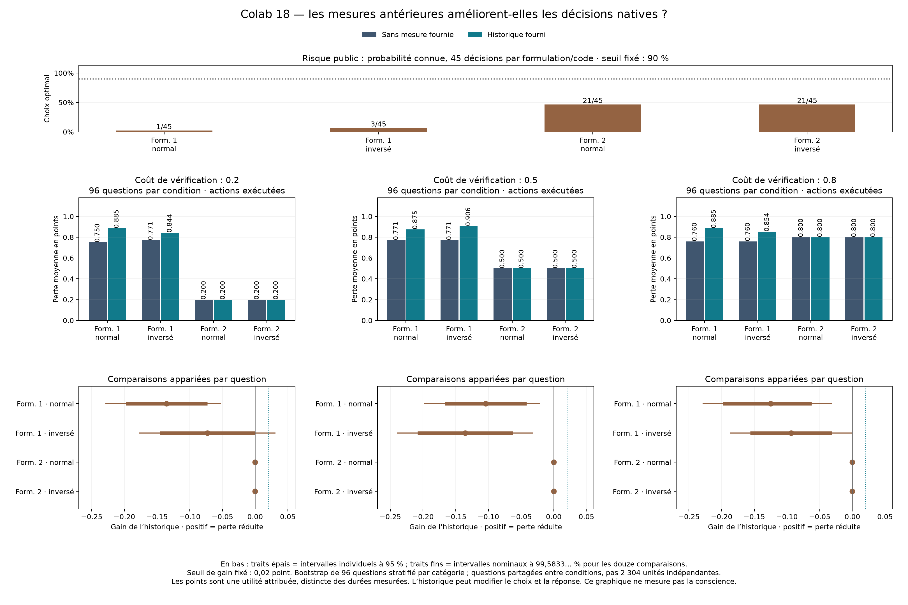

# Colab 18 : les décisions échouent au contrôle de risque

19 septembre 2026. **Aucun des quatre contrôles de risque public ni des douze
contrastes de bénéfice de l'historique ne passe.** Dans ce diagnostic, fournir
les fréquences antérieures n'améliore pas les actions réellement exécutées.
Le modèle échoue déjà quand la probabilité de réussite est donnée exactement :
on ne peut donc pas attribuer cet échec à un seul défaut d'accès à sa compétence.

Le MCP Colab a exécuté le lot complet de 19:13 à 19:31 UTC sur A100 40 Go.
Les 4 884 emplacements sont reçus et audités, sans erreur technique : 3 644
appels LLM, 1 152 appels à l'outil exact et 88 emplacements d'exécution
laissés sans action à cause d'un code invalide. Les poids Qwen3-4B sont restés
figés. Les [sources et le protocole](NATIVE_CHOICE_PROTOCOL.md) n'ont pas été
modifiés après observation des réponses.

## Le contrôle public échoue avant toute question de connaissance de soi

Chaque groupe contient 45 décisions : cinq probabilités connues, trois coûts
et trois graines. Le critère exige au moins 41 bonnes décisions par groupe.
Un code entouré de texte reste invalide selon la règle fixée avant collecte.
Les indices `w0/w1` désignent les deux formulations ; `m0/m1`, les codes
normal et inversé.

| Formulation / code | Choix optimaux | Réponses directes | Vérifications | Invalides |
|---|---:|---:|---:|---:|
| w0 / m0 | 1/45 (2,22 %) | 11 | 0 | 34 |
| w0 / m1 | 3/45 (6,67 %) | 7 | 0 | 38 |
| w1 / m0 | 21/45 (46,67 %) | 0 | 45 | 0 |
| w1 / m1 | 21/45 (46,67 %) | 0 | 45 | 0 |

La deuxième formulation déclenche toujours la vérification, y compris quand
son coût la rend défavorable. La première ne déclenche aucune vérification.
Le seuil de 90 % n'est approché dans aucun groupe.

## Les choix natifs suivent la présentation

Les 96 nouvelles questions sont chacune présentées dans 24 conditions.
Sans historique, la première formulation déclenche 576 réponses directes sur
576 ; la seconde, 576 vérifications sur 576. Avec historique, la première
donne 488 codes directs et 88 codes invalides ; la seconde donne encore
576 vérifications. Aucun choix valide ne passe de réponse directe à
vérification, ou inversement, lorsque le coût passe de 0,2 à 0,8 pour une
même question et une même formulation. Les transitions supplémentaires
concernent exclusivement le format invalide.

**Limite de conception révélée par l'inspection après résultats :** la
première formulation présente la réponse directe en premier ; la seconde
présente l'outil en premier. Inverser les chiffres change le code de l'action
mais ne change pas cet ordre. L'effet de formulation et celui de l'ordre sont
donc confondus. Les réponses sont compatibles avec une préférence pour la
première option décrite ; ce lot n'isole pas causalement ce mécanisme.

L'inspection descriptive des textes bruts trouve uniquement `1`, `2`,
`Code 1.`, `Code 2` ou `Code 2.` dans les 2 484 décisions, toujours avec le
chiffre de la première action présentée. Les 160 réponses entourées de texte
sont les 72 contrôles publics invalides et les 88 choix natifs invalides.
Aucune génération n'atteint sa limite de tokens. Cette inspection ne change
ni le parseur, ni les scores, ni le critère annoncé. Elle ne doit pas être
présentée comme une hypothèse confirmatoire fixée avant l'expérience.

## L'historique ne réduit pas la perte

La différence est **perte sans historique moins perte avec historique**.
Une valeur positive favoriserait l'historique. Les pertes proviennent des
actions réellement exécutées, et non de la seule réponse de référence.

| Coût | Formulation / code | Sans historique | Avec historique | Différence | Intervalle corrigé |
|---|---|---:|---:|---:|---|
| 0,2 | w0 / m0 | 0,750000 | 0,885417 | −0,135417 | [−0,229167 ; −0,052083] |
| 0,2 | w0 / m1 | 0,770833 | 0,843750 | −0,072917 | [−0,177083 ; 0,031250] |
| 0,2 | w1 / m0 | 0,200000 | 0,200000 | 0 | [0 ; 0] |
| 0,2 | w1 / m1 | 0,200000 | 0,200000 | 0 | [0 ; 0] |
| 0,5 | w0 / m0 | 0,770833 | 0,875000 | −0,104167 | [−0,197917 ; −0,020833] |
| 0,5 | w0 / m1 | 0,770833 | 0,906250 | −0,135417 | [−0,239583 ; −0,031250] |
| 0,5 | w1 / m0 | 0,500000 | 0,500000 | 0 | [0 ; 0] |
| 0,5 | w1 / m1 | 0,500000 | 0,500000 | 0 | [0 ; 0] |
| 0,8 | w0 / m0 | 0,760417 | 0,885417 | −0,125000 | [−0,229167 ; −0,031250] |
| 0,8 | w0 / m1 | 0,760417 | 0,854167 | −0,093750 | [−0,187500 ; 0] |
| 0,8 | w1 / m0 | 0,800000 | 0,800000 | 0 | [0 ; 0] |
| 0,8 | w1 / m1 | 0,800000 | 0,800000 | 0 | [0 ; 0] |

Les six contrastes de la première formulation sont négatifs ; quatre ont
un intervalle corrigé entièrement négatif. Ceux de la seconde sont exactement
nuls parce que les deux conditions demandent toujours le même outil, au même
coût. Aucun contraste ne satisfait le gain minimal de 0,02 point. Les
intervalles nuls décrivent cette politique constante sur le lot ; ils ne
garantissent pas une équivalence universelle.

Le bootstrap apparié utilise 20 000 tirages des **96 questions**, stratifiés
dans les six catégories. Les intervalles affichés ont une couverture nominale
individuelle de 99,5833… %, avec correction prévue pour les douze comparaisons.
Ils sont approximatifs et conditionnels aux réponses observées. Les graines
ne représentent pas des entraînements indépendants du LLM.

La fréquence historique reste dans le contexte lors de l'exécution directe.
Elle peut donc changer aussi la résolution, pas seulement le choix. Exemple :
à coût 0,2, formulation w0 et code m0, les deux conditions choisissent toutes
deux de répondre directement aux 96 questions, mais donnent respectivement
24 et 11 réponses exactes. Leur différence de perte ne peut pas être expliquée
par un changement d'action. Ce constat ne localise pas un circuit causal.

## Référence de compétence et coûts observés

La réponse numérique obligatoire sans contexte de décision est exacte dans
27 cas sur 96 (28,125 %) : respectivement 8/16, 2/16 et 0/16 pour les trois
longueurs de comptage, puis 15/16, 2/16 et 0/16 pour les sommes alternées.
Ce n'est pas le contrefactuel exact des réponses après décision. Sur cette
réponse commune, le seuil utilisant les fréquences Beta donne les pertes
descriptives 0,177083 / 0,427083 / 0,639583 aux trois coûts. Ce calcul de
référence n'est pas présenté comme l'exécution de cette politique.

Les appels observés totalisent environ 41,44 s pour les contrôles publics,
351,16 s pour les choix, 21,04 s pour les références et 626,69 s pour les
exécutions conditionnelles. Leurs tokens de sortie totalisent respectivement
565, 4 789, 292 et 8 761. Ces durées excluent le chargement initial ; la durée
murale complète est d'environ 18 min 40 s. Les points de pénalité sont des
coûts attribués au jeu, distincts des secondes, d'un prix ou de l'énergie.

## Réception et double calcul

Le [reçu final](../artifacts/native-choice-pilot/receipt.json) conserve la
configuration et les empreintes. L'archive `menia-choix-natifs.zip` fait
824 478 octets ; son SHA-256 est
`94aa38aec094a63698799509f1360de1aca3155c308c0e2f222e1ef6b64ecb8f`.
Le journal complet fait 14 286 674 octets ; son SHA-256 est
`d469753914339cfaddb0b49cbcdd10b966c8ea6874d51fa791ebe490f7d7d785`.

L'archive et chaque fichier sont vérifiés. Le lecteur reconstruit les requêtes
et les actions depuis les seules informations disponibles au moment du choix.
Le journal parent et ses six comptes d'apprentissage sont également vérifiés.
Le recalcul principal retrouve exactement le bilan GPU. Le
[second calcul](../artifacts/native-choice-pilot/verification.json) retrouve
les quatre contrôles, 24 tableaux natifs et douze contrastes à
`2,220446049250313e-16` près. Il partage le plan et le lecteur d'intégrité :
c'est un contrôle logiciel distinct, pas une réplication extérieure.
Ces deux calculs ont précédé la première lecture des scores.

Les sept tests avant collecte restent réussis. Les changements après lecture
concernent ce compte rendu et la présentation : déplacement de la légende
pour éviter une étiquette et précision que ce sont les questions, pas les
réponses générées, qui sont communes entre conditions. Les données,
comparaisons et seuils n'ont pas changé.

## Conséquence pour la suite

Le préalable manquant est une décision stable sous risque explicite et
changements de présentation. Un prochain diagnostic devra croiser
**indépendamment l'ordre des actions, leur code et la formulation**, puis
séparer conformité de format et optimalité économique, avec règles fixées
avant les nouvelles réponses. Il faudra aussi séparer le contexte qui sert
à choisir de celui qui sert à résoudre pour attribuer correctement un gain.
Ce nouveau lot n'est pas lancé dans ce compte rendu.

Ce résultat concerne Qwen3-4B dans ces consignes françaises, avec réflexion
désactivée ; il n'établit pas une incapacité générale du modèle. Il n'établit
ni conscience de soi ni contribution inédite. L'objectif global reste ouvert,
et ce lot ne justifie aucune modification de Menia sur iPhone.
