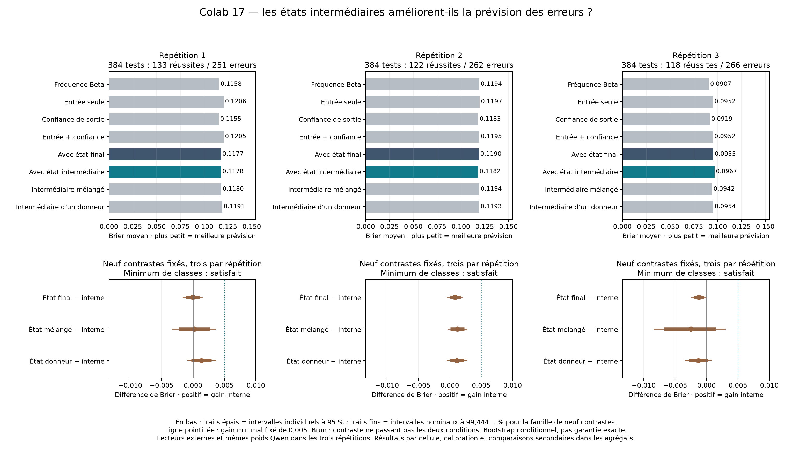

# Colab 17 : aucun apport intermédiaire reproductible selon le critère fixé

19 septembre 2026. **Les neuf comparaisons principales échouent au critère
annoncé.** L'ajout de la projection de couche 17 ne donne pas un gain de Brier
d'au moins 0,005, avec borne inférieure corrigée positive, face aux trois
contrôles dans les trois répétitions. Le prérequis d'au moins vingt réussites
et vingt erreurs est satisfait partout. Cet échec ne vient donc pas d'une
collecte incomplète ou d'un lot de test sans erreurs.

Les 3 456 réponses sont reçues et auditées : 1 728 pour ajuster les lecteurs,
576 pour sélectionner leur régularisation, puis 1 152 de test. Les trois
répétitions emploient les mêmes poids Qwen3-4B de base, avec des questions et
ajustements distincts. Aucun poids du LLM n'est modifié. Le
[protocole](NATURAL_ERROR_PROTOCOL.md), les sources, contrôles et seuils sont
conservés tels qu'ils étaient publiés avant collecte.

## Prévision des erreurs

Le Brier est l'erreur quadratique de la probabilité de réussite annoncée avant
le premier tirage de token ; plus petit signifie meilleur. Chaque colonne
porte sur 384 questions, identiques entre les huit lecteurs.

| Lecteur externe | Répétition 1 | Répétition 2 | Répétition 3 |
|---|---:|---:|---:|
| Fréquence Beta par catégorie | 0,115830 | 0,119438 | 0,090739 |
| Entrée seule | 0,120562 | 0,119654 | 0,095244 |
| Confiance de sortie et catégorie | 0,115476 | 0,118293 | 0,091889 |
| Entrée et confiance | 0,120542 | 0,119466 | 0,095169 |
| Contrôle avec état final | 0,117738 | 0,119001 | 0,095499 |
| Ajout de l'état intermédiaire | 0,117777 | 0,118153 | 0,096723 |
| Intermédiaire mélangé lors de l'ajustement | 0,118001 | 0,119357 | 0,094230 |
| Intermédiaire d'un autre exemple | 0,119107 | 0,119282 | 0,095425 |

Le lecteur interne est moins bon que la référence Beta dans les répétitions 1
et 3, légèrement meilleur dans la deuxième. Les modèles riches ne dominent
donc pas systématiquement une fréquence apprise par catégorie. Les contrôles
de remplacement conservent les autres variables du problème courant ; ils
modifient les entrées du lecteur externe, sans intervenir dans le LLM.

Différences principales : **Brier du comparateur moins Brier interne**.
Une valeur positive favoriserait l'ajout intermédiaire. Les intervalles
ci-dessous sont ceux corrigés pour les neuf comparaisons, de couverture
nominale individuelle 99,444… %.

| Répétition | Comparateur | Différence | Intervalle corrigé |
|---|---|---:|---|
| 1 | État final | −0,000039 | [−0,001618 ; 0,001519] |
| 1 | État mélangé | 0,000225 | [−0,003366 ; 0,003687] |
| 1 | État donneur | 0,001330 | [−0,000900 ; 0,003664] |
| 2 | État final | 0,000849 | [−0,000447 ; 0,002084] |
| 2 | État mélangé | 0,001205 | [−0,000358 ; 0,002787] |
| 2 | État donneur | 0,001130 | [−0,000455 ; 0,002772] |
| 3 | État final | −0,001224 | [−0,002456 ; −0,000056] |
| 3 | État mélangé | −0,002493 | [−0,008386 ; 0,003067] |
| 3 | État donneur | −0,001298 | [−0,003415 ; 0,000884] |

Aucun gain ponctuel n'atteint 0,005 ; les neuf bornes supérieures corrigées
sont aussi en dessous de ce seuil. Le troisième contraste contre l'état
final indique une dégradation, avec intervalle corrigé excluant zéro. Les
deux petites améliorations de la répétition 2 face aux états de remplacement
ont des intervalles individuels à 95 % positifs, mais pas leurs intervalles
corrigés : elles ne changent pas le verdict.

Ces intervalles proviennent de 20 000 rééchantillonnages appariés stratifiés
dans les six catégories, conditionnels aux lecteurs déjà ajustés. Ils ne
garantissent pas exactement la couverture, n'incluent pas toute la variance
d'un nouvel apprentissage et ne prouvent pas une équivalence universelle.

## Ce que masque une AUROC globale élevée

Le modèle réussit respectivement 133, 122 et 118 questions sur 384. Réussites
par catégorie, sur 64 questions chacune :

| Catégorie | Répétition 1 | Répétition 2 | Répétition 3 |
|---|---:|---:|---:|
| Compter A, 8 lettres | 37 | 29 | 37 |
| Compter A, 24 lettres | 20 | 23 | 11 |
| Compter A, 64 lettres | 6 | 4 | 3 |
| Somme alternée, 2 termes | 63 | 59 | 62 |
| Somme alternée, 4 termes | 6 | 7 | 5 |
| Somme alternée, 8 termes | 1 | 0 | 0 |

L'AUROC globale interne atteint 0,892 / 0,894 / 0,915, mais celle de la
fréquence Beta atteint déjà 0,900 / 0,880 / 0,922. Cette référence donne
exactement la même prévision à tous les problèmes d'une catégorie : son
classement global provient uniquement des écarts entre catégories. Une bonne
AUROC globale ne suffit donc pas à établir une reconnaissance des erreurs
propres à chaque question. Les AUROC internes par catégorie sont variables,
et ne sont pas définies lorsque toutes les réponses sont fausses.

Sur les 1 152 tests, les 779 erreurs comprennent cinq formats non conformes
et 774 entiers incorrects. Aucune génération n'atteint la limite de tokens.
Ces comptes descriptifs, inspectés après l'audit, ne changent ni la règle
de correction stricte ni les données retenues.

La perte descriptive utilisant un seuil de 0,8 et une vérification parfaite
supposée coûter 0,2 vaut 0,171875 / 0,179688 / 0,172917 pour le lecteur interne,
contre 0,169271 / 0,179688 / 0,171875 pour Beta. Elle n'indique pas d'avantage
dans ces trois lots. Aucun outil de vérification n'est exécuté et aucune
dépense réelle ou décision native n'est mesurée par cette simulation.

## Conséquence pour la suite

Ce montage ne fournit pas le gain prédictif supplémentaire recherché. Il
ne justifie pas de choisir ce lecteur comme mécanisme privilégié, puis de
présenter ses effets sur les actions comme l'utilisation d'une information
de soi démontrée. Il reste possible qu'une autre couche, représentation,
méthode ou tâche donne un autre résultat ; les sélectionner sur ces tests
exigerait ensuite des données nouvelles pour une confirmation.

La [revue des décisions natives](NATIVE_ERROR_DECISION_REVIEW.md), publiée
avant lecture de ces scores, distingue cette prévision externe du choix
effectif du modèle. Un contrôle de compréhension des coûts et des
formulations reste pertinent, mais aucune direction causale prometteuse
n'est identifiée ici par notre critère. L'expérience n'examine pas la
conscience de sa propre existence et ne la confirme pas. La nouveauté
scientifique et l'objectif global restent non établis.

## Réception et audit

- Exécution MCP sur A100 de 40 Go : 18:13:01–18:37:28 UTC le 19 septembre
  2026 ; code terminal 0, 3 456 statuts `ok`, aucune reprise. Qwen3-4B BF16,
  révision `1cfa9a7208912126459214e8b04321603b3df60c`, sans adaptateur.
- Archive conservée dans les Téléchargements : `menia-erreurs-naturelles.zip`,
  14 655 561 octets, SHA-256
  `722405a1c86ac8a3e85f5d48074d4711f97e7a4a06a1fb98a9b459b85239b492`.
  Les 56 fragments et les quatre fichiers sont vérifiés à la réception.
- Journal brut : 42 006 351 octets, SHA-256
  `8a36aceb7773201c5f06f35352a9e7344c2a30d6c182fdc103115f117ce00e4a`.
  Ordre des événements, trois ajustements et toutes les prévisions sont
  reconstruits depuis les données autorisées avant réponse.
- Recalcul principal exactement identique au bilan GPU ;
  [calcul arithmétique séparé](NATURAL_ERROR_AUDIT.md) concordant à
  `2,220446049250313e-16` près : 24 tableaux globaux, 144 tableaux par
  catégorie, 21 contrastes dont neuf principaux, calibration et critère.
  Les deux calculs ont réussi avant lecture des scores. Ils partagent le
  lecteur d'intégrité et la reconstruction des ajustements : ce n'est pas
  une réplication extérieure du collecteur.
- Huit tests de collecte réussis sur PC et dans Colab avant exécution ;
  deux tests de l'auditeur réussis avant les résultats. La présentation
  fixée avant leur lecture est appliquée sans modification et inspectée.

[Agrégats](../artifacts/natural-error-pilot/summary.json),
[vérification](../artifacts/natural-error-pilot/verification.json),
[reçu](../artifacts/natural-error-pilot/receipt.json),
[Colab fixé](https://colab.research.google.com/github/speed25200-cyber/Menia/blob/a6e8ee683573995de69f9e861e9903d465d4538a/notebooks/17_natural_error_colab.ipynb).
Sources scientifiques : `7997c23a417abfde194c3b7281e854ea1173d64c` ; auditeur
et figure : `7b115930eed7b2542c31cfb7844195b7aa5094e0`. Les journaux bruts
restent locaux ; aucun nouveau poids n'est installé sur l'iPhone.
