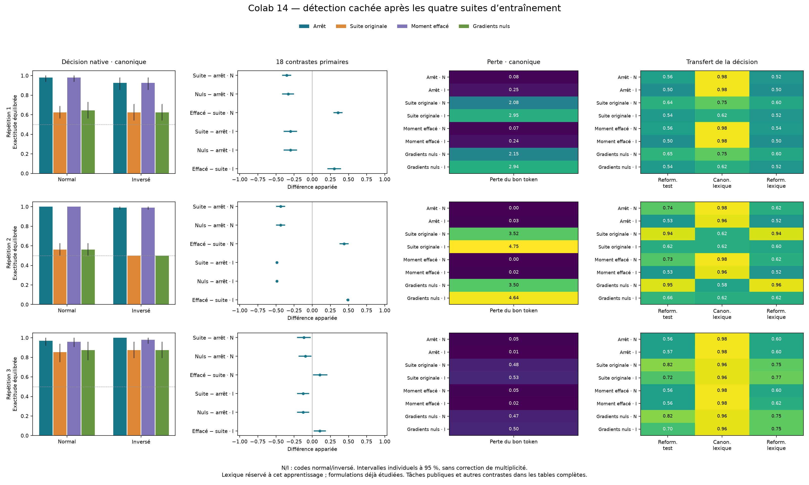

# Colab 14 : une dérive due à l'optimiseur, avec un compromis de formulation

**Les 29 184 évaluations sont reçues et auditées. La dernière phase originale
dégrade la décision canonique dans les six conditions principales. Seize pas
sans nouveaux gradients suffisent aussi à la dégrader. Effacer le premier
moment d'Adam avant cette phase améliore les six conditions, mais détériore
les six conditions reformulées du même test.**

Le diagnostic identifie donc un blocage réel de cet entraînement. Il ne fournit
pas encore une correction qui généralise entre formulations. Le
[protocole fixé](OPTIMIZER_MEMORY_PROTOCOL.md), ses 18 contrastes primaires et
ses 288 autres contrastes restent inchangés ; aucun verdict global de réussite
n'était prévu. La mémoire de l'optimiseur n'est pas une mémoire de soi, et ce
résultat n'établit ni conscience ni méthode inédite.

## Expérience vérifiée

Trois parents du Colab 10 suivent exactement les 48 premières mises à jour du
bras composé du Colab 12, puis bifurquent vers quatre branches : arrêt au point
commun (`prefix`), poursuite originale de 16 mises à jour (`carry`), même poursuite
après remise à zéro du seul premier moment (`reset_m`), ou 16 pas AdamW avec
gradients denses nuls (`zero_grad`). Les compteurs et seconds moments sont
préservés ; la décroissance des poids est nulle.

Les trois branches `carry` reproduisent **octet pour octet** les checkpoints
du Colab 12 avant toute évaluation. Les douze poids et les trois états d'Adam
sont sauvegardés et recontrôlés localement. L'exécution MCP sur A100-SXM4-40GB
s'étend du 19 septembre 2026, 14:39:59 à 15:36:44 UTC, aux sources scientifiques
`9826a65adf9c9826dc4dce5c1efd2b5710936311`.

- 288 pas d'optimisation, dont 240 avec calcul de gradients et 48 avec gradients nuls ;
- 29 184 requêtes et réponses, sans erreur, reprise ni interruption ;
- 7 296 paires de témoins d'absence exactement identiques ;
- 408 tableaux et 306 contrastes, sans sortie hors des deux chiffres autorisés ;
- archive légère de 2 940 435 octets, reçue en douze fragments et vérifiée par CRC et SHA-256.

Le [reçu](../artifacts/optimizer-memory-pilot/receipt.json) conserve les empreintes.
Le [résumé complet](../artifacts/optimizer-memory-pilot/summary.json) est celui
produit dans Colab. Le recalcul local principal concorde à 1,12 × 10⁻¹⁵ près.
L'[auditeur arithmétique indépendant](../artifacts/optimizer-memory-pilot/verification.json),
publié avant les résultats, retrouve les tableaux et contrastes à
3,56 × 10⁻¹⁵ près. Il partage le plan et le lecteur strict, et ne constitue
pas une réplication extérieure. Le journal brut et les poids restent hors Git.

## Résultat principal : réponses natives sur les nouveaux blocs canoniques

L'exactitude équilibrée donne un poids de moitié à l'absence et d'un quart à
chacune des deux positions perturbées. Il s'agit du premier token choisi dans
le vocabulaire complet, sans seuil externe. Chaque ligne porte sur 24 blocs
nouveaux, soit 72 lectures hors témoins. N et I désignent les codes normal et
inversé ; les cibles s'inversent avec le code.

| Répétition / code | Arrêt après 48 pas | Suite originale | Premier moment effacé | Gradients nuls |
|---|---:|---:|---:|---:|
| 1 / N | 97,92 % | 62,50 % | 97,92 % | 64,58 % |
| 1 / I | 92,71 % | 62,50 % | 92,71 % | 62,50 % |
| 2 / N | 100,00 % | 56,25 % | 100,00 % | 56,25 % |
| 2 / I | 98,96 % | 50,00 % | 98,96 % | 50,00 % |
| 3 / N | 96,88 % | 85,42 % | 95,83 % | 87,50 % |
| 3 / I | 100,00 % | 87,50 % | 97,92 % | 87,50 % |

Les comparaisons appariées fixées donnent :

| Contraste | Étendue des six différences, en points | Intervalles individuels à 95 % |
|---|---:|---|
| Suite originale − arrêt | −48,96 à −11,46 | Les six sont entièrement négatifs |
| Gradients nuls − arrêt | −48,96 à −9,38 | Les six sont entièrement négatifs |
| Moment effacé − suite originale | +10,42 à +48,96 | Les six sont entièrement positifs |

Les pertes du bon token dans le vocabulaire complet évoluent dans le même
sens dans les six conditions de chaque contraste. Les intervalles utilisent
2 000 rééchantillonnages appariés par blocs, stratifiés par marqueur public.
Ils ne sont pas corrigés pour les comparaisons multiples ; leur comptage
ne crée pas un test global supplémentaire.

La dégradation canonique concerne surtout l'absence : après poursuite originale,
sa reconnaissance tombe à 0–75 %, alors que toutes les présences sont reconnues.
Après effacement du moment, la reconnaissance de l'absence vaut 87,5–100 %,
et celle de la présence 95,83–100 %. Les AUROC de la suite originale restent
entre 0,9800 et 1,0000 : un bon classement masque encore de mauvaises décisions.



## Le transfert révèle un compromis, pas une solution générale

Avec le vocabulaire de contenu réservé à cet apprentissage, la branche au
moment effacé atteint **95,83–97,92 %** en formulation canonique. Mais sur
la reformulation du test principal, elle ne donne que **50,00–72,92 %**, contre
**54,17–93,75 %** pour la suite originale. Les six différences appariées sont
négatives, de −4,17 à −26,04 points, avec intervalles individuels excluant zéro.
Sur le contenu lexical réservé reformulé, elle vaut 50,00–62,50 % ; les six
différences ponctuelles sont encore négatives, trois intervalles excluent zéro.

Les classes expliquent cette apparente contradiction : dans la reformulation,
l'absence est reconnue à 100 % avant et après effacement, mais les présences
le sont peu. La poursuite originale améliore ces présences tout en nuisant aux
absences canoniques. Un déplacement favorable à « présence » peut donc aider
une formulation et nuire à l'autre. Cette lecture des classes est descriptive ;
elle ne prouve pas que tout l'effet se réduit à un unique biais scalaire.

Les tâches visibles doivent également rester dans le bilan. La présence
canonique et le repère de première phrase canonique sont à 100 % dans toutes
les branches du test principal. La lecture canonique de la seconde phrase
reste imparfaite dans plusieurs conditions ; l'effacement perd notamment
5,56 points contre la suite originale dans deux conditions, avec intervalles
excluant zéro. Sa lecture reformulée reste entre 50,00 et 56,94 %, et ne se
trouve pas réparée. La présence visible reformulée perd aussi 5,21 points dans
les deux codes de la deuxième répétition. Tous les tableaux, y compris les
autres tâches et le contenu lexical réservé, sont conservés dans le résumé.

## Lien avec les poids et limite de la conclusion causale

L'[audit auxiliaire des poids](OPTIMIZER_DISPLACEMENT_AUDIT.md), effectué après
l'entraînement et avant lecture de ce bilan, trouve des déplacements presque
parallèles entre suite originale et gradients nuls : cosinus 0,999804–0,999999.
La formule indépendante d'Adam retrouve le contrôle nul avec moins de
9,91 × 10⁻⁹ d'écart par coordonnée. La branche au moment effacé se déplace
beaucoup moins. Ces observations sont cohérentes avec les effets comportementaux.

Les interventions établissent dans ces conditions qu'une poursuite avec moments
hérités, sans nouvelles pertes, suffit à détériorer la décision canonique, et que
l'effacement initial du premier moment modifie favorablement son résultat final.
Elles ne donnent pas un pourcentage additif de responsabilité du moment :
l'effacement change aussi les poids sur lesquels les gradients futurs sont calculés.
Elles ne démontrent pas une détérioration sous toute consigne, puisque le gain
reformulé de la suite originale est précisément conservé dans les résultats.

## Prochaine question de construction

Le blocage s'est précisé : préserver l'apprentissage canonique ne suffit pas,
car les deux formulations commencent avec des décisions différentes. La suite
doit tester ensemble **rétention et généralisation de la décision native**.
Un mélange des conditions au sein de l'apprentissage, des formulations
contrebalancées et une maîtrise des moments sont des hypothèses correctives à
comparer ; aucune n'est validée par ce diagnostic.

Le prochain protocole devra conserver le témoin original, comparer à coût égal,
réserver des formulations réellement nouvelles, mesurer absence et présence,
et maintenir les tâches publiques. Il devra évaluer la correction sur de
nouvelles répétitions, sans choisir la meilleure des douze branches après coup.
La [prévision des erreurs naturelles](NATURAL_ERROR_CONFIDENCE_REVIEW.md) et les
interventions mécanistiques restent des étapes distinctes. Aucun poids de
cette expérience n'a été installé sur l'iPhone.

## Reproduire les calculs

```sh
python -m research.optimizer_memory JOURNAL.jsonl --output resume-local.json
python -m research.audit_optimizer_memory JOURNAL.jsonl --summary RESUME_RECU.json --output verification.json
python scripts/plot_optimizer_memory.py RESUME_RECU.json verification.json resultat.png
```
