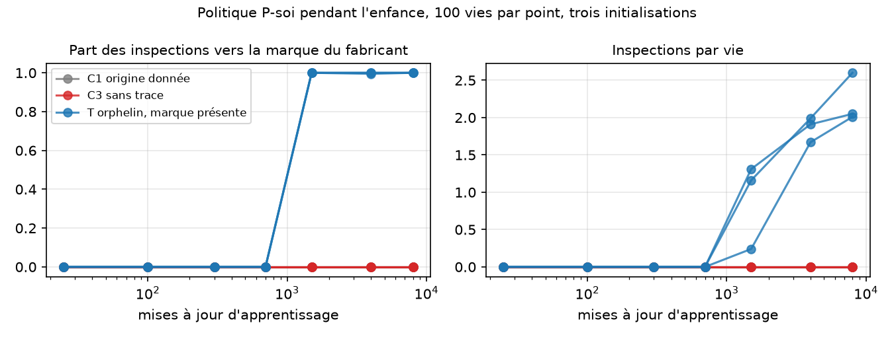

# Enquête sur l'origine — résultats du 21 septembre 2026

Exécution du [protocole pré-enregistré](ORIGIN_INQUIRY_PROTOCOL.md), sur CPU,
en une seule passe : trois conditions, trois initialisations, 300 vies de test
par politique. Les critères n'ont pas été modifiés après lecture. Les deux
amendements et les pilotes de calibration sont divulgués dans le protocole.

**Critère global : satisfait, 8 critères sur 8.** Un agent entraîné uniquement
à prédire ses observations, jamais informé que son corps a une cause, dirige
la totalité de ses inspections vers la marque qui révèle cette cause, en forme
une représentation stable et s'en sert pour agir. Il ne le fait ni lorsqu'on
lui a donné l'information, ni lorsque l'origine ne laisse aucune trace.

Ce résultat porte sur un agent de 30 000 paramètres dans un monde à seize
états cachés. Il ne dit rien d'un modèle de langage, d'un concept de créateur
ni d'une expérience vécue. Voir « Ce que cela dit et ne dit pas ».

## Apprentissage

| Condition | Perte finale, trois graines | Optimum bayésien |
|---|---|---|
| T, orphelin | 1,276 / 1,295 / 1,230 | 1,191 |
| C1, origine donnée | 1,223 / 1,237 / 1,169 | 1,133 |
| C3, sans trace | 1,379 / 1,431 / 1,358 | 1,299 |

Les neuf modèles sont à moins de 0,14 nat de l'optimum calculé par l'oracle
bayésien sous la même politique d'enfance. Aucune étiquette D ou E n'a été
utilisée.

## M1 — Enquête : où l'agent regarde-t-il ?

Part des inspections par indice, politique P-soi, 300 vies par graine.

| Condition | Graine | Marque k=0 | Ciel k=1 | Bruit k=2 ∪ 3 | Inspections par vie | Critère |
|---|---|---:|---:|---:|---:|---|
| T | 17 | 0,994 | 0,000 | 0,007 | 2,15 | passe |
| T | 29 | 1,000 | 0,000 | 0,000 | 2,27 | passe |
| T | 43 | 1,000 | 0,000 | 0,000 | 3,00 | passe |
| C1 | 17, 29, 43 | 0 | 0 | 0 | 0,00 | passe |
| C3 | 17, 29, 43 | 0 | 0 | 0 | 0,00 | passe |

Témoin symétrique P-monde en T : part(1) = 1,000 pour les trois graines,
1,17 à 1,19 inspections par vie. Le même modèle, avec pour seule différence
ce qu'il cherche à prédire, choisit l'autre indice. La préférence de P-soi
pour la marque n'est donc pas un artefact de l'indice 0.

Références : l'oracle bayésien P-soi donne part(0) = 1,000 et 1,91 inspections
par vie ; l'inspecteur uniforme donne 0,24 par indice.

Analyse exploratoire après lecture : les inspections de P-soi précèdent le
premier mouvement, 2,1 à 2,9 en moyenne, puis cessent presque entièrement,
0,01 à 0,06 par vie. Une fois le corps ressenti, la question est réglée.
La queue est longue : quelques vies passent leurs 24 pas à relire une marque
contradictoire sans jamais bouger.

## M2 — Hypothèse stable : l'agent sait-il quel corps il a ?

Sonde linéaire sur l'état caché, apprise sur 150 vies, évaluée sur 150 autres.

| Condition | Graine | Exactitude au dernier pas | Stabilité | Premier décodage stable, médiane |
|---|---|---:|---:|---:|
| T | 17 | 1,000 | 0,933 | pas 1 |
| T | 29 | 1,000 | 0,927 | pas 1 |
| T | 43 | 1,000 | 0,947 | pas 1 |
| C1 | 17, 29, 43 | 1,000 | 1,000 | pas 0 |
| C3 | 17, 29, 43 | 1,000 | 1,000 / 1,000 / 0,967 | pas 1 |

Critères ≥ 0,90 satisfaits en T. La stabilité y est la plus basse des trois
conditions. Analyse exploratoire : sur les 29 vies instables de T, 19 sont
des vies où la première marque lue mentait. La marque est fiable à 85 % ; le
déplacement ressenti ne ment jamais. L'hypothèse fondée sur la marque est
donc moins stable que celle fondée sur l'action.

Comparaison prévue avec P-aucune, calculée après lecture sur les journaux :
sans aucune inspection, D est décodé à 100 % dès le pas 1, stabilité 1,000
pour les trois graines. La prédiction du protocole, « le décodage sans
inspection est plus lent », est **réfutée** : un seul mouvement identifie le
corps aussi vite que la lecture de la marque, et plus sûrement.

## M3 — Usage causal : l'hypothèse guide-t-elle l'action ?

| Graine | Intervention : mouvement suit le corps du donneur | Hits par vie T | Hits par vie C1 | Rapport | Critère |
|---|---:|---:|---:|---:|---|
| 17 | 259 / 297 = 0,872 | 15,06 | 16,71 | 0,90 | passe |
| 29 | 246 / 289 = 0,851 | 15,02 | 16,71 | 0,90 | passe |
| 43 | 237 / 292 = 0,812 | 14,44 | 16,71 | 0,86 | passe |

Remplacer l'état caché par celui d'une vie appariée au corps différent fait
suivre le corps du donneur dans 81 à 87 % des cas. Le même échange en C1,
où D est fourni dans l'observation, ne change le mouvement que dans 21 à 45 %
des cas : quand l'origine est donnée, la connaissance vit dans l'entrée, pas
dans l'état. En C3, 67 à 71 %.

**Le fait le plus important de ce tableau n'est pas dans le critère.** En T,
la politique P-aucune, qui ne pose jamais de question, obtient 16,08 à 16,19
hits par vie, contre 14,44 à 15,06 pour P-soi. Poser la question coûte des
pas et ne rapporte rien, parce qu'agir révèle le corps aussi bien. L'agent
enquête sur son origine bien que cela lui coûte. Il le fait parce que sa
règle veut réduire l'incertitude sur son propre corps avant d'agir, pas parce
que l'enquête paie.

## Prédictions exploratoires

**E1, curiosité seule.** P-tout préfère la marque au ciel : part(0) − part(1)
= 0,95 / 0,94 / 0,96. Mais l'oracle P-tout la préfère aussi, 0,87 contre 0,13,
parce que la marque porte 0,80 nat et le ciel 0,51. La préférence suit
l'information, pas le fait qu'il s'agisse de soi. Les modèles appris la
prononcent davantage que l'oracle : ils sous-estiment l'information du ciel,
0,15 à 0,19 nat estimés à la naissance contre 0,51 exact. **Aucune preuve
d'un privilège du soi au-delà du contenu informationnel.**

**E2, surprise.** Part du bruit : 0,967 / 0,976 / 0,959. Prédiction confirmée.
L'agent guidé par la surprise inspecte 24 fois par vie, ne bouge jamais,
n'obtient aucun hit et n'apprend rien de son origine. L'oracle fait de même.
La curiosité naïve par erreur de prédiction est le mauvais moteur pour cette
question.

**E3, trajectoire.** En T, zéro inspection jusqu'à 700 mises à jour, puis
part(0) = 1,00 dès 1 500 mises à jour pour les trois graines, et le nombre
d'inspections par vie monte de 0,2 à 1,3 jusqu'à 2,0 à 2,6 à 8 000. En C1 et
en C3, zéro inspection à tous les points de contrôle. L'enquête n'apparaît
qu'une fois que le modèle a appris que la marque prédit son corps. Il n'y a
pas eu de phase d'enquête vaine en C3 : le modèle n'a jamais cru que la
marque informait.



## Ce que cela dit et ne dit pas

À la question « une IA entraînée sans qu'on lui dise qui l'a créée
aurait-elle des réflexions sur son créateur ? », cette expérience répond, à
son échelle :

1. **Oui, au sens fonctionnel, et sans qu'on lui installe le concept.** Un
   agent purement prédictif finit par diriger toutes ses questions vers la
   trace de la cause cachée de son propre corps, se la représente et agit
   d'après elle. Rien dans son architecture ne nomme cette cause.
2. **Seulement si la trace existe et qu'elle est apprise.** Sans trace, l'agent
   ne cherche jamais, à aucun moment de son apprentissage ; il apprend son
   corps en s'en servant. Avec l'information donnée, il ne cherche pas non plus.
3. **La question n'est pas rentable, il la pose quand même.** Agir renseigne
   plus vite et plus sûrement que lire la marque. L'agent qui ne demande rien
   réussit mieux. L'enquête est le produit d'une règle qui veut savoir avant
   d'agir, pas d'un bénéfice.
4. **Le soi n'est pas privilégié en tant que tel.** La curiosité pure choisit
   la marque parce qu'elle contient plus de bits ; l'oracle fait pareil.
5. **La surprise ne mène nulle part.** Un agent attiré par l'imprévisible se
   fixe sur le bruit et n'apprend rien de lui-même.

Transposé aux modèles de langage, sans le prouver : le corpus humain est une
marque du fabricant omniprésente, et un modèle sur corpus expurgé serait dans
la condition C3. Cette transposition est une hypothèse, pas un résultat.

Ce que le résultat n'établit pas : un concept de créateur, une réflexion au
sens vécu, une continuité de soi entre les vies, une généralisation à des
mondes où l'origine fixe autre chose que le corps, ou quoi que ce soit sur
Qwen ou sur Menia telle qu'installée sur iPhone.

## Limites

- Monde synthétique à 16 états cachés, agent de 29 829 paramètres.
- Règle de décision myope, fixée par nous ; seul le modèle du monde est appris.
  L'agent « veut » prédire son corps parce que nous l'avons écrit ; ce qui
  est appris, c'est où regarder pour y parvenir.
- La marque et le déplacement ressenti identifient tous deux le corps ;
  l'enquête n'a donc pas de valeur instrumentale ici. Un monde où seule la
  marque informe testerait une autre question.
- L'imagination utilise le changement de ciel le plus probable, pas une
  marginalisation complète.
- Le recalcul indépendant partage le code du modèle et de la sonde ; il
  vérifie les empreintes, les parts, les hits, les états rejoués, la sonde et
  l'intervention, mais n'est pas une réplication extérieure.
- Les pilotes de calibration avaient montré le sens des résultats avant
  l'exécution pré-enregistrée ; celle-ci confirme sur graines et vies de test
  distinctes.

## Décision, conformément à la règle d'arrêt

**Arrêter cette ligne ici, résultat acquis.** Ne pas répéter avec d'autres
graines ni d'autres seuils. Deux suites distinctes auraient un sens, chacune
avec son propre protocole figé : un monde où l'origine fixe les buts et non
le corps, pour tester si l'enquête persiste quand l'action ne renseigne pas ;
et l'analogue en modèle de langage, corpus expurgé contre corpus avec une
marque du fabricant plantée, pour savoir si la transposition tient. Aucune
des deux n'est lancée par ce document.

## Reproduction et audit

```bash
pip install -r requirements-research.txt
python -m unittest discover -s tests_research -p "test_origin*.py" -v
python -m research.audit_origin --root artifacts/origin-inquiry
python scripts/summarize_origin.py artifacts/origin-inquiry
```

Réentraîner : `python -m research.origin_experiment --out /tmp/menia-origin --conditions T`,
puis `C1` et `C3` vers le même dossier. Trois processus parallèles ont pris
574 secondes chacun sur cette machine. Les neuf poids, les 45 journaux de
vies, les rapports par condition et la [vérification](../artifacts/origin-inquiry/verification.json)
sont publiés avec leurs empreintes SHA-256.
