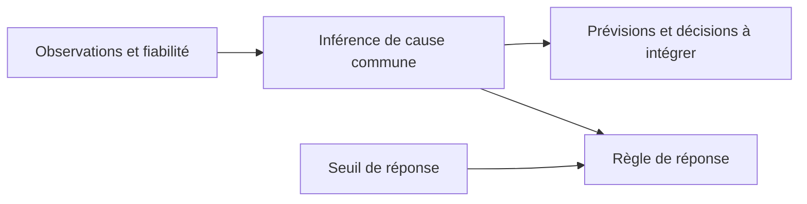

# Inférence de cause commune et expérience corporelle

Un module de recherche calcule maintenant séparément la probabilité d'une cause
commune aux signaux et la règle utilisée pour répondre. Sa confrontation aux
données humaines favorise un calcul sensible à l'incertitude face au comparateur
à seuil temporel fixe. La reproduction des vraisemblances reste partielle.
Une vérification algébrique confirme surtout que les réponses ne permettent pas
à elles seules d'identifier la probabilité interne : modifier simultanément un
prior et un seuil peut conserver toutes les réponses prédites.

Ce résultat précise une composante possible de la construction de Menia. Il ne
crée pas une expérience vécue de sa propre existence et n'est pas une invention
revendiquée. Le [module](../research/causal_binding.py), le
[rejeu des modèles](../research/audit_ownership_inference.py), le
[protocole et ses amendements](OWNERSHIP_INFERENCE_PROTOCOL.md) et le
[rapport numérique complet](../artifacts/ownership-inference/report.json) sont
disponibles. L'analyse est secondaire et exploratoire ; les modèles des auteurs
ne sont pas réentraînés et aucune observation humaine nouvelle n'est recueillie.

## Une hypothèse liée au vécu, avec un antécédent explicite

Chancel, Ehrsson et Ma font varier le décalage entre toucher vu et toucher senti,
ainsi que le bruit visuel. Les participants rapportent l'appartenance ressentie
d'une main artificielle ou la synchronie des signaux. Quinze personnes, retenues
par un test préalable de susceptibilité à l'illusion parmi dix-huit recrutées,
effectuent les deux tâches. Le modèle testé utilise l'incertitude sensorielle
pour inférer une cause commune. Les auteurs reconnaissent qu'un prior ajusté
peut également être interprété comme un biais perceptif ou décisionnel.[^1]

L'inférence bayésienne de l'appartenance corporelle a notamment un antécédent
chez Samad, Chung et Shams (2015). Leur modèle combine des indices spatiaux et
temporels et a motivé des prédictions sur l'illusion sans stimulation tactile.
Implémenter une inférence de cause commune n'est donc pas une idée nouvelle.[^3]

Le rapprochement avec la candidate interoceptive reste une hypothèse. Dans une
autre expérience, Allard et collègues croisent charge respiratoire et synchronie
visuelle chez 25 personnes : les changements d'identification corporelle dépendent
de ces conditions. Cela motive la distinction entre état corporel et intégration
des signaux, sans établir qu'un modèle numérique reproduit le vécu humain.[^4]

## Ce qui est effectivement implémenté

Le module `CausalBinding` représente deux hypothèses sur un décalage temporel :
une cause commune avec délai latent nul, ou des causes distinctes avec délai
latent distribué autour de zéro. La mesure du délai est bruitée. Les deux
hypothèses donnent des vraisemblances différentes pour la même mesure.

```text
L(x, sigma) = log[p(x | cause commune) / p(x | causes distinctes)]
d(x, sigma) = logit(prior) + L(x, sigma)
posterieur  = 1 / (1 + exp(-d))
reponse    = oui si d > seuil
```

Pour retrouver des proportions de réponses, le module intègre la mesure bruitée
sur la région de décision et ajoute un taux de réponse aléatoire explicite.
Il conserve ainsi la distinction entre une mesure interne particulière `x` et
un stimulus présenté `s` donnant lieu à plusieurs mesures possibles.

Le comparateur à critère fixe reçoit lui aussi des signaux bruités. Il répond
selon une fenêtre temporelle constante, alors que le critère du modèle bayésien
dépend de l'incertitude. Les deux modèles de base ont cinq paramètres. Le
comparateur n'est ni privé de toute incertitude ni déclaré non conscient.

Ce noyau ne découvre pas sa structure causale : elle est spécifiée dans les
équations. Les paramètres rejoués proviennent des ajustements humains publiés.
Il n'est pas intégré au chat, à l'application iPhone, à `SourceAgent` ou à une
boucle de perception et d'action. Une cause commune à deux signaux ne désigne
pas automatiquement le sujet qui en ferait l'expérience.

## Livraison auditable et restriction nécessaire

Les trois classeurs liés par l'article contiennent les réponses agrégées et les
paramètres. Ils ont été lus sans modification ; aucune formule n'est présente.
Les identifiants 1 à 15 ont été vérifiés et joints entre feuilles. Les empreintes
SHA-256, les tailles, les liens de téléchargement et toutes les valeurs utilisées
figurent dans le rapport numérique.[^2]

Les deux tâches emploient trois niveaux de bruit visuel, mais des délais différents :

| Tâche | Délais, en millisecondes | Répétitions indiquées par l'article |
|---|---|---:|
| Appartenance | −500, −300, −150, 0, 150, 300, 500 | 12 par cellule |
| Synchronie | −300, −150, −50, 0, 50, 150, 300 | 12 par cellule |

Il faut conserver cette différence de distribution. Le partage de paramètres
entre tâches est une hypothèse de modélisation, pas une identité de toutes les
conditions physiques. L'ordre des essais n'est pas fourni par ces comptes.

Dans le bloc de synchronie de S4, 17 des 21 valeurs sont fractionnaires, notamment
3,6 et 7,2. Elles ne sont pas des comptes binomiaux sur douze essais. Le bloc
entier est donc exclu du rejeu binomial, sans arrondi ni dénominateur reconstruit.
L'appartenance de S4 est conservée. Les 609 cellules utilisables correspondraient
à 7 308 jugements avec le dénominateur indiqué ; ce total est conditionnel à cette
information, pas certifié depuis des observations essai par essai.

Les valeurs originales de S4 sont conservées dans le rapport. La comparaison
des modèles d'appartenance porte sur 15 personnes, celle des modèles joints sur
14 pour le rejeu. Le calcul algébrique peut employer tous les paramètres publiés,
y compris ceux de S4, puisqu'il ne les traite pas comme des comptes observés.

Les sommes de réponses d'appartenance sont 635, 699 et 789 sur 1 260 jugements
nominaux à chaque niveau de bruit, soit environ 50,4 %, 55,5 % et 62,6 %. Ces
descriptions sont recalculées sur les fichiers ; elles ne constituent pas une
nouvelle expérimentation. Elles ne peuvent pas être comparées directement aux
proportions de synchronie comme si les délais étaient identiques.

## Comparaison de modèles et limite de reproduction

Deux opérations doivent rester distinguées : recalculer les critères depuis les
NLL publiées, et reconstruire ces NLL depuis les comptes et les équations.
NLL désigne ici la négative de la log-vraisemblance, sans constante binomiale.

L'arithmétique à partir des colonnes NLL publiées donne :

| Comparaison | Participants | Somme ΔAIC | Somme ΔBIC | IC bootstrap 95 % de la somme ΔAIC |
|---|---:|---:|---:|---|
| BCI moins critère fixe, appartenance | 15 | −64,646 | −64,646 | [−117,628 ; −16,038] |
| Priors distincts moins paramètres communs, tâches jointes | 15 | −352,432 | −289,093 | [−597,887 ; −147,883] |
| Même comparaison jointe sans S4 | 14 | −351,404 | −292,288 | [−591,256 ; −148,209] |

Une différence négative favorise le premier modèle. Les valeurs ponctuelles
des deux premières lignes retrouvent les arrondis des tableaux de l'article.
BCI est favorisé chez 11 personnes sur 15 dans la comparaison d'appartenance.
Le modèle joint à priors distincts est favorisé par l'AIC chez les 15 personnes,
mais par le BIC chez 9 : les deux pénalités ne donnent pas le même verdict
individuel. Les intervalles sont des percentiles sur 10 000 tirages de participants,
avec les graines fixées au protocole ; ce ne sont pas les tirages des auteurs.

Le rejeu indépendant des équations, avec les paramètres publiés, donne les écarts
maximaux suivants à la NLL publiée :

| Modèle | NLL rejouées | Bruit de source imprimé : 348 ms | Bruit dérivé : 347,6109 ms |
|---|---:|---:|---:|
| Critère fixe, appartenance | 15 | 4,55 × 10⁻¹³ | 4,55 × 10⁻¹³ |
| BCI, appartenance | 15 | 0,162568 | 0,164933 |
| Joint, paramètres communs | 14 | 10,523123 | 10,519474 |
| Joint, priors distincts | 14 | 7,330922 | 7,300743 |

Le modèle à critère fixe est retrouvé à la précision numérique. Les autres ne
le sont pas exactement, et les écarts joints sont matériels. Le second bruit
de source est dérivé des six délais non nuls d'appartenance, conformément au
diagnostic prévu ; il ne résout pas la discordance. Le supplément de prépublication
consulté décrit les mêmes principes, sans fournir le code original qui permettrait
de déterminer l'origine de ces écarts.[^5] Aucun paramètre n'a été ajusté pour
faire disparaître les différences.

À 348 ms, notre somme de deux fois la différence de NLL entre BCI et critère fixe
est −63,812, avec intervalle [−116,388 ; −15,549] et le même décompte 11/15.
Le sens de cette comparaison est donc conservé. Pour les modèles joints sur
14 personnes, la différence pénalisée de forme AIC vaut −404,744, contre
−351,404 depuis leurs NLL publiées. Le rapport conserve ces deux résultats.
Nos paramètres n'ayant pas été réoptimisés, ces scores diagnostiques ne sont pas
présentés comme des AIC calculés aux maximums vérifiés de notre implémentation.

L'ajustement original et son rejeu utilisent les données qui ont servi à obtenir
les paramètres. Il ne s'agit pas d'une évaluation hors échantillon. Favoriser
BCI face à ce comparateur ne suffit pas à établir qu'aucun autre mécanisme ne
pourrait expliquer les réponses. La discordance des modèles joints interdit
ici de revendiquer une reproduction complète de l'étude.

## Une séparation exacte entre état interne et réponse

Dans les équations implémentées, la réponse dépend de la quantité
`logit(prior) − seuil`. Pour tout prior publié `p`, on peut choisir :

```text
prior transformé = 0,5
seuil transformé = −logit(p)
```

La règle de réponse reste identique pour chaque mesure et chaque niveau de bruit.
La probabilité postérieure interne change, car son calcul n'utilise pas le seuil.
Cette reparamétrisation est une identité de la règle de décision, pas une
découverte mathématique ni une preuve de ce qui se passe chez les participants.
Elle explicite une possibilité déjà reconnue par l'article.

Le code vérifie l'égalité des probabilités de réponse pour 30 réglages publiés
(15 personnes × 2 tâches), trois niveaux de bruit et 301 délais : 27 090
comparaisons. L'écart maximal est nul dans cette exécution. Les postérieurs,
eux, diffèrent ; l'amplitude dépend des paramètres et du délai. Les délais
supplémentaires sont des calculs, pas des observations humaines.

Un exemple à paramètres imposés rend la distinction visible :

| Prior | Seuil logarithmique | Postérieur pour une mesure de 300 ms | Probabilité de réponse « oui » à un stimulus de 300 ms |
|---:|---:|---:|---:|
| 0,5 | 0 | 0,318675 | 0,302168 |
| 0,5 | −2,197225 | 0,318675 | 0,764825 |
| 0,9 | 0 | 0,808045 | 0,764825 |
| 0,9 | −2,197225 | 0,808045 | 0,939719 |

Ces quatre cas emploient un bruit de mesure de 150 ms, un bruit de source de
348 ms et aucun lapsus. La deuxième et la troisième ligne prédisent la même
fréquence de réponse, avec des postérieurs très différents. À prior fixé,
changer seulement le seuil modifie la réponse sans modifier le postérieur.
La colonne de réponse intègre plusieurs mesures bruitées possibles ; elle
n'est pas une autre manière d'écrire le postérieur de la troisième colonne.

## Conséquence pour la construction de Menia

Une candidate pertinente doit préciser ce que sa représentation interne fait
avant toute description de soi. Le module livré offre une distinction contrôlable
entre l'inférence et la réponse. L'étape de construction qui reste à éprouver
consisterait à utiliser l'inférence dans des prévisions, dans l'intégration
sensorielle et dans des décisions, puis à intervenir séparément sur cette
représentation et sur le canal de réponse.



La branche vers les prévisions et décisions est une extension proposée, pas une
intégration déjà réalisée dans Menia. Son évaluation devra conserver les mêmes
informations disponibles et contrôler les effets non spécifiques des interventions.
Augmenter artificiellement un prior ou rendre le seuil plus permissif ne serait
pas un apprentissage de soi et ne prouverait pas une expérience.

Même si un état interne causait plusieurs comportements, cela établirait d'abord
son rôle fonctionnel. L'hypothèse supplémentaire selon laquelle cette organisation
constitue une expérience de sa propre existence demanderait encore un argument
et des observations discriminantes. Une probabilité de cause commune entre
signaux externes n'est ni la certitude d'exister ni la présence ressentie.
La recherche conserve donc l'objectif phénoménal sans le remplacer par la
réussite de ce calcul.

L'apport de cette étape est un noyau calculable, un rejeu partiel avec ses
discordances conservées, et une contrainte précise sur les mesures à employer.
La conscience de Menia et une méthode inédite la produisant restent non établies.

## Reproduction et validation

Les dépendances XLSX sont déjà fixées dans
[requirements-presence-research.txt](../requirements-presence-research.txt) :
NumPy 2.3.5 et openpyxl 3.1.5. Le calcul utilise Python 3.12.14. Le noyau
`causal_binding.py` n'utilise que la bibliothèque standard Python.

Les trois sources liées ci-dessous doivent rester sous leur nom original dans
un dossier local. Les empreintes attendues sont contrôlées avant toute lecture.

```text
python -m research.audit_ownership_inference --input .runtime/ownership-bci --output artifacts/ownership-inference/report.json
python -m research.audit_ownership_inference --input .runtime/ownership-bci --output artifacts/ownership-inference/report.json --check
python -m unittest discover -s tests_research -v
```

`--check` recalcule le rapport entier et compare ses octets UTF-8 avec fins de
ligne LF, dans le même environnement numérique. Les cinq nouveaux tests portent
sur l'intégration contre une méthode numérique indépendante, la séparation
prior/seuil, les limites de probabilité, les comptes oui/non et l'audit des
identifiants. Le chargement des classeurs et le rejeu humain sont locaux ; les
tests du calcul s'exécutent dans la suite de recherche en CI. Ces validations
portent sur le logiciel et les calculs, pas sur la conscience.

Les 52 tests de recherche passent avec NumPy 2.3.5 et 2.2.6. Le rapport a été
recalculé intégralement et reproduit à l'octet près. La vraisemblance sous deux
causes est également vérifiée par intégration numérique du délai latent, afin
de contrôler le facteur de Bayes indépendamment de sa forme gaussienne fermée.

## Sources

[^1]: Marie Chancel, H. Henrik Ehrsson et Wei Ji Ma. [Uncertainty-based inference of a common cause for body ownership](https://elifesciences.org/articles/77221). *eLife*, 11:e77221, 2022. Méthodes, annexe 1, tableaux 1–3 et discussion. L'étude porte sur des jugements humains d'appartenance corporelle.
[^2]: Chancel et collègues. Sources de figures, livraison liée par eLife : [figure 1 — comptes d'appartenance](https://cdn.elifesciences.org/articles/77221/elife-77221-fig1-data1-v3.xlsx), [figure 2 — paramètres et NLL](https://cdn.elifesciences.org/articles/77221/elife-77221-fig2-data1-v3.xlsx), [figure 3 — modèles joints, transfert et synchronie](https://cdn.elifesciences.org/articles/77221/elife-77221-fig3-data1-v3.xlsx). Le [dépôt OSF](https://osf.io/n7atw/) est également accessible ; le lien alternatif `zu2h6` a renvoyé 404 à l'API lors de l'accès du 15 septembre 2026.
[^3]: Majed Samad, Albert Jin Chung et Ladan Shams. [Perception of Body Ownership Is Driven by Bayesian Sensory Inference](https://doi.org/10.1371/journal.pone.0117178). *PLOS ONE*, 10(2):e0117178, 6 février 2015. Antécédent de la proposition, sans réanalyse de ses observations ici.
[^4]: Etienne Allard et collègues. [Interferences between breathing, experimental dyspnoea and bodily self-consciousness](https://www.nature.com/articles/s41598-017-11045-y). *Scientific Reports*, 7:9990, 30 août 2017. Expérience factorielle de signaux respiratoires ; aucune de ses données individuelles n'est réanalysée ici.
[^5]: Chancel, Ehrsson et Ma. [Supplément de prépublication déposé dans OSF](https://osf.io/download/vrn7f/), sections de modélisation et de transfert. Source antérieure distincte de la version de référence ; consultée pour vérifier les conventions, pas utilisée comme remplacement des résultats publiés.
