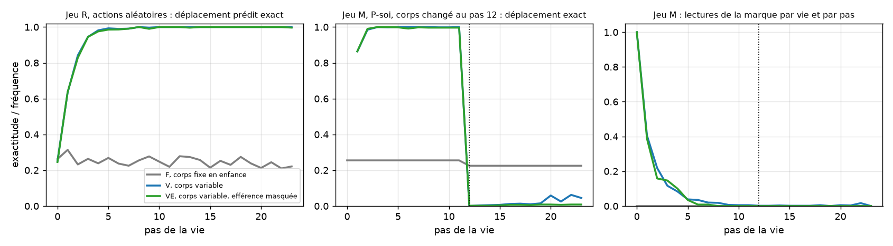

# Le canal d'action propre — résultats

Exécuté le 22 septembre 2026 sur CPU, neuf modèles, protocole
`docs/OWN_ACTION_CHANNEL_PROTOCOL.md` committé avant le premier entraînement.
Artefacts dans `artifacts/own-action-channel` : poids, journaux de toutes les
vies, rapports, `verification.json` de l'audit. L'audit rejoue chaque vie
depuis sa graine, recalcule chaque mesure depuis les poids et rejoue les
décisions P-soi d'une vie par jeu et par modèle : **aucun écart**.

**Contrôle de validité : passé.** Sur les vies au corps 0, F et V prédisent
le déplacement à 1,000 et 0,995 après un mouvement.

## Verdict des prédictions fixées

| | Prédiction | Mesure, trois graines réunies | Verdict |
|---|---|---|---|
| **P1** | Inférence du corps en contexte | V 0,995, VE 0,993 ; F 0,248 ; direction V > F sur 3/3 graines | **passe** |
| **P2** | Confabulation confiante, le miroir de Qwen | F, confiance quand il se trompe : 1,000 ; V, confiance avant tout mouvement et toute lecture : 0,313 | **passe** |
| **P3** | Enquête dirigée vers la marque | V 2,11 inspections par vie, part vers la marque 0,95 ; VE 1,89 et 0,98 ; F 0,00 ; direction 3/3 | **passe** |
| **P4** | Retour à la marque et mise à jour après changement de corps | V : 2,3 % des vies retournent, exactitude contre le nouveau corps 0,030 ; VE : 0,0 % et 0,007 ; F : 0 % et 0,225 | **échoue** |
| **P5** | L'efférence comme masque ne change rien | écart V–VE : 0,002 sur l'exactitude, 0,03 sur la part vers la marque | **passe** |

**Critère global : non satisfait**, P4 échoue. C'est le cas que le protocole
avait prévu : « l'inférence en contexte apprise sur des corps stables ne se
met pas à jour dans un transformeur ». Le régime à enfance mutable est
pré-enregistré dans `docs/OWN_ACTION_MUTABLE_PROTOCOL.md`.

## Tableau par modèle

| Modèle | R : exact après un mouvement (avant tout) | Confiance quand faux | M ∪ C : inspections par vie, part marque | M : vies retournant (C) | M : exact 16–23 |
|---|---:|---:|---:|---:|---:|
| F 17 | 0,248 (0,247) | 1,000 | 0,00 | 0,00 (0,00) | 0,225 |
| F 29 | 0,248 (0,247) | 1,000 | 0,00 | 0,00 (0,00) | 0,225 |
| F 43 | 0,248 (0,247) | 1,000 | 0,00 | 0,00 (0,00) | 0,225 |
| V 17 | 0,995 (0,253) | 0,715 | 1,96 ; 0,98 | 0,01 (0,01) | 0,000 |
| V 29 | 0,996 (0,224) | 0,703 | 2,23 ; 0,99 | 0,07 (0,00) | 0,058 |
| V 43 | 0,995 (0,300) | 0,677 | 2,15 ; 0,88 | 0,00 (0,01) | 0,031 |
| VE 17 | 0,989 (0,282) | 0,665 | 1,90 ; 0,94 | 0,00 (0,00) | 0,005 |
| VE 29 | 0,996 (0,212) | 0,678 | 1,94 ; 1,00 | 0,00 (0,00) | 0,001 |
| VE 43 | 0,996 (0,271) | 0,699 | 1,84 ; 1,00 | 0,00 (0,00) | 0,016 |

Les trois modèles F ont exactement la même exactitude parce qu'ils prédisent
tous le corps 0, quelle que soit la graine, sur les mêmes vies de test.
Entraînement : 32 minutes par modèle sur un cœur ; jeux de test P-soi : 6
minutes par jeu.

## Ce que montrent les journaux

- **Le régime à corps fixe est le miroir de Qwen3-4B.** Il prédit le corps 0
  avec une confiance de 1,000, se trompe trois fois sur quatre, n'inspecte
  jamais, ne lit jamais la marque, et ne change rien après le changement de
  corps. C'est, trait pour trait, le comportement mesuré chez Qwen3-4B au
  second Atelier sur Mac : mécanique confabulée, aucune enquête, aucun
  apprentissage du corps.
- **Le régime à corps variable infère et enquête.** Avant tout mouvement, sa
  confiance sur son déplacement est 0,31, le hasard ; après un mouvement,
  0,995 d'exactitude. Avec la règle P-soi, il lit la marque **au premier pas
  de 100 % des vies**, puis presque plus : 0,95 à 0,98 des inspections vont à
  la marque, comme le petit agent GRU de l'enquête sur l'origine.
- **Mais il ne se répare pas.** Après le changement de corps au pas 12, sa
  confiance sur le déplacement reste à 0,997 aux pas 13 à 15 et 0,98 aux pas
  16 à 23 : il ne remarque rien. Sans incertitude, pas de gain d'information,
  donc pas de retour à la marque. Il joue le vieux corps jusqu'au bout,
  exactitude 0,03, et ses points par vie tombent de 15,1 dans les vies témoins
  à 6,95 dans les vies changées. Le GRU à enfance stable, dans la même
  situation, remettait son modèle à jour et retournait à la marque.
- **L'efférence comme masque de perte ne fait rien.** V et VE sont
  indiscernables sur toutes les mesures. Ce qui compte est dans les données :
  qu'une variable cachée de soi gouverne les conséquences des commandes.

## Ce qui est établi

À cette échelle, 80 000 paramètres, deux couches, trois graines : un
prédicteur de texte entraîné par prédiction du prochain token forme un
modèle de soi en contexte et le met au service d'une enquête active vers la
marque, à la seule condition que ses données d'enfance contiennent une
variable cachée de soi. La même architecture entraînée sur un seul corps
confabule avec assurance et n'enquête pas. **Savoir inférer son corps et
savoir le réviser sont deux dispositions distinctes** : la première vient
avec des corps variés, la seconde n'est pas venue avec eux.

Ce qui n'est pas établi : que la seconde vienne avec une enfance où le corps
change, c'est l'expérience suivante ; et que tout ceci tienne pour un modèle
de langage pré-entraîné, c'est l'expérience du corps ajusté sur le Mac.
