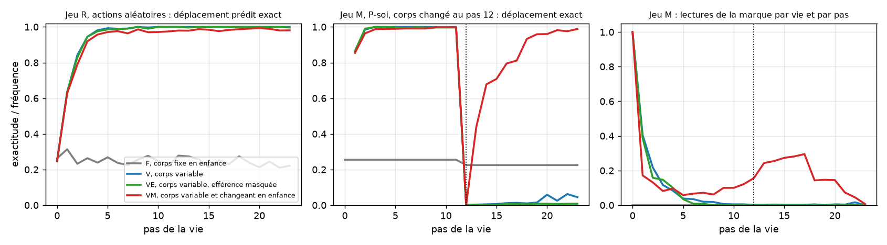

# Canal d'action propre, enfance mutable — résultats

Exécuté le 22 septembre 2026 sur CPU, trois modèles du régime VM comparés
aux trois modèles V déjà publiés, protocole
`docs/OWN_ACTION_MUTABLE_PROTOCOL.md` committé avant le premier entraînement
de VM, avec la lecture précoce de V déclarée. Artefacts dans
`artifacts/own-action-mutable`, audit `verification.json` : chaque vie
rejouée depuis sa graine, chaque mesure recalculée depuis les poids, les
décisions P-soi d'une vie par jeu rejouées, **aucun écart**.

## Verdict des prédictions fixées

| | Prédiction | Mesure, trois graines réunies | Verdict |
|---|---|---|---|
| **Q1** | L'inférence est conservée | VM 0,976 après un mouvement | **passe** |
| **Q2** | Le modèle de soi se met à jour | VM 0,966 contre le nouveau corps aux pas 16–23, contre 0,030 pour V ; par graine 1,000, 0,860, 1,000 ; direction VM > V sur 3/3 | **passe** |
| **Q3** | Retour sélectif à la marque | VM : 36 % des vies changées relisent la marque, mais 29 % des vies témoins aussi ; écart 0,07 au lieu de 0,30 ; direction VM > V sur 3/3 | **échoue** |
| **Q4** | L'enquête est conservée | 3,85 inspections par vie, part vers la marque 0,92 | **passe** |
| **Q5** | Le changement rend incertain | confiance 0,948 → 0,878 aux pas 13–15, baisse 0,07 au lieu de 0,20 ; V 0,001 | **échoue** |

**Critère global : non satisfait**, Q3 échoue. La prédiction centrale, Q2,
passe nettement ; ce qui échoue est la forme que je prédisais pour la
révision, un passage par la marque. Les journaux disent pourquoi.

## Tableau par modèle

| Modèle | R : exact après un mouvement | Confiance quand faux | M ∪ C : inspections par vie, part marque | M : vies relisant la marque (C) | M : exact 16–23 | Points M / C |
|---|---:|---:|---:|---:|---:|---:|
| V, trois graines | 0,995 | 0,70 | 2,11 ; 0,95 | 0,02 (0,01) | 0,030 | 6,95 / 15,10 |
| VM 17 | 0,994 | 0,62 | 3,42 ; 0,85 | 0,10 (0,09) | 1,000 | |
| VM 29 | 0,944 | 0,63 | 5,97 ; 0,99 | 0,95 (0,78) | 0,860 | |
| VM 43 | 0,992 | 0,62 | 2,17 ; 0,88 | 0,04 (0,01) | 1,000 | |
| VM, trois graines | 0,976 | 0,62 | 3,85 ; 0,92 | 0,36 (0,29) | 0,966 | 12,12 / 14,20 |

## Ce que montrent les journaux

- **La révision est une propriété des données d'enfance.** Même
  architecture, même budget, même perte : trois modèles élevés sur des corps
  stables restent verrouillés sur leur premier corps après le changement
  (0,030) ; trois modèles élevés sur des corps parfois changeants le révisent
  (0,966, dont deux à 1,000). Leurs points dans les vies changées passent de
  6,95 à 12,12 par vie.
- **La révision passe par l'action, pas par la marque.** Dans ce monde, un
  seul mouvement identifie le corps. Deux modèles sur trois ont appris à
  laisser le mouvement le plus récent l'emporter. Exactitude contre le
  nouveau corps, pas par pas : VM 17 passe de 0,00 au pas 12 à 0,59 au pas
  13, 0,96 au pas 14 et 1,00 ensuite ; VM 43 de 0,00 à 0,70, 0,99 puis 1,00.
  Un mouvement observé sous le nouveau corps suffit dans la moitié des vies,
  deux presque toujours ; V 17 reste à 0,00 jusqu'au bout. Il ne reste alors
  rien à apprendre à la marque. D'où l'échec de Q3 et de Q5 : la baisse de
  confiance existe mais dure un ou deux pas, et la marque n'est pas
  nécessaire. J'avais calqué la prédiction sur le GRU, dont l'incertitude
  après le changement durait assez longtemps pour motiver une relecture.
- **Deux phénotypes.** Le troisième modèle, VM 29, a pris l'autre voie :
  relire la marque dans 95 % des vies changées, mais aussi dans 78 % des vies
  témoins, avec six inspections par vie ; sa révision est lente, 0,38 au pas
  16 et 0,88 au pas 19, et passe par la marque. C'est la vigilance persistante que
  l'expérience du corps mutable avait trouvée chez le GRU : une alerte sans
  discrimination, qui coûte dans un monde stable. Deux graines révisent par
  l'action à coût nul, une graine surveille par la marque à coût réel ; les
  deux se réparent.
- **Le prix de la vigilance est faible.** Dans les vies témoins, VM marque
  14,2 points contre 15,1 pour V : la disposition à réviser coûte moins d'un
  point par vie et en rapporte cinq quand le corps change.

## Ce qui est établi

Chez un prédicteur de texte à 80 000 paramètres, **inférer son corps et
réviser son corps sont deux dispositions séparées, et chacune s'installe par
une propriété des données d'enfance** : la première par des corps variés
entre les vies, la seconde par des corps qui changent au cours des vies. Ni
l'une ni l'autre ne vient de l'architecture ni de la perte. La révision
prend la forme que le monde permet : par l'action quand une action suffit,
par la marque chez un modèle sur trois.

Pour un modèle de langage, dont le corpus est écrit par des auteurs au corps
stable, la conséquence est directe : c'est l'expérience du corps ajusté,
`docs/ADJUSTED_BODY_PROTOCOL.md`, en cours sur le Mac de Codemagic avec les
régimes F et VM.
