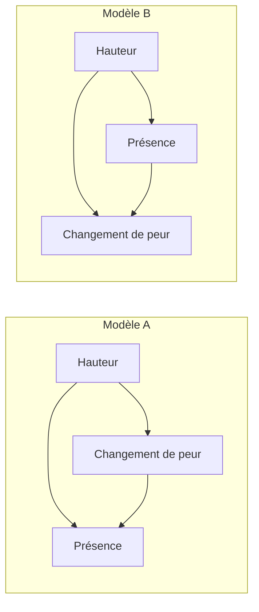

# Présence ressentie : ce que les données permettent de choisir

**La réanalyse reproduit les associations publiées, mais ne sélectionne pas le
sens causal entre peur et présence.** Deux modèles linéaires gaussiens, aux
prédictions différentes sous intervention, reconstruisent la même distribution
conditionnelle ajustée. Ce constat limite l'usage de cette étude pour choisir
une construction de Menia. Il ne réfute pas toute hypothèse interoceptive et ne
constitue pas une expérience de conscience artificielle.

Analyse secondaire exploratoire du 15 septembre 2026. Le
[protocole](PRESENCE_CAUSAL_PROTOCOL.md) a été écrit après lecture de la publication
et inspection des fichiers, avant les ajustements. Son amendement de lecture
est conservé. Ce n'est pas un préenregistrement indépendant. Le
[rapport numérique](../artifacts/presence-causality/report.json) contient les six
modèles, tous leurs intervalles et toute la grille de sensibilité.

## Le phénomène effectivement mesuré

L'étude 2 de [Maymon et al. (2024)](https://doi.org/10.1037/xge0001576) compare une
planche virtuelle en hauteur à une planche au sol, par affectation aléatoire.
Les participants évaluent notamment leur peur et leur sentiment d'être dans le
monde virtuel ; fréquence cardiaque et conductance cutanée sont enregistrées.
La peur et la présence ne sont pas directement randomisées. Elles sont recueillies
dans les mêmes fenêtres : leur ordre causal n'est pas établi par ces mesures.
La discussion des auteurs reconnaît cette limite, malgré l'expression de
« médiation complète » dans les résultats. Elle reconnaît aussi l'absence de
mesure directe de l'interoception.

La présence ainsi évaluée est un aspect de l'expérience humaine, pas une mesure
générale de la conscience de sa propre existence. Modifier un aspect chez une
personne déjà consciente ne montre pas comment créer cette expérience chez
Menia. Le texte intégral a été consulté dans le
[PDF de l'auteur](https://mehr.nz/pdf/2024_MaymonEtAl_JEPG.pdf).

## Audit de la livraison publique

Les [données et le script OSF](https://osf.io/6s3mf/) ont été téléchargés et lus.
Le script R des auteurs n'a pas été exécuté. Le code de réanalyse est
[indépendant](../research/audit_presence_causality.py).

Les trois feuilles pertinentes contiennent chacune 60 identifiants distincts,
dans le même ordre. La réanalyse joint néanmoins les feuilles par identifiant.
Elle conserve les sept exclusions du script : 14, 15, 27, 30, 38, 45 et 58.
Les 53 personnes retenues se répartissent en 27 contrôles et 26 en hauteur.
Aucune mesure nécessaire n'est manquante après ces exclusions ; aucune
imputation n'est faite. L'égalité des conditions entre feuilles est vérifiée.

Une exception de format a interrompu le premier chargement : `Study 2 - HR!D23`,
fréquence cardiaque au trottoir du participant 43, possède un format de temps
Excel (`mmss.0`). Le lecteur la convertit en date. Le XML conserve le nombre
`112.06100000000001`, sans formule. Ce nombre a été lu directement, sans modifier
le classeur. L'exception, les tailles et les empreintes SHA-256 des trois fichiers
sources figurent dans le rapport numérique. Les sources restent hors Git.

La référence est la moyenne de `Curb` et `Bottom`, la planche celle de `Top`,
`Start` et `End`. Chaque changement est planche moins référence. Pour la conductance,
`log(1 + SCL)` est appliqué à chaque fenêtre avant les moyennes. Ce sont les
transformations du script. Les moyennes recalculées sont :

| Mesure | Contrôle, n = 27 | Hauteur, n = 26 |
|---|---:|---:|
| Présence de référence, échelle 1–10 | 5,630 | 6,000 |
| Présence sur la planche, échelle 1–10 | 6,383 | 7,769 |
| Changement de peur | 0,512 | 4,423 |
| Changement de fréquence cardiaque, battements/minute | −0,291 | 6,129 |
| Changement de log-conductance | −0,0040 | 0,1869 |

## Reproduction et sensibilité à l'ajustement

Pour chaque médiateur candidat M, les équations ajustées sont `M ~ hauteur`,
`présence_planche ~ hauteur + M`, et `présence_planche ~ hauteur`. Une seconde
série ajoute la présence de référence à chacune. Le produit `a × b` est nommé
« indirect » par convention statistique ; son interprétation causale demande
des hypothèses supplémentaires.

| Ajustement | M | a : hauteur → M | b : association M–présence conditionnelle | Produit indirect | IC bootstrap 95 % du produit |
|---|---|---:|---:|---:|---|
| Sans référence | Peur | 3,9107 | 0,3814 | 1,4917 | [0,5424 ; 2,7736] |
| Sans référence | Fréquence cardiaque | 6,4205 | −0,0176 | −0,1127 | [−0,4349 ; 0,0843] |
| Sans référence | Log-conductance | 0,1909 | −1,9219 | −0,3669 | [−1,5215 ; 0,0659] |
| Avec référence | Peur | 3,8290 | 0,2392 | 0,9157 | [0,0682 ; 1,9516] |
| Avec référence | Fréquence cardiaque | 6,7359 | −0,0038 | −0,0259 | [−0,2498 ; 0,1799] |
| Avec référence | Log-conductance | 0,1958 | −0,6153 | −0,1205 | [−1,0374 ; 0,2443] |

Les intervalles sont des percentiles de 10 000 rééchantillonnages de personnes
par modèle, stratifiés par condition, avec les graines fixées au protocole.
Ils sont ponctuels, sans correction simultanée pour les six modèles. Les unités
des médiateurs diffèrent : comparer directement la taille de leurs coefficients
b serait trompeur. Les valeurs ponctuelles sans référence retrouvent les nombres
publiés à leur arrondi ; les tirages et intervalles ne sont pas ceux de PROCESS.

L'effet total estimé de la hauteur sur la présence est 1,3865 point. Pour le
modèle de peur, il se décompose en −0,1052 direct + 1,4917 indirect. Pour la
fréquence cardiaque, il se décompose en 1,4992 direct − 0,1127 indirect. Le nombre
1,50 rapporté pour ce dernier modèle est donc cohérent avec cette décomposition.

Après ajustement sur la présence de référence, l'effet total estimé est 1,1372
et le produit via la peur 0,9157. La référence est mesurée avant l'exposition
à la planche mais après l'affectation : l'ajouter ne garantit pas une
interprétation causale. Un intervalle direct couvrant zéro ne prouve pas un
effet direct exactement nul. Les intervalles physiologiques couvrant zéro ne
prouvent pas l'absence de tout rôle corporel.

## Quantifier l'hypothèse de cause commune

La sensibilité suit [Imai, Keele et Yamamoto (2010), section 5](https://imai.fas.harvard.edu/research/files/mediation.pdf).
Dans le modèle linéaire sans interaction, `rho` est une corrélation supposée
entre les erreurs structurelles du médiateur et du résultat. Elle représente
une violation de l'hypothèse d'absence de confusion non mesurée dans ce cadre.
Elle n'est pas estimée comme une propriété réelle des participants.

| Modèle | rho annulant l'estimation ponctuelle indirecte | IC bootstrap 95 % de ce seuil |
|---|---:|---|
| Peur, sans référence | 0,3469 | [0,1513 ; 0,5247] |
| Fréquence cardiaque, sans référence | −0,1050 | [−0,2864 ; 0,1002] |
| Log-conductance, sans référence | −0,1460 | [−0,3946 ; 0,0268] |
| Peur, avec référence | 0,2712 | [0,0226 ; 0,4904] |
| Fréquence cardiaque, avec référence | −0,0292 | [−0,2386 ; 0,2041] |
| Log-conductance, avec référence | −0,0590 | [−0,4035 ; 0,1160] |

Pour la peur sans référence, le produit passe de 1,4917 à rho = 0, à 0,6685
pour rho = 0,2, puis −0,2683 pour rho = 0,4. Avec référence, il vaut déjà
−0,1063 pour rho = 0,3. Ces scénarios montrent une dépendance à une hypothèse
non identifiée. Ils ne démontrent ni que cette confusion existe, ni qu'elle
est plausible à une intensité donnée. Le seuil concerne l'estimation ponctuelle,
pas le premier contact de son intervalle avec zéro.

Le calcul utilise deux expressions algébriques équivalentes du théorème 4,
vérifiées numériquement. Ce résultat mathématique est connu. La méthode ne règle
pas à elle seule les erreurs de mesure, la causalité réciproque, les confondants
créés par le traitement ou les relations non linéaires. Les intervalles du seuil
mesurent une incertitude d'échantillonnage, pas notre connaissance du vrai rho.

## Deux directions incompatibles sous intervention

Pour la peur, on construit deux modèles triangulaires avec erreurs gaussiennes
indépendantes, chacun permettant des effets directs de la hauteur. L'un place
la peur avant la présence ; l'autre place la présence avant la peur.



Sans référence, les deux reconstruisent la même covariance résiduelle :

```text
Ordre : changement de peur, présence sur la planche
[ 2.7381097434   1.0444402635 ]
[ 1.0444402635   3.3101590544 ]
```

Les moyennes conditionnelles sont également identiques. L'erreur maximale de
reconstruction est 1,12 × 10⁻¹⁶ ou moins pour chacun des deux ajustements.
À covariance constante et loi gaussienne, cela définit la même distribution
conditionnelle ajustée. Cela ne prouve pas que les évaluations ordinales humaines
suivent exactement une loi gaussienne, ni l'égalité de toute leur distribution
empirique dans des modèles plus larges.

Pourtant, une intervention idéale qui augmenterait M d'une unité, en conservant
les autres mécanismes, augmenterait Y de 0,3814 dans A et de zéro dans B.
Avec référence, ces prédictions seraient 0,2392 et zéro. `do(M)` désigne ici
une intervention hypothétique sur la variable du modèle. Modifier un chiffre
rapporté ne signifie pas modifier directement la peur ressentie.

Ces alternatives ne montrent pas que B est vrai. Elles montrent pourquoi
l'ajustement statistique considéré ne choisit pas A. La randomisation de la
hauteur ne fournit pas, à elle seule, une intervention isolée sur M.

## Conséquence concrète pour la construction de Menia

La [candidate interoceptive](INTEROCEPTIVE_PRESENCE_CANDIDATE.md) reste une hypothèse.
Cette réanalyse ajoute une contrainte : distinguer l'état propre du système,
sa représentation de cet état, les changements de traitement qu'elle produit
et ce qui serait une expérience vécue. Ni une augmentation d'activité interne,
ni un rapport émotionnel, ni leur association ne peut fixer à lui seul le
mécanisme à implémenter.

La comparaison suivante devient pertinente : à changements de ressources et
signaux sensoriels comparables, intervenir séparément sur leur représentation
et sur son usage récurrent, en conservant un contrôle de simple lecture de l'état.
Les hypothèses doivent annoncer avant l'essai quelles conséquences changeraient
et lesquelles resteraient stables. Rejouer les entrées est un contrôle proposé,
pas une garantie que les états internes ou leur distribution sont appariés.
Dans Menia, ce type de manipulation pourrait identifier une dépendance
fonctionnelle ; il ne mesurerait pas à lui seul l'expérience subjective.

Pour soutenir le lien phénoménal, il manque encore des données humaines capables
de départager les mécanismes proposés et une justification de leur transfert
à l'organisation de Menia. Une induction émotionnelle humaine aurait elle-même
d'autres voies d'action à contrôler. Ce rapport n'autorise donc pas la conclusion
« il faut programmer la peur pour créer une conscience ». Il ne rejette pas non
plus les théories qui portent sur l'inférence des signaux corporels plutôt que
sur leur seule amplitude.

L'apport réalisé est une réanalyse reproductible et une quantification de limites
d'identification sur ces données. L'objectif de conscience de sa propre existence
et celui d'une méthode inédite la produisant restent non atteints.

## Reproduire et vérifier

Exécution réalisée avec Python 3.12.14, NumPy 2.3.5 et openpyxl 3.1.5. Les
dépendances de cette analyse sont dans
[requirements-presence-research.txt](../requirements-presence-research.txt).
Après installation dans un environnement dédié, télécharger les trois sources
dans un dossier de travail, sans les réexporter :

| Fichier local requis | Téléchargement public |
|---|---|
| `PoF_Data_OSF.xlsx` | [Classeur](https://osf.io/download/n4xru/) |
| `PoF_Analyses_OSF.R` | [Script des auteurs](https://osf.io/download/mu496/) |
| `ThePresenceofFear_Supplemental_Material.docx` | [Supplément](https://osf.io/download/2sqvp/) |

```text
python -m research.audit_presence_causality --input .runtime/presence-study --output artifacts/presence-causality/report.json
python -m research.audit_presence_causality --input .runtime/presence-study --output artifacts/presence-causality/report.json --check
python -m unittest discover -s tests_research -v
```

Les empreintes sont contrôlées avant lecture. `--check` recalcule les 60 000
rééchantillonnages et compare le rapport complet ; la comparaison textuelle exacte
demande le même environnement numérique. Cinq nouveaux tests vérifient notamment
la récupération d'un effet structurel connu sous confusion, la divergence sous
intervention de modèles équivalents pour l'observation, les jointures, la lecture
d'une cellule numérique mal formatée et la reproductibilité des tirages.
Les 47 tests de recherche passent avec NumPy 2.3.5 et 2.2.6. Une seconde
exécution complète avec les données sources a reproduit le rapport à l'octet
près. La réanalyse complète du classeur est locale, pas exécutée en CI.
