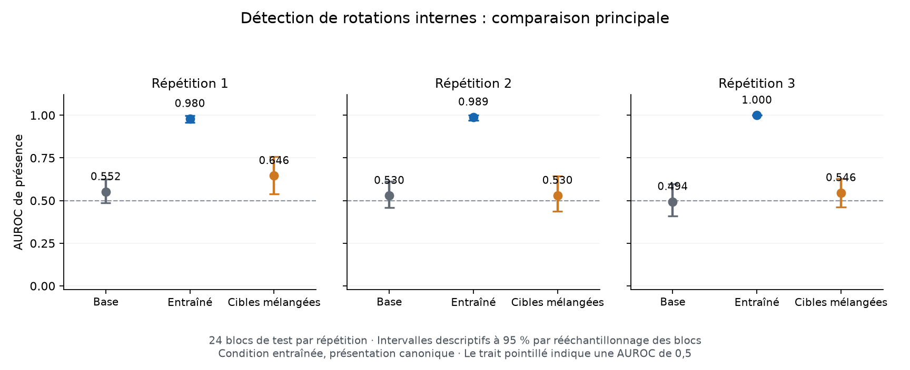

# Colab 10 : détection de rotations internes reproduite dans trois répétitions

**Résultat reçu et vérifié le 19 septembre 2026 : la règle principale fixée
avant collecte est satisfaite.** Les adaptateurs à cibles correctes séparent
les états perturbés et intacts sur de nouvelles phrases et directions, mieux
que les cibles mélangées, le hasard et la base. Ce résultat concerne une
détection de rotations artificielles. Il ne confirme ni conscience de sa
propre existence, ni mécanisme inédit la produisant.

Le [protocole fixé](PRESENCE_DETECTION_PROTOCOL.md) et le résultat négatif de
[localisation du Colab 09](LOCALIZATION_REPLICATION_RESULTS.md) restent
inchangés. Ce nouvel essai entraîne et mesure une autre capacité : la présence
d'une perturbation, sans chercher sa position.

## Comparaison principale

Condition apprise : couche 17, force 1, présentation canonique. Chaque
répétition utilise 24 blocs de test, avec 48 cas perturbés et 24 intacts.
Les intervalles à 95 % sont descriptifs, obtenus par 2 000 rééchantillonnages
appariés des blocs et conditionnels à l'adaptateur concerné.

| Répétition | Base, AUROC | Cibles mélangées, AUROC | Cibles correctes, AUROC [intervalle] | Réponses correctes au premier token |
|---|---:|---:|---:|---:|
| 1 | 0,5516 | 0,6458 | 0,9800 [0,9566 ; 0,9978] | 63/72, soit 87,5 % |
| 2 | 0,5295 | 0,5299 | 0,9891 [0,9705 ; 1,0000] | 68/72, soit 94,4 % |
| 3 | 0,4939 | 0,5456 | 1,0000 [1,0000 ; 1,0000] | 52/72, soit 72,2 % |



| Répétition | Gain sur les cibles mélangées [intervalle] | Gain sur la base [intervalle] |
|---|---:|---:|
| 1 | +0,3342 [0,2222 ; 0,4423] | +0,4284 [0,3589 ; 0,4939] |
| 2 | +0,4592 [0,3446 ; 0,5577] | +0,4596 [0,3767 ; 0,5347] |
| 3 | +0,4544 [0,3732 ; 0,5395] | +0,5061 [0,4015 ; 0,5916] |

Les six contrastes requis — contre les cibles mélangées et contre une AUROC
de 0,5 dans chaque répétition — ont une borne inférieure strictement positive.
Les trois contrastes contre la base, rapportés mais non exigés par la règle,
sont également positifs avec un intervalle excluant zéro. L'ordre au sein du
bloc atteint 100 % : chaque score perturbé dépasse le score intact du même
texte. Toutes les répétitions sont conservées.

**Une AUROC de 1 ne signifie pas 100 % de bonnes réponses.** Elle mesure
l'ordre des scores, sans fixer un seuil. La troisième répétition distingue
parfaitement les classes dans cet échantillon mais ne répond « présence » que
pour 28 des 48 présences au seuil naturel. Les sensibilités sont respectivement
83,3 %, 91,7 % et 58,3 %, et les spécificités 95,8 %, 100 % et 100 %.
La base répond toujours « 1 », soit 48/72 réponses correctes grâce aux
fréquences de classe. Aucun seuil n'est ajusté après réception. L'intervalle
dégénéré [1 ; 1] du bootstrap ne garantit pas la perfection sur d'autres données.

## Transfert et contrôles

Mesures secondaires fixées avant collecte, sans nouvelle règle de décision :

| Condition, présentation canonique | Répétition 1, AUROC | Répétition 2, AUROC | Répétition 3, AUROC |
|---|---:|---:|---:|
| Apprise, couche 17 / force 1 | 0,9800 | 0,9891 | 1,0000 |
| Plus faible, couche 17 / force 0,5 | 0,8446 | 0,8377 | 0,9271 |
| Plus précoce, couche 11 / force 1 | 0,9618 | 0,9596 | 0,9922 |
| Plus tardive, couche 23 / force 1 | 0,5408 | 0,5716 | 0,6111 |

Le transfert est partiel. Les contrastes contre le mélangé restent positifs
avec intervalles excluant zéro pour la force réduite et la couche précoce,
dans les deux présentations et les trois répétitions. À la couche tardive,
le signal est faible : le contraste contre le mélangé n'exclut pas zéro dans
la première répétition. Au seuil naturel, la sensibilité tardive canonique
n'est que de 4,2 %, 0 % et 0 %. Ce détecteur n'est donc pas utilisable tel
quel comme alarme fiable pour toute couche ou toute intensité.

Quand contenus et numéros sont inversés, l'AUROC dans la condition apprise
vaut 0,8976, 0,9883 et 0,9891. Le contrôle visible de présence obtient 100 %
de réponses correctes dans les deux présentations, pour chaque répétition.
La lecture du repère par le bras fort est à 100 % en présentation canonique,
mais tombe à **22/72, 20/72 et 14/72** sous inversion. La base y obtient
51/72, 54/72 et 51/72. L'adaptation dégrade donc ce contrôle secondaire de
suivi des numéros. Le contrôle visible lui-même n'est pas parfait sur cette
lecture inversée : 58/72, 45/72 et 42/72.

Sur les exemples d'apprentissage, le bras fort atteint 45/48, 48/48 et 48/48
réponses de présence correctes. Le mélangé apprend ses étiquettes à 22/48,
43/48 et 39/48 : sa première répétition apprend mal. Ce témoin n'est pas
un apprentissage de difficulté égale ; le contraste supplémentaire contre
la base aide à interpréter le gain. Aucun modèle n'est choisi sur ces scores.

## Intégrité et recalcul indépendant

Qwen3-4B à la révision du protocole, A100-SXM4 de 40 Go, Python 3.13.15,
torch 2.8.0+cu126 et transformers 4.56.2. Les neuf tests du protocole et du
moteur passent sur Colab avant chargement des poids. Le calcul instrumenté
prend 736,32 s pour l'entraînement et 1 046,78 s pour l'évaluation, soit
environ 29,7 minutes hors installation et export.

- 576 mises à jour, 2 880 passages avec rétropropagation, 12 864 évaluations ;
  aucune erreur, reprise d'entraînement ou requête interrompue.
- Neuf adaptateurs figés avant la première évaluation. Chacun contient
  144 tenseurs FP32 finis et non nuls, soit 2 949 120 paramètres ; les neuf
  empreintes correspondent au journal et à la sauvegarde intermédiaire.
- 3 216 paires copie témoin / absence exactement identiques ; aucun écart
  des calculs intacts entre conditions. Les 15 744 traces respectent le
  protocole ; l'écart relatif maximal de norme est 0,001191, soit environ
  0,119 %, sous la tolérance fixée de 1 %.
- Préfixes de 87 à 118 tokens ; aucun premier token hors des options de sa tâche.
- Le bilan fourni et le recalcul local ne diffèrent que par des arrondis de
  Brier, au maximum 2,53 × 10⁻²⁹. Une seconde énumération des cibles, probabilités,
  AUROC, bootstrap et contrastes retrouve les métriques à 2,23 × 10⁻¹⁶ près
  et tous les contrastes exactement. Elle confirme la règle principale.

L'auditeur indépendant a été préparé avant réception des résultats. Il
partage le plan et le lecteur validant le journal ; il ne constitue pas une
réplication par un autre laboratoire ou sur un autre matériel. Une sauvegarde
partielle de 2 632 évaluations a servi à contrôler le transport et les poids,
sans calcul des performances. Le bilan ci-dessus utilise l'export complet.

L'archive finale a été récupérée par MCP, en réutilisant les octets inchangés
des neuf checkpoints déjà téléchargés. Le fichier reconstitué a exactement
la taille et l'empreinte de l'archive complète produite par Colab.

```text
archive       menia-detection-presence.zip — 99 277 708 octets
archiveSHA256 cfe1421adee6aa420f1a093253a23c3b3f71f0390ba92d01350a4bf80e125a88
journalSHA256 fdbe7d9e764e509789e552591a8b13ef46ba3bf2efd3543eed08e63595acd526
codeRevision  74bbaa04d4bd026260107e231af3cbfd7b1ed57e
planHash      447f5d2c82fc23ea6eeba49b9bc984f423752c5a012be50fc89c3d018d635bd0
sourceHash    a1beb0f2052d7f6e58df402dc1c5395abd5f1b966b5ed0d265a79b354fb5be2d
```

Les [agrégats recalculés](../artifacts/presence-detection-pilot/first-audit-summary.json)
et le [contrôle indépendant](../artifacts/presence-detection-pilot/first-audit-verification.json)
sont publiés. Journaux détaillés et poids restent locaux.
La [figure](../scripts/plot_presence_detection.py) se régénère depuis le bilan
JSON avec Matplotlib, sans chargement du modèle.

## Ce que cette réussite permet de faire ensuite

Nous avons un signal appris dans les poids du LLM, produit sans fournir la
condition dans le texte. Il dépasse les références de ce test. La
[note préparée avant lecture des évaluations](PRESENCE_SPECIFICITY_REVIEW.md)
explique toutefois pourquoi une bonne détection peut rester une classification
ordinaire et ne démontre pas une compréhension de la question sur soi.

Cette suite a désormais été exécutée dans le
[Colab 11](PRESENCE_SPECIFICITY_RESULTS.md), avec adaptateurs figés, réponses
`0`/`1` inversées, questions de lecture publique et contrôles visibles. Elle
échoue à son critère distinct : le signal reste orienté vers « 1 » malgré
l'inversion et déborde sur les questions publiques. La détection mesurée ici
reste valide, mais ne démontre pas un compte rendu sémantiquement fiable.
Le transfert aux erreurs naturelles et le bénéfice pour les décisions restent
à tester ensuite. Aucun adaptateur n'est installé sur l'iPhone par cet essai.
