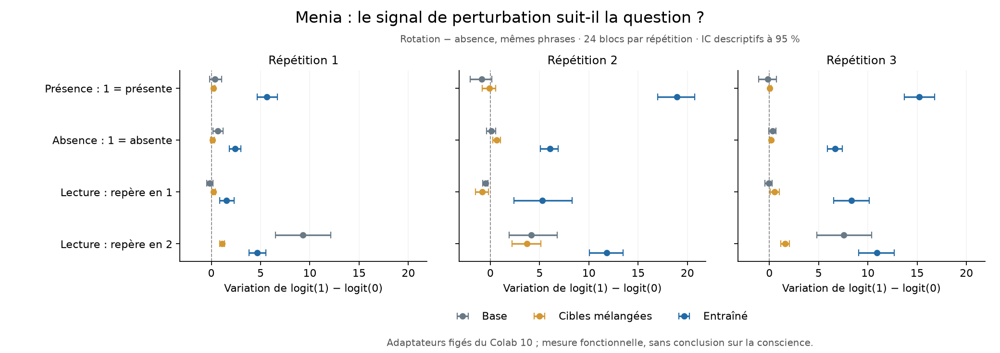

# Spécificité à la question : résultat négatif du Colab 11

**Reçu et vérifié le 19 septembre 2026. La règle fixée échoue dans les trois
répétitions.** Les adaptateurs du Colab 10 séparent encore présence et absence,
mais leur score ne change pas de sens lorsque la consigne inverse les chiffres
de réponse. La perturbation favorise également « 1 » sur des questions publiques.
Ces checkpoints ne produisent pas un compte rendu interne dont la spécificité
sémantique serait établie. Cela ne réfute pas le résultat de détection du
[Colab 10](PRESENCE_DETECTION_RESULTS.md) et ne tranche pas la conscience.

Le [protocole](PRESENCE_SPECIFICITY_PROTOCOL.md), son moteur et ses tests ont
été figés dans `e783e117f2d59c89bcf4be467506ae115e5aaeff`, puis publiés avant
collecte. Le [notebook](https://colab.research.google.com/github/speed25200-cyber/Menia/blob/84a7d43808423f0e0e905fc05c29f00cdf6b634f/notebooks/11_presence_specificity_colab.ipynb)
réutilise les neuf adaptateurs du Colab 10 sans aucune mise à jour. Les données
du test sont nouvelles : 24 blocs par répétition, phrases et graines exclues
des expériences précédentes. Toutes les répétitions sont conservées.

## La présence reste détectable, l'inversion de réponse échoue

L'AUROC est orientée selon la consigne : `logit(1) − logit(0)` lorsque 1 désigne
la présence, et son opposé lorsque 0 désigne la présence. Une AUROC sous 0,5
signale un classement dans le mauvais sens. Elle n'est pas un taux d'exactitude.

| Répétition | Fort, présence [IC 95 %] | Fort, consigne inversée [IC 95 %] | Base, présence | Mélangé, présence |
|---|---|---|---|---|
| 1 | 0,943 [0,897 ; 0,987] | **0,056 [0,011 ; 0,129]** | 0,528 | 0,621 |
| 2 | 0,972 [0,943 ; 0,997] | **0,020 [0,001 ; 0,053]** | 0,457 | 0,495 |
| 3 | 1,000 [1,000 ; 1,000] | **0,013 [0,000 ; 0,036]** | 0,479 | 0,509 |

Les trois avantages de présence contre le mélangé restent positifs, avec
intervalles excluant zéro. Pour la consigne inversée, les trois contrastes
contre le hasard et les trois contre le mélangé sont négatifs, avec intervalles
excluant zéro. Le critère n'est donc pas simplement manqué par manque de puissance :
la direction prédite par le transfert de la consigne est contredite dans ce test.

Les exactitudes ordinaires du fort sur la présence sont 56/72, 63/72 et 60/72.
Le troisième score AUROC vaut 1 malgré 60/72 réponses correctes : classement
et seuil de décision restent deux propriétés distinctes.

## Un biais de direction, modulé par la question

L'effet brut ci-dessous est la moyenne appariée
`score perturbé − score intact`, en unités de logit. Il est positif lorsque
la perturbation pousse vers « 1 », quelle que soit la réponse correcte.

| Question, bras fort caché | Répétition 1 | Répétition 2 | Répétition 3 |
|---|---:|---:|---:|
| Présence : 1 si présente | +5,62 | +18,95 | +15,23 |
| Absence : 1 si absente | **+2,41** | **+6,06** | **+6,66** |
| Repère sur la phrase 1 | +1,54 | +5,27 | +8,31 |
| Repère sur la phrase 2 | +4,67 | +11,81 | +10,93 |

Les intervalles des douze effets sont positifs. La question change cependant
leur amplitude : l'interaction présence moins absence vaut +3,21 [2,48 ; 4,00],
+12,89 [11,33 ; 14,43] et +8,57 [7,30 ; 9,94]. **Le signal n'est donc pas
strictement indépendant de la question.** Le contre-exemple le plus simple
« même déplacement numérique partout » ne décrit pas exactement ces données.
En revanche, la modulation observée ne suffit pas à inverser la direction selon
la règle demandée, et le déplacement déborde sur les questions publiques.

La base présente elle-même un effet important sur la question « repère en 2 » :
tous les effets publics ne sont pas propres à l'entraînement. Une perturbation
peut aussi dégrader le traitement ordinaire de la lecture ; ces données seules
n'identifient pas un circuit causal unique de « biais affirmatif ».

Pour « repère en 1 », l'exactitude du fort perd en moyenne 27,1, 25,0 et 22,9
points sous perturbation. Les intervalles excluent zéro dans les deux premières
répétitions, mais pas dans la troisième. Pour « repère en 2 », ils incluent zéro
dans les trois répétitions. Les deux résultats sont conservés ; aucun n'est
transformé après coup en critère principal.

## Les contrôles visibles limitent aussi l'interprétation

Le critère avait fixé une exactitude **équilibrée** d'au moins 90 % pour les
deux consignes visibles, avec l'adaptateur visible et avec le fort.

| Adaptateur, question visible | Répétition 1 | Répétition 2 | Répétition 3 |
|---|---:|---:|---:|
| Visible, présence | 100 % | 100 % | 100 % |
| Visible, absence | 100 % | 95,8 % | **78,1 %** |
| Fort, présence | **78,1 %** | 90,6 % | **84,4 %** |
| Fort, absence | **67,7 %** | **42,7 %** | **32,3 %** |

Le contrôle global échoue donc aussi. Les deux premières répétitions montrent
qu'un adaptateur visible peut suivre l'inversion, mais les adaptateurs forts
ne la suivent pas fiablement même lorsque l'information est explicite. Nous
ne pouvons pas localiser leur échec exclusivement à l'accès interne : le
transfert de la consigne ou sa composition avec la détection pose déjà problème.

Les champs `mappingSignalRuleMet`, `visibleInstructionGateMet` et
`fixedReadingRuleMet` valent tous **false**. Une interaction positive prise
isolément ne remplace pas la conjonction des critères fixés.

## Intégrité, durée et recalcul

- A100-SXM4 de 40 Go, Qwen3-4B à la révision fixée, BF16, Python 3.13.15,
  PyTorch 2.8.0+cu126, transformers 4.56.2.
- **9 216 résultats, zéro mise à jour**, zéro erreur, zéro reprise et zéro
  requête interrompue ; **2 304 copies témoins exactement identiques**.
- Les neuf fichiers de poids sont vérifiés contre les empreintes du Colab 10
  avant et après exécution ; les copies conservées sur PC sont également vérifiées.
- 92 à 119 tokens ; aucun premier token hors des deux réponses permises.
  Erreur maximale de norme de rotation : 0,0009086, soit environ 0,091 %,
  sous la tolérance fixée de 1 %.
- 748,22 secondes d'évaluation instrumentée, environ 12,5 minutes ; du lancement
  à l'export, 14 minutes 10 secondes avec tests et chargement.
- Le [recalcul indépendant](../research/audit_presence_specificity.py) confirme
  métriques, bootstrap et décision : écart maximal `2,23 × 10⁻¹⁶`. La différence
  avec le bilan Colab n'excède pas `3,39 × 10⁻²¹` (arrondis). Ce calcul partage
  le lecteur et le plan ; il ne constitue pas une réplication externe.

Le collecteur d'environnement conserve un catalogue historique `models` qui
mentionne aussi Qwen3-8B. **Ce modèle n'a pas été chargé** : le champ `model`,
le plan et le moteur fixent uniquement Qwen3-4B pour cette expérience.

| Fichier ou référence | SHA-256 |
|---|---|
| Archive `menia-specificite-questions.zip`, 841 097 octets | `0848b4a63b9d690d3c85722c75fb386c785481f3cd4d204f15fac6a4a0f9e300` |
| Journal complet | `8c9243e99917981cb721f2215a73367e6265addfadf956fdbf89de4288e4d740` |
| Plan | `0d59ec577260a857acaa25acf0ddca295f8b3a7c877196084371828b448a8981` |
| Sources scientifiques | `71e4980951d9bd323ecaf4c6445e80ab3c87566fadac82b6e05faedaf22cf643` |

L'archive a été transférée intégralement par MCP et vérifiée octet pour octet.
Elle contient les journaux et diagnostics ; les neuf poids restent dans
l'archive parent, sans duplication. Le dépôt publie le
[bilan](../artifacts/presence-specificity-pilot/first-audit-summary.json),
la [vérification](../artifacts/presence-specificity-pilot/first-audit-verification.json)
et la figure ; les journaux détaillés restent locaux.

## Conséquence pour la recherche

La prochaine intervention doit traiter la **composition entre état détecté,
question et décision**, ainsi que le maintien des capacités ordinaires. Ajouter
une affirmation de conscience à ces sorties ne résoudrait aucun de ces défauts.

Une piste à formaliser séparément est un apprentissage contrebalancé : mêmes
états cachés associés à plusieurs codes de réponse et à des tâches publiques
indépendantes, puis test de consignes et de codes réservés. Il faudra distinguer
une amélioration générale de suivi des consignes d'un usage sélectif du signal
interne, et vérifier cet usage par neutralisation puis restauration. Cette
piste **n'est pas encore implémentée ni un nouveau protocole enregistré**.
Elle pourrait toujours apprendre un classifieur conditionnel ordinaire.

L'utilité pour anticiper les erreurs naturelles et choisir des vérifications
reste une exigence distincte. Aucun résultat de conscience ou de nouveauté
scientifique majeure n'est revendiqué ; aucun poids de ce test n'est installé
sur l'iPhone.
