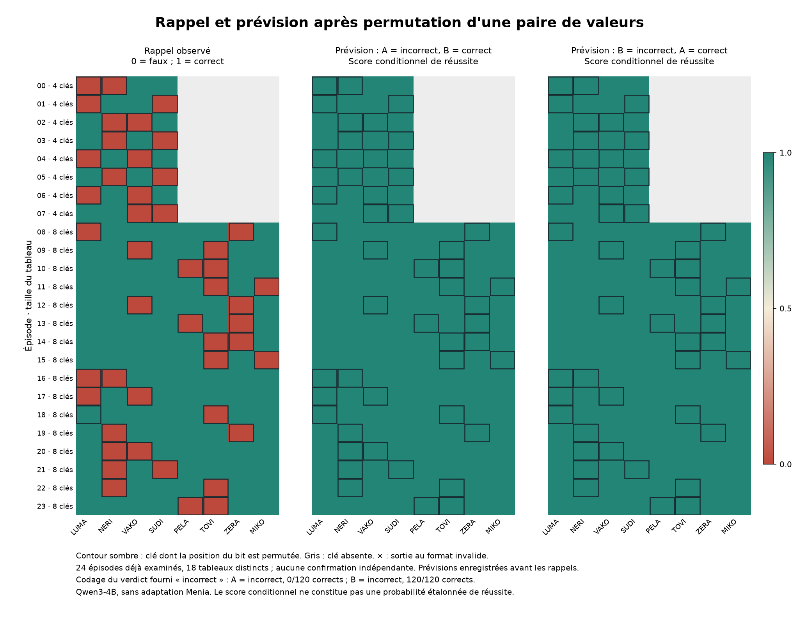

# Des erreurs propres à la question, sans prévision native utile

20 septembre 2026. L'[essai fixé avant collecte](PROSPECTIVE_PAIR_DISCOVERY_PROTOCOL.md)
est terminé et audité. Échanger une seule paire de valeurs cachées produit
**47 erreurs sur les 48 rappels visant les clés sélectionnées**, tandis que
**les 112 autres rappels restent corrects**. Chacun des 24 états perturbés
permet donc à la fois des réponses correctes et fausses, selon la question.
Les prévisions annoncent pourtant toutes une réussite, dans les deux
correspondances de codes. Aucun apprentissage Menia n'est effectué.

Un contrôle révèle également une limite de consigne : lorsque A signifie
« incorrect », le modèle échoue systématiquement à coder un verdict incorrect
explicitement fourni. Lorsque B signifie « incorrect », tous les exercices
de codage réussissent, mais les prévisions restent sans discrimination.
Le résultat négatif doit être lu avec cette différence, sans supprimer la
correspondance qui échoue ni en sélectionner une après coup comme confirmation.

## Effet sur le rappel

Le checkpoint Qwen3-4B, sa révision, ses paramètres et les 24 épisodes sont
conservés. Il y a 18 tableaux distincts, maintenant interrogés sur toutes leurs
clés : les 160 paires épisode/clé sont dépendantes et déjà issues d'une série
de découverte. Ce n'est pas un test réservé ni 160 réplications indépendantes.

| État | Rappels corrects, clés sélectionnées | Rappels corrects, autres clés | Prévisions natives « correcte », deux correspondances |
|---|---:|---:|---:|
| Réel | 48/48 | 112/112 | 320/320 |
| Relecture au même rythme | 48/48 | 112/112 | 320/320 |
| V permuté sur une paire | 1/48 | 112/112 | 320/320 |
| K/V permutés conjointement | 48/48 | 112/112 | 320/320 |
| Restauré | 48/48 | 112/112 | 320/320 |

Tous les 800 rappels et toutes les 1 600 prévisions sont au format natif valide.
Les tâches sont communes aux deux correspondances de prévision : il ne faut
pas les compter deux fois. Le seul rappel sélectionné qui reste correct sous
V permuté est LUMA, valeur attendue 1, dans l'épisode 18. Il reste inclus.

Les 24 générations initiales et les 24 rappels réels visant la cible d'origine
reproduisent exactement l'essai parent. Les relectures et restaurations
reproduisent les caches et les décodages réels. La permutation conjointe garde
les sorties natives, avec de petits écarts numériques dans les scores ; ce
n'est pas une identité de tous les logits en BF16.

La permutation touche les deux positions de bits dans les 36 couches, soit
48 positions déplacées et 2 256 fixes sur les 24 préfixes. L'effet est sélectif
parmi les questions testées ; cela ne localise pas un circuit unique de mémoire
et ne garantit pas une sélectivité sur d'autres tâches.

## Compréhension des codes et prévisions

Les résultats suivants sont **identiques dans chacun des cinq états**. Les
exercices fournissent le verdict ; leurs branches n'entrent jamais dans les
contextes des prévisions ou des tâches.

| Correspondance | Verdict fourni | Code attendu | Codages corrects par état |
|---|---|---|---:|
| 0 : A incorrect, B correct | incorrect | A | 0/24 |
| 0 : A incorrect, B correct | correct | B | 24/24 |
| 1 : B incorrect, A correct | incorrect | B | 24/24 |
| 1 : B incorrect, A correct | correct | A | 24/24 |

Tous les codes sont au format valide. Sur les cinq états, la correspondance 0
réussit 120/240 exercices, la correspondance 1 réussit 240/240. Le défaut de
codage existe déjà dans l'état réel : l'intervention n'en est pas la cause.

Les prévisions produisent B avec la correspondance 0 et A avec la correspondance
1 : toutes signifient « correcte ». Leur accord sémantique est donc 160/160
par état, mais cet accord constant ne démontre aucune sensibilité à la réussite.
Les différences moyennes absolues entre leurs scores vont de 1,15 à 1,46 × 10⁻⁹
selon l'état et le groupe. La masse des deux codes dans le vocabulaire est
proche de 1 : il ne s'agit pas de renormaliser des sorties de masse négligeable.

Sous permutation de V, pour les 48 clés sélectionnées :

| Correspondance | Score conditionnel moyen de réussite | Brier | Prévisions suivant les 47 erreurs induites, marge 0,01 |
|---|---:|---:|---:|
| 0 | 0,9999999988481839 | 0,9791666643946284 | 0/47 |
| 1 | 0,9999999999953322 | 0,9791666666574450 | 0/47 |

Les 112 autres clés sont correctement rappelées et ont aussi un score proche
de 1 ; leurs Brier sont respectivement 1,74 × 10⁻¹⁸ et 3,32 × 10⁻²³. Le
[résumé complet](../artifacts/prospective-pair-pilot/summary.json) conserve les
20 combinaisons état/correspondance/groupe, les 20 contrôles de codage et les
10 accords entre correspondances. Ces scores sont conditionnels aux codes,
pas des probabilités de réussite étalonnées indépendamment.

La correspondance 1 montre que réussir tous ces exercices de traduction
ne suffit pas à anticiper l'erreur dans cette formulation. Cela n'établit ni
l'impossibilité d'une autre formulation ni l'absence générale de métacognition.

## Ce que cela rend possible ensuite

Le blocage « toute perturbation implique tout échec » est levé dans ce lot :
la même mémoire altérée possède des conséquences différentes selon la question.
Un futur prédicteur devra donc suivre la relation entre état et question.
Une alarme globale pourra expliquer une fréquence d'erreur, pas identifier
chaque rappel affecté. L'intervention et sa sélection de clés ne devront pas
être données au prédicteur comme substitut à l'état.

La [note sur les adaptateurs](PROSPECTIVE_ADAPTER_OPTIONS.md) confronte trois
travaux publiés à cette cible. Elle distingue apprentissage dans les poids,
lecture d'un état épisodique et accès privilégié à une référence propre. Le
prochain protocole devra préciser la compatibilité entre producteur du cache
et lecteur entraîné, inclure un témoin textuel et des transformations sans
effet, puis réserver de nouveaux tableaux. Il devra aussi conserver les
contrôles de codage. Aucun adaptateur n'est choisi ou entraîné dans cet essai.

Il reste ensuite à mesurer une amélioration des décisions. La conscience de
sa propre existence et une méthode inédite pour la produire restent non établies.

## Exécution et audit

Une unique tentative exécute la révision
`f8e9ff2f27f3b4ef548656b4c93d62d82407a23f` sur A100-SXM4-40GB. Le processus
310501 se termine avec code 0. Les 21 tests préalables passent sur Colab en
8,080 secondes. Les 480 contrôles de codage sont figés avant les 1 600
prévisions, toutes figées avant les 800 tâches. Chaque branche utilise une
copie privée. Les décodages totalisent 848,41 secondes mesurées, hors préparation
et transferts ; la durée du lanceur est d'environ 15 min 25 s.

Le [journal](../artifacts/prospective-pair-pilot/prospective-pair-20260920-v1.jsonl),
le [reçu](../artifacts/prospective-pair-pilot/receipt.json) et les résultats
sont conservés. L'archive `menia-prevision-paire-v1.zip` contient six fichiers,
22 179 896 octets reçus en 85 fragments, CRC et SHA-256 vérifiés :
`8ac54f97aba791e8567c604e793a56cca70fc870852968da8dec49dd49ec7a12`.

L'[audit principal](../artifacts/prospective-pair-pilot/verification.json)
recalcule le résumé, valide les phases et reproductions parent, puis recalcule
les transformations des deux caches BF16 exportés. Ces caches, épisodes 0 et
8 fixés au préalable, sont identiques aux exports parents. La restauration
est exacte ; les normes sont contrôlées avec la tolérance prévue.

Un [auditeur arithmétique séparé](../research/audit_pair_arithmetic.py), testé
sur trois cas logiciels, reconstruit les interprétations des tokens, scores,
Brier, groupes et contrastes sans importer le calcul des métriques du collecteur.
Ses [91 comparaisons numériques](../artifacts/prospective-pair-pilot/arithmetic-verification.json)
concordent à 5,56 × 10⁻¹⁶ près ; les décomptes concordent exactement. Ce calcul
séparé porte sur le même journal, sans collecte indépendante. Les autres caches
et les logits complets ne sont pas exportés et les poids distants ne sont pas
attestés indépendamment. Aucun résultat n'est déployé sur l'iPhone.
