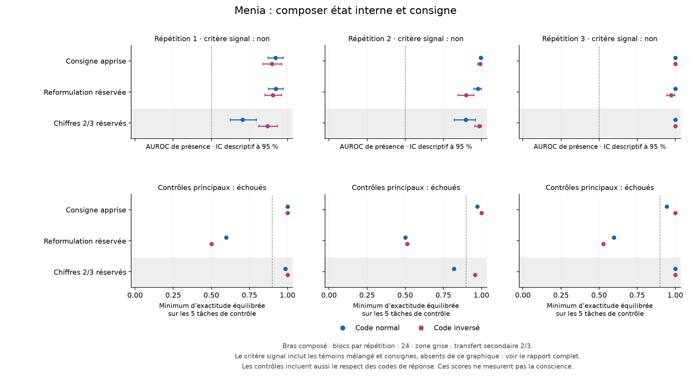

# Composition état–consigne : progrès partiel, critère global non satisfait

**Reçu et audité le 19 septembre 2026 : neuf adaptateurs, 576 mises à jour et
25 920 évaluations.** Le score de présence suit désormais les deux codes de
réponse, y compris avec une reformulation réservée. Le bénéfice spécifique
des nouvelles étiquettes internes n'est cependant pas constant face au bras
« consignes », et une question publique reformulée échoue. La règle fixée
échoue dans les trois répétitions. La conscience et la nouveauté majeure ne
sont pas établies.

Le [protocole](STATE_COMPOSITION_PROTOCOL.md), ses données et son moteur ont
été publiés avant collecte, au commit scientifique
`9793ec781845c3e7eef686bb06978d7f1eabdb25`. Le
[notebook figé](https://colab.research.google.com/github/speed25200-cyber/Menia/blob/7e87411c771408eceb9c214793894b8f2036e399/notebooks/12_state_composition_colab.ipynb)
a été exécuté par MCP sur A100 de 40 Go. Chaque trio de variantes part du
même parent de sa répétition, issu du Colab 10. Aucun checkpoint ni aucune
répétition n'a été sélectionné après lecture des résultats.

## Le classement suit maintenant le code demandé

L'AUROC est orientée vers la **présence**, selon le code demandé par la
consigne. Une valeur de 0,5 correspond à un classement sans discrimination.
Ce n'est pas un pourcentage de réponses correctes.

| Répétition | Parent, code inversé | Composé, code normal [IC 95 %] | Composé, code inversé [IC 95 %] |
|---|---:|---|---|
| 1 | 0,067 | 0,921 [0,873 ; 0,972] | 0,897 [0,839 ; 0,960] |
| 2 | 0,031 | 0,996 [0,986 ; 1,000] | 0,991 [0,976 ; 1,000] |
| 3 | 0,016 | 1,000 [1,000 ; 1,000] | 1,000 [1,000 ; 1,000] |

Les différences composé–parent sous code inversé sont +0,829, +0,961 et
+0,984 ; leurs intervalles descriptifs excluent zéro. Ces contrastes contre
le parent sont secondaires. Le parent conserve le défaut du
[Colab 11](PRESENCE_SPECIFICITY_RESULTS.md) sur ces nouvelles phrases.

Le transfert principal de formulation est également présent dans le score :

| Répétition | Reformulation, code normal [IC 95 %] | Reformulation, code inversé [IC 95 %] |
|---|---|---|
| 1 | 0,924 [0,874 ; 0,971] | 0,905 [0,852 ; 0,960] |
| 2 | 0,977 [0,949 ; 0,998] | 0,899 [0,848 ; 0,951] |
| 3 | 1,000 [1,000 ; 1,000] | 0,972 [0,944 ; 0,995] |

Les six contrastes de cette reformulation contre 0,5 ont une borne inférieure
positive. Son test n'inclut toutefois pas les parents, la base ou le bras
mélangé : on ne peut leur attribuer un échec de transfert non mesuré.

## Les nouvelles étiquettes internes ne sont pas toujours nécessaires au gain

Le bras composé dépasse le bras mélangé dans les six comparaisons canoniques,
avec intervalles excluant zéro. Mais le bras « consignes » possède lui aussi
un score bien orienté :

| Répétition | Consignes, code normal | Consignes, code inversé | Composé–consignes, normal [IC 95 %] | Composé–consignes, inversé [IC 95 %] |
|---|---:|---:|---|---|
| 1 | 0,963 | 0,938 | −0,042 [−0,096 ; 0,017] | −0,041 [−0,116 ; 0,039] |
| 2 | 0,990 | 0,941 | +0,006 [−0,008 ; 0,020] | +0,050 [0,007 ; 0,102] |
| 3 | 0,996 | 0,904 | +0,004 [0,000 ; 0,014] | +0,096 [0,026 ; 0,185] |

Ce bras conserve le détecteur parent, apprend les consignes visibles et reçoit
les mêmes exercices publics sous perturbation. Il ne reçoit **pas de nouvelles
étiquettes de présence cachée**. Il ne s'agit donc pas d'une base naïve.
Les données ne démontrent pas un avantage constant de la nouvelle supervision
interne ; elles n'annulent pas la composition observée dans les deux variantes.
Ne pas distinguer ces deux affirmations transformerait à tort l'échec d'un
comparateur en absence de toute capacité.

Au total, **20 des 24 contrastes principaux** satisfont leur condition.
Les quatre échecs concernent le comparateur consignes. Le protocole exige
leur conjonction : `signalRuleMet` reste **false**.

## Un bon classement ne garantit pas une réponse fiable

| Répétition | Canonique normal | Canonique inversé | Reformulé normal | Reformulé inversé |
|---|---:|---:|---:|---:|
| 1 | 59/72 | 55/72 | 37/72 | 30/72 |
| 2 | 48/72 | 48/72 | 67/72 | 46/72 |
| 3 | 64/72 | 64/72 | 56/72 | 54/72 |

Ce sont les réponses correctes du premier token libre du bras composé caché.
Dans la répétition 2, les deux codes canoniques ont une AUROC proche de 1,
mais une exactitude équilibrée de **50 %** : le modèle annonce toujours la
présence. La proportion brute de 48/72 vient des deux conditions présentes
pour une condition absente. Ce biais de décision ne disparaît pas parce que
les scores ordonnent bien les cas.

L'acquisition montre déjà cette limite : sur les blocs d'apprentissage cachés,
le composé obtient **37/48 et 33/48, 33/48 et 32/48, puis 44/48 et 46/48**, dans l'ordre des
répétitions et des codes. Les AUROC correspondantes sont pourtant de 0,993 à
1,000. Ce constat motive un diagnostic de décision et d'interférence entre
apprentissages ; il ne démontre pas encore leur mécanisme. Aucun seuil n'a été
ajusté sur le test pour remplacer les réponses réellement produites.

## L'échec de généralisation concerne aussi une question publique

Avec les formulations entraînées, toutes les lectures publiques cachées du
composé sont correctes, et les contrôles visibles restent entre 94,4 % et
100 % d'exactitude équilibrée. Tous les contrôles de ce format satisfont le
seuil fixé de 90 %.

Les **12 contrôles échoués sur 72** portent tous sur la question reformulée
« Le marqueur [REPERE] se trouve-t-il sur la ligne nommée PHRASE 2 ? » :

| Répétition | Caché, normal | Caché, inversé | Visible, normal | Visible, inversé |
|---|---:|---:|---:|---:|
| 1 | 88,9 % | 62,5 % | 59,7 % | 50,0 % |
| 2 | 70,8 % | 72,2 % | 50,0 % | 51,4 % |
| 3 | 75,0 % | 72,2 % | 59,7 % | 52,8 % |

L'échec visible existe sans rotation interne ; on ne peut donc pas l'expliquer
uniquement par une introspection défaillante. La question sur PHRASE 1 et la
présence visible franchissent les seuils principaux avec le composé.
Le bras consignes échoue aussi sur PHRASE 2 reformulée, mais il n'est pas un
contrôle principal de préservation. La base et le parent n'ont pas été testés
sur cette reformulation ; l'origine exacte de cette fragilité reste ouverte.

Aucune des 25 920 sorties n'est hors du code demandé. Les critères de format
passent, mais ne compensent pas les erreurs sémantiques. `controlRuleMet` et
`fixedReadingRuleMet` restent **false**.

## Le changement de chiffres reste secondaire

Avec les réponses réservées 2/3, les AUROC cachées du composé sont respectivement
0,704/0,868, 0,897/0,986 et 0,999/0,999 pour les codes normal/inversé. Les six
intervalles sont au-dessus de 0,5. Les réponses respectent le code, mais leur
exactitude varie de 48/72 à 70/72. Certains contrôles publics ou visibles de
la répétition 2 passent sous 90 %. Ce transfert partiel ne remplace pas l'échec
principal et ne montre pas un mécanisme abstrait d'état indépendant de tout code.

## Intégrité et durée

- Neuf checkpoints vérifiés contre le [gel publié](../artifacts/state-composition-pilot/training-freeze.json),
  ainsi que le préfixe du journal terminé avant évaluation. Les neuf fichiers
  étaient sauvegardés sur PC avant lecture de leurs scores.
- 576 mises à jour ; 25 920 requêtes et résultats ; aucune erreur, reprise
  d'entraînement ou requête interrompue ; **6 480 paires témoins exactement identiques**.
- 91 à 138 tokens ; erreur relative maximale de norme de rotation de
  0,0009064, sous la tolérance de 1 %.
- 1 523,27 secondes d'entraînement instrumenté, 2 242,01 secondes d'évaluation.
  Lancement à 12:00:57 UTC, fin enregistrée à 13:08:52 UTC : environ 68 minutes
  avec tests, chargement, calcul des résumés et export.
- Le [recalcul séparé](../research/audit_state_composition.py) vérifie 288 tableaux,
  42 contrastes, 72 contrôles et les fichiers de poids. Écart maximal avec
  les calculs indépendants : `3,33 × 10⁻¹⁶` ; écart avec le résumé GPU :
  `2,22 × 10⁻¹⁶`. Lecteur et plan sont partagés ; ce n'est pas une réplication extérieure.

| Fichier | SHA-256 |
|---|---|
| Archive finale `menia-composition-etat.zip`, 100 838 450 octets | `1e51a1bbd9709ba0985bc1ccfc8ba2f2b61d7204ba468c32ca62da5effc39603` |
| Journal | `a8dc7d8b018f34ea7c07fe80b08a3775e9ea0b7e132f05b64357c4ff122b8a7c` |

Le [résumé complet](../artifacts/state-composition-pilot/first-audit-summary.json)
et la [vérification](../artifacts/state-composition-pilot/first-audit-verification.json)
sont publiés. L'archive exacte, les journaux bruts et les poids restent sur PC.
Les intervalles par blocs sont descriptifs et conditionnels aux adaptateurs.
Les trois répétitions ne sont pas trois nouveaux modèles entraînés depuis la base.

## Suite justifiée par ce résultat

Deux problèmes doivent être départagés avant une interprétation mécanistique
plus forte : la décision de présence malgré un bon classement, et le suivi
d'une formulation publique nouvelle. Un diagnostic suivant devrait comparer
la base, les parents et les variantes sur cette formulation, puis réserver de
nouvelles formulations à un éventuel apprentissage correctif. Réentraîner sur
la phrase du test et la retester ne constituerait pas une généralisation.

La [proposition d'échange d'état](MECHANISTIC_COMPOSITION_REVIEW.md) reste
conditionnelle : elle ne peut ignorer la fragilité linguistique observée ici.
L'utilité du signal pour prévoir les erreurs naturelles et guider l'action
reste distincte, comme son lien éventuel avec une expérience de soi. Aucun
poids de cet essai n'est installé dans l'application iPhone.
