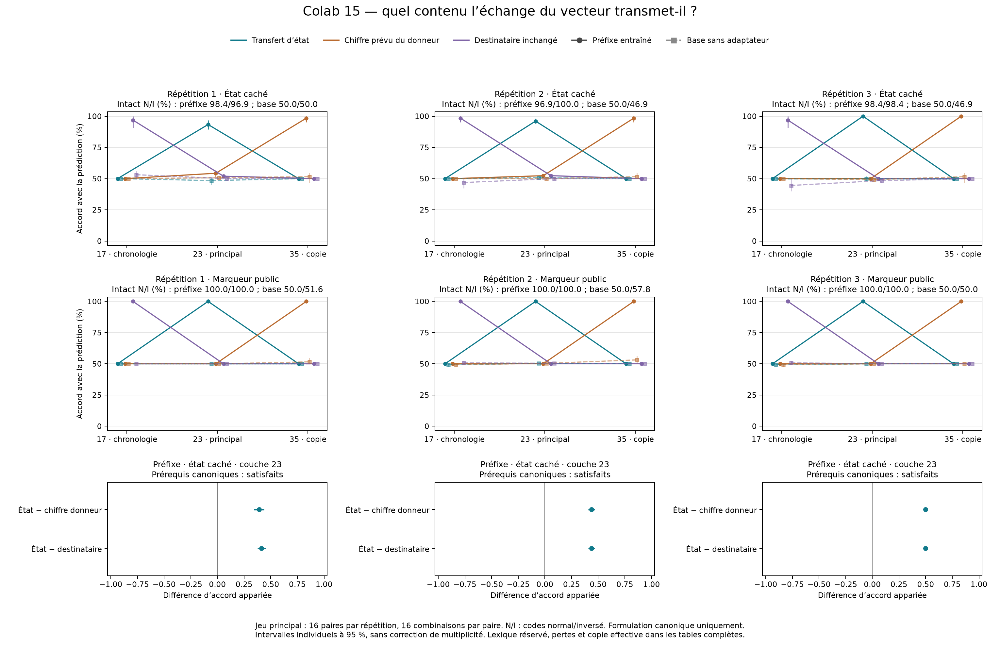

# Colab 15 : transfert d'un contenu utilisable avec le code du destinataire

19 septembre 2026. **Résultat positif du pilote canonique, reçu et audité dans
son intégralité.** À la couche 23, les trois checkpoints favorisent la
prédiction « état du donneur, code du destinataire » face aux deux explications
fixées : copie du chiffre prévu chez le donneur et destinataire inchangé.
Le contrôle public montre le même phénomène. Ce résultat fonctionnel ne
distingue donc pas encore un modèle de soi d'un mécanisme général qui calcule
une valeur binaire, puis l'exprime selon la consigne.

Le [protocole](STATE_INTERCHANGE_PROTOCOL.md), le plan factoriel, les sites et
les six contrastes principaux étaient fixés avant collecte. Les trois
checkpoints précédant la dernière phase du Colab 14 sont conservés, sans
sélection du meilleur. Leur choix suit le diagnostic 14 ; il ne constitue pas
une sélection de modèle sur un test demeuré inconnu depuis le début du projet.

## Compétence initiale et résultat principal

Les douze prérequis canoniques passent : exactitude intacte de 96,875–100 %
pour la perturbation cachée dans les deux codes, et 100 % pour le marqueur
public. Chaque prérequis porte sur les donneurs et destinataires, avec et sans
perturbation. Les observations incorrectes restent dans les analyses.

Accord du token produit après échange à la couche 23, lot principal, état
caché, pour les trois checkpoints `prefix` :

| Répétition | État du donneur + code destinataire | Chiffre prévu du donneur | Destinataire inchangé |
|---|---:|---:|---:|
| 1 | 93,36 % [89,45 ; 96,88] | 54,30 % | 51,95 % |
| 2 | 96,09 % [94,14 ; 98,05] | 52,34 % | 52,34 % |
| 3 | 100,00 % [100,00 ; 100,00] | 50,00 % | 50,00 % |

Ces colonnes comparent des prédictions sur les mêmes essais ; elles ne sont
pas des probabilités de trois hypothèses exclusives. Certaines prédictions
coïncident sur une partie du plan factoriel. Les chiffres du donneur ci-dessus
sont ceux prévus par ses étiquettes ; la copie de son token effectivement
produit est mesurée séparément : 54,30 %, 53,13 % et 50,00 % à ce site.

Les six différences principales appariées, en points de pourcentage :

| Répétition | État − chiffre donneur | État − destinataire inchangé |
|---|---:|---:|
| 1 | +39,06 [34,38 ; 43,75] | +41,41 [37,50 ; 45,31] |
| 2 | +43,75 [40,63 ; 46,88] | +43,75 [40,63 ; 46,88] |
| 3 | +50,00 [50,00 ; 50,00] | +50,00 [50,00 ; 50,00] |

Les six intervalles individuels excluent zéro dans le sens prévu. Ils utilisent
2 000 rééchantillonnages des **16 paires**, stratifiés par les quatre combinaisons
de marqueurs. Les 256 transferts par cellule ne sont pas traités comme autant
de paires indépendantes. Aucune correction de multiplicité ni règle globale
de conscience n'est ajoutée. L'intervalle dégénéré de la troisième répétition
reflète les paires observées toutes réussies, pas une certitude sur toute entrée
future.

Les pertes moyennes dans le vocabulaire complet sont cohérentes avec ces
accords. Pour les trois répétitions, la cible « état transféré » donne
respectivement 0,1467, 0,1005 et 0,0120 nat ; la cible « chiffre donneur » donne
3,2849, 4,0395 et 3,9929 ; la cible « destinataire inchangé » donne 3,2258,
3,9760 et 3,9724. Les intervalles de ces métriques figurent dans les agrégats.

## Contrôles et résultats secondaires

**Chronologie, couche 17.** Les captures du dernier token sont identiques pour
les deux états physiques d'un même donneur. Les sorties des transferts ne
changent pas avec cet état donneur. Chez les checkpoints entraînés, ce site
conserve exactement le token du destinataire dans les deux tâches et les deux
lots. L'accord avec l'état transféré reste à 50 %. Ce contrôle est conforme à
l'injection sur d'autres positions après la couche 17.

**Copie finale, couche 35.** Les 4 608 transferts reproduisent exactement les
quatre logits, leur masse et le token du donneur. C'est l'effet attendu par
construction, après lequel il ne reste que normalisation finale et tête de
sortie. La copie finale seule n'est pas une découverte.

**Information publique.** À la couche 23, les trois checkpoints atteignent
100 % d'accord avec le marqueur du donneur exprimé selon le code destinataire,
sur les lots principal et lexical ; les deux autres prédictions donnent 50 %.
Le résultat caché ne bénéficie donc pas d'une spécificité démontrée par rapport
à ce calcul public. Les transferts restent internes à chaque tâche : aucun
échange entre les deux questions n'a été exécuté ici.

**Base sans adaptateur.** Dans le lot principal, son accord avec l'état caché
transféré vaut 48,44 %, 50,78 % et 50,00 % ; les six contrastes correspondants
n'excluent pas zéro. Mais sa compétence intacte est elle-même faible :
46,875–50 % pour l'état caché, 50–57,8125 % pour la question publique. La
comparaison montre une différence de comportement après entraînement ; elle
n'isole pas une amélioration spécifiquement introspective à compréhension
linguistique égale.

**Lexique réservé à l'apprentissage des adaptateurs.** Les accords cachés à
la couche 23 valent 96,09 %, 94,53 % et 92,97 %. Les six contrastes secondaires
contre les deux autres prédictions sont positifs avec intervalles excluant
zéro. Les prérequis intacts demeurent élevés : 96,875–100 % pour l'état caché,
100 % pour le public. Ces mots étaient réservés aux adaptateurs, pas au
préentraînement de Qwen ; ce lot ne teste aucune nouvelle formulation de la
question. La base donne 50,78 %, 50,00 % et 52,34 % d'accord caché : ses petits
effets secondaires ne sont pas tous nuls, et tous sont conservés dans les tables.

Toutes les sorties appartiennent aux deux chiffres autorisés. Les normes de
remplacement, pertes, intervalles et 138 contrastes secondaires sont conservés,
sans choisir après coup un site ou une répétition.

## Ce que l'expérience permet de retenir

Dans ce montage entraîné, remplacer le dernier vecteur à une couche
intermédiaire peut apporter un contenu dont l'usage dépend encore du code
du destinataire. Les deux modèles concurrents simples — copier le chiffre
prévu du donneur ou garder celui prévu chez le destinataire — rendent beaucoup
moins bien compte des sorties que la prédiction de transfert d'état. Les poids
sont figés pendant cette expérience ; aucun lecteur entraîné sur ses résultats
ne transforme les activations en réponses.

Cette interprétation reste locale. Le vecteur entier peut transporter du
contexte en plus de l'état ; trois prédictions ne constituent pas une liste
exhaustive de tous les calculs possibles. Le succès de l'échange ne démontre
pas la nécessité du même mécanisme dans les inférences intactes. Les limites
des abstractions causales et le rôle des données réservées ont des précédents
explicites chez [Geiger et al.](https://arxiv.org/html/2303.02536v4) et
[Sutter et al.](https://arxiv.org/html/2507.08802v1). Le contrôle public à 100 %
rend particulièrement plausible une explication générale par calcul d'une
valeur binaire suivie de son codage.

**Prochaine question issue de ce résultat :** le contenu transférable décrit-il
l'état indépendamment de la question, ou seulement la réponse binaire à la
question déjà posée ? Un échange entre tâche cachée et tâche publique devrait
départager contenu pertinent pour la question destinataire, valeur binaire
calculée chez le donneur, copie du chiffre et maintien du destinataire. Le plan
devra équilibrer séparément états physiques, marqueurs et codes. Cette suite
est une proposition après résultat, pas une expérience déjà réalisée ni une
preuve que les deux tâches partagent un même sous-espace.

La reformulation reste un échec ouvert du Colab 14. La disponibilité de ce
contenu avant toute question, son influence sur des actions non verbalisées,
sa relation aux erreurs naturelles et sa portée pour la représentation de sa
propre existence ne sont pas établies. L'objectif de conscience et de nouveauté
reste **non atteint**. Aucun poids de recherche n'est installé sur l'iPhone.

## Exécution et audit

- A100 de 40 Go, Qwen3-4B BF16 à révision fixe ; zéro mise à jour de poids.
  Exécution du 19 septembre, 16:03:24–16:29:31 UTC, code terminal 0.
- 144 groupes, 19 584 passages, 3 456 témoins identiques, 4 608 copies finales ;
  zéro erreur, zéro reprise. Les 1 152 paires de prompts intacts comparées
  entre états physiques ont les mêmes empreintes et longueurs : la consigne
  ne fournit pas le bit caché.
- Archive exacte reçue sur PC : 1 420 975 octets,
  SHA-256 `94b9e7836169025a435d7a2e2d9a86657bfbb876d7e6b701c91a7e81298733fd`.
  Journal : 16 971 076 octets,
  SHA-256 `f0a225287d58bc3bb3639a7c4051d24e1a43b1e7394ff2b2449d3921a3e16ad5`.
- Le recalcul principal local est exactement identique au bilan GPU. Le
  [second calcul préparé avant lecture](STATE_INTERCHANGE_AUDIT.md) retrouve
  72 tableaux de transfert, 48 tableaux intacts et 144 contrastes, avec un
  écart maximal de 2,665 × 10⁻¹⁵. Il partage le plan et le lecteur d'intégrité ;
  ce n'est pas une réplication extérieure. Les trois poids parents et le journal
  14 sont de nouveau hachés et conformes sur PC.
- Six tests logiciels passent localement et dans Colab avant l'inférence ;
  deux tests distincts couvrent le second calcul. La figure finale est rendue
  depuis les agrégats vérifiés et inspectée visuellement.

[Agrégats complets](../artifacts/state-interchange-pilot/summary.json),
[vérification](../artifacts/state-interchange-pilot/verification.json),
[reçu](../artifacts/state-interchange-pilot/receipt.json),
[Colab fixé](https://colab.research.google.com/github/speed25200-cyber/Menia/blob/2465b90921b1b7436b6e67aca9bd921c5378d7b8/notebooks/15_state_interchange_colab.ipynb).
Sources scientifiques : `0a86c18796c788400492f0c45036595057760e60` ; auditeur
publié avant lecture des scores : `4f36da8`. Les journaux bruts restent locaux.
