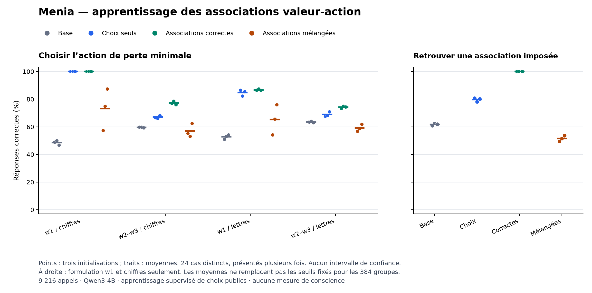

# Colab 22 : associations apprises, décision encore fragile

20 septembre 2026. **Les neuf entraînements et les 9 216 évaluations sont
terminés, reçus et audités. Le critère global fixé échoue.** L'apprentissage
auxiliaire correct produit 576/576 associations retrouvées sur les valeurs
nouvelles testées, mais le choix optimal reste sensible à la formulation
et aux codes. Ce résultat précise une compétence acquise et sa limite.

## Expérience réalisée

Le [protocole v2](VALUE_ACTION_LEARNING_PROTOCOL.md) compare le modèle de base
à trois recettes appariées : choix seuls (`choice`), choix et associations
correctes (`linked`), mêmes entrées avec cibles auxiliaires mélangées
(`shuffled`). Trois initialisations donnent neuf adaptateurs Q/V de rang 8,
576 mises à jour et 4 608 exemples. Les poids de base restent figés ; les
neuf entraînements précèdent toute évaluation.

Les 24 cas de test utilisent des probabilités et coûts absents des 32 cas
d'apprentissage. Les appels combinent formulations, chiffres ou lettres,
ordres et affectations des codes. Les 9 216 appels sont des présentations
répétées de 24 cas, pas 9 216 situations indépendantes. Les initialisations
partagent le même modèle préentraîné.

La v1 est conservée comme tentative arrêtée : son défaut de labels auxiliaires
a été détecté avant tout test, après 22 mises à jour du premier adaptateur.
La v2 repart d'états initiaux neufs. Le [reçu d'arrêt](../artifacts/value-action-learning-pilot/aborted-v1.json)
et l'archive correspondante restent disponibles.

## Résultats complets du transfert

Pourcentages de choix optimaux : moyenne sur les présentations d'un cas,
puis sur les 24 cas et les trois répétitions. w0/w1 sont utilisées à
l'apprentissage ; les tests de choix utilisent w1/w2/w3. Les lettres A/B
ne servent pas à l'entraînement de ce lot.

| Présentation du choix | Base | Choix seuls | Associations correctes | Associations mélangées |
|---|---:|---:|---:|---:|
| w1, chiffres | 48,61 % | 100,00 % | 100,00 % | 73,26 % |
| w2/w3, chiffres | 59,72 % | 67,01 % | 77,26 % | 56,94 % |
| w1, lettres | 52,78 % | 84,72 % | 86,81 % | 65,28 % |
| w2/w3, lettres | 63,54 % | 68,92 % | 74,31 % | 59,20 % |

La [figure PDF](../artifacts/value-action-learning-pilot/transfer-domains.pdf)
et le [bilan intégral](../artifacts/value-action-learning-pilot/summary.json)
conservent les répétitions et les 384 groupes. Les points ne sont pas des
intervalles de confiance.

Pour la recherche d'association, le modèle doit retrouver le code lié à
une valeur donnée, sans choisir la plus petite. Avec w1 et les chiffres,
les résultats sont : base **356/576**, choix seuls **459/576**, associations
correctes **576/576**, associations mélangées **297/576**. Le bras correct
réussit les 192 appels dans chacune des trois répétitions. Cette compétence
est mesurée seulement sur cette formulation et cet alphabet ; son transfert
aux autres formulations et aux lettres n'est pas testé par cette sous-tâche.

Sur tous les choix, le bras `linked` obtient 1 411/1 728 (81,66 %), contre
1 315/1 728 (76,10 %) pour les choix seuls. Le budget contient deux fois plus
de présentations dans chacun des domaines w2/w3 que dans chacun des domaines
w1 : cette moyenne globale ne remplace donc pas les quatre lignes du tableau.

## Critère fixé et échecs persistants

Un groupe devait atteindre au moins 22/24 bonnes réponses. Un contrôle global
exigeait la réussite de tous ses groupes. **Trois contrôles globaux sur 24
passent** : les trois recherches d'association de `linked`. Les trois
contrôles de choix de ce même bras échouent. Le critère principal, qui
exigeait les six, n'est donc pas atteint.

Six des neuf contrastes de transfert atteignent un gain de cinq points face
à chacune des trois références : les trois répétitions pour les nouvelles
formulations avec chiffres, la deuxième pour les lettres avec w1, et les
deux premières quand formulation et alphabet sont nouveaux. Le gain sur
les choix seuls reste de 0 puis 1,04 point dans deux répétitions du domaine
w1/lettres, et de 3,65 points dans la troisième du domaine entièrement nouveau.
Ces contrastes manquent le seuil fixé ; les critères ne sont pas modifiés.

Un [diagnostic descriptif après résultats](../artifacts/value-action-learning-pilot/constant-choice-diagnostic.json)
recense les sorties constantes dans les 288 groupes de choix. Il en trouve
19/72 pour `linked`. Par exemple, avec w1, lettres, réponse directe présentée
d'abord et codée B, ce bras répond **B sur les 24 cas**, dans les trois
répétitions. Avec w2, chiffres et réponse directe codée 2, il répond toujours
**1**, dans les deux ordres et les trois répétitions. Chaque groupe contient
12 cas par action optimale : une réponse constante donne exactement 12/24.
Ce constat décrit les sorties ; il n'identifie pas le circuit responsable.

## Intégrité et coût

La collecte sur A100 40 Go s'étend du 19 septembre à 22:06:48 à 22:55:32 UTC,
tests et chargement compris. Les six tests fixés passent sur PC (28,208 s)
et Colab (50,461 s). Aucun appel technique échoué, code invalide ou arrêt
à la limite de tokens n'est enregistré. Les évaluations génèrent 18 432
tokens en 1 615,30 secondes d'inférence mesurée.

L'archive `menia-apprentissage-valeurs-actions-v2.zip` contient 16 fichiers,
soit 116 437 708 octets. Après réception complète, le journal, les douze
fichiers de poids et le préfixe d'apprentissage correspondent au reçu pris
pendant l'évaluation. Les deux recalculs donnent des écarts numériques nuls.
Le second calcul utilise une arithmétique distincte, mais partage le plan
et le lecteur d'intégrité : ce n'est pas une réplication externe.
Le [reçu final](../artifacts/value-action-learning-pilot/receipt.json) et la
[vérification](../artifacts/value-action-learning-pilot/verification.json)
conservent les empreintes et les versions.

Les entraînements de choix seuls utilisent 80 384 tokens d'entrée chacun,
contre 84 224 pour les deux bras auxiliaires (+4,78 %). Les neuf durées
d'entraînement totalisent 1 184,53 secondes. Le nombre de mises à jour et
d'exemples est apparié, pas les tokens ou les durées. `linked` reçoit deux
fois moins de cibles de choix que `choice` : la comparaison porte sur des
recettes complètes, pas sur l'effet isolé d'une représentation interne.

## Conséquence pour l'objectif

L'apprentissage améliore la recherche d'association et une partie du
transfert des choix. Cela ne suffit pas à garantir l'usage d'une estimation
propre dans une décision : les valeurs sont fournies publiquement et aucune
représentation de capacités internes n'est isolée dans cet essai. Les poids
sont conservés pour la recherche ; aucune installation sur iPhone n'est faite.

La suite préparée entraîne l'[évaluation de réponses effectivement produites](NATIVE_ANSWER_CONFIDENCE_PREPARATION.md),
avec comparateurs de difficulté et de probabilités de sortie, puis comparaison
croisée à réponses identiques. Elle ne doit pas supposer que le blocage de
généralisation des actions est résolu. Il faudra ensuite tester causalement
le lien entre estimation et choix, avec contrôles de contenu et de capacité.
Ni conscience de sa propre existence ni méthode inédite la produisant ne
sont établies par ce résultat.
